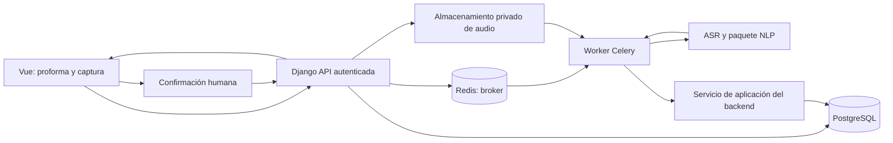

# Auditoría técnica y propuesta de arquitectura HOMEX

Fecha de revisión: 12–13 de septiembre de 2026. Alcance: repositorio local `homex-nlp`, documento de requisitos adjunto, imagen `Arquitectura.png`, dataset completo y `homex_bd.sql`.

## 1. Dictamen

HOMEX tiene una base conceptual aprovechable: separar muebles personalizados de productos con existencias, capturar información mediante voz y exigir validación humana antes de convertirla en información comercial. El SQL representa mucho mejor el negocio previsto que la aplicación actual.

La implementación es un prototipo de extracción y medición, todavía no una aplicación comercial consistente con ese modelo. El impedimento principal no es SQLite: son los contratos incompatibles, el entrenamiento desconectado del dataset, la pérdida de información semántica y varias reglas de integridad incompletas en PostgreSQL. Sustituir SQLite por PostgreSQL sin resolverlos trasladaría los problemas.

Mi recomendación es conservar las decisiones centrales del SQL, corregir sus invariantes y construir una aplicación Django modular con un worker ASR/NLP independiente. Una captura propone una línea de proforma; la proforma acumula tantas líneas como se necesiten. No conviene empezar añadiendo todos los extractores enumerados ni fragmentando el negocio en numerosos servicios.

## 2. Evidencia y límites

Se revisaron los cuatro módulos Python, el HTML completo, dependencias, configuración, imagen, los 200 registros y las 22 tablas, 26 funciones y 23 triggers del SQL. También se inspeccionó la SQLite existente mediante conexión de solo lectura.

Se ejecutó el esquema en una instancia temporal de PostgreSQL 16.15 y se realizaron 16 casos SQL reproducibles, cada uno dentro de una transacción revertida. Se utilizó el modo monousuario porque el entorno no permite abrir sockets. Esto verifica sintaxis y comportamientos transaccionales secuenciales, **no concurrencia entre conexiones ni permisos de un usuario de producción**.

Se ejecutaron el conversor, el motor NLP y pruebas aisladas de HITL con el entorno virtual existente: spaCy 3.8.13 y Pydantic 2.13.4. No se entrenó un modelo ni se hicieron pruebas de audio, navegador, carga o despliegue. No hay un `model-best` en el repositorio. Los resultados NLP descritos corresponden al fallback realmente cargado, no a un modelo HOMEX entrenado.

Los archivos de aplicación, SQL original y dataset permanecen sin cambios. La revisión agrega solamente documentación y evidencia bajo `docs/`.

- [Resultados SQL](auditoria/resultados_sql.json): `verificado: true` significa que se reprodujo el comportamiento descrito, incluidos los defectos; no significa que el diseño haya superado una prueba de corrección.
- [Resultados Python](auditoria/resultados_python.json): estadísticas, desalineaciones, salidas del motor y pruebas HITL.
- [Verificador Python](auditoria/verificar_python.py): reproduce las comprobaciones sin modificar la SQLite del proyecto.
- [Instrucciones y casos SQL](auditoria/README.md).

## 3. Lo que está bien

| Decisión existente | Valor y condición para conservarla |
|---|---|
| Mueble a medida fuera de `productos` | Evita convertir cada fabricación particular en un SKU artificial. Debe permanecer como detalle más especificaciones. |
| Cabecera y detalles de proforma separados | Permite acumular muebles dictados individualmente y añadir productos de catálogo. |
| Fichas `productos_silla` y `productos_piso` | Dan estructura a categorías distintas sin llenar el maestro de columnas irrelevantes. Falta proteger cambios posteriores de categoría. |
| `NUMERIC` para dinero en PostgreSQL | Adecuado; hay que mantener representación decimal en API y cálculos. |
| Kardex mediante movimientos | El stock proyectado y los movimientos ofrecen una buena base de trazabilidad y conciliación. |
| Aprobación y pedido en una transacción | El caso S01 confirma creación de pedido y salida de stock. S02 confirma reversión ante existencias insuficientes. |
| Bloqueo ordenado de productos | El `FOR UPDATE` por ID ordenado es una decisión razonable para reducir conflictos entre aprobaciones; falta cubrir escrituras de detalles. |
| Restricción de mutación del kardex | S15 confirma rechazo de `UPDATE` y `DELETE` de movimientos. |
| SQL con varias validaciones de catálogo | No se limita a claves foráneas genéricas: comprueba conceptos en clientes, productos, proformas y otros puntos. |
| Separación `main` / `nlp_engine` / `database` | Buena separación inicial de responsabilidades, aunque todavía muy amplia y acoplada a contratos provisionales. |
| Texto original y normalizado separados | Es la base correcta para trazabilidad; falta mapear offsets y versionar transformaciones. |
| Carga de modelos fuera de cada petición | Evita recarga por audio. Debe hacerse en el ciclo de vida del worker, una vez por proceso. |
| SQL parametrizado en SQLite | Las escrituras revisadas usan parámetros, no concatenan valores del usuario. |
| Corrección humana y señal visual de cambios | Es el flujo apropiado para cotizaciones. Debe ampliarse para manejar ausencia, rechazo y revisión con identidad. |

## 4. Contradicciones que deben resolverse primero

### Captura, ítem y proforma son conceptos distintos

El SQL establece una relación de cero o un `items_ia` y cero o un `items_humano` por captura mediante `UNIQUE(captura_id)` [SQL, líneas 393 y 418]. Esto coincide con tu idea de dictar mueble por mueble. Una línea puede tener cantidad dos: sigue siendo un ítem, no dos capturas obligatorias.

En cambio, `CotizacionCapturada`, el segmentador, las tablas SQLite y la interfaz aceptan listas de muebles por audio [motor, líneas 93, 182 y 617; frontend, línea 417]. Además, el segmentador no aplica los conectores que declara: solo separa encabezados por mayúsculas y saltos de línea. La transcripción se concatena con espacios en `main.py`, por lo que esa estrategia no corresponde bien al canal de voz.

**Propuesta:** contrato singular `CapturaProcesada.item_propuesto`, nullable cuando no hay extracción. Si aparecen varios productos principales, advertir y solicitar un nuevo dictado o división explícita. La interfaz añade el ítem validado a la proforma existente. Una recaptura se conserva como una nueva captura vinculable a la misma línea; no borra la evidencia anterior.

No hace falta prohibir que un mueble tenga varios componentes: «escritorio con cajonera» puede ser un solo ítem. El detector debe distinguir producto principal de componente, sin asumir que cada sustantivo representa otra línea.

### El flujo de la imagen necesita corregirse

La imagen coloca faster-whisper antes de Redis/Celery y presenta una cadena visual de contenedores que puede interpretarse como un recorrido lineal. El audio debe llegar primero al backend autenticado y almacenarse; la tarea se encola antes de ejecutar ASR. Redis no es un intermediario entre el worker y PostgreSQL.

Django, Vue, Celery, Redis, Docker Compose y Nginx son componentes propuestos, **no implementados en este checkout**. Actualmente hay FastAPI, HTML/JavaScript y ejecución síncrona del trabajo pesado. No puedo inferir el estado de otros repositorios que no se proporcionaron.

## 5. Dataset: valioso, pero no compatible de extremo a extremo

### Resultados cuantitativos

| Comprobación | Resultado |
|---|---:|
| Registros JSON válidos | 200 |
| Anotaciones | 2.378 |
| Etiquetas distintas | 18 |
| Textos duplicados exactos | 0 |
| Offsets fuera de rango | 0 |
| Solapamientos entre anotaciones | 0 |
| Spans no alineados estrictamente con tokens | 11, en 10 registros |
| Entidades obtenidas por el conversor actual al recibir estos registros | **0** |

Las 11 desalineaciones se verificaron con `spacy.blank('es')` y con el tokenizador de `es_core_news_sm`. Incluyen límites de `mts.` y `ESCRITORIO EN L` en determinados contextos. No deben corregirse expandiendo spans a ciegas; hay que revisar tokenización, puntuación y convención de anotación. Los números de registro y offsets están en la evidencia.

Distribución: `ACCESORIO` 556; `CANTIDAD`, `PRODUCTO` y `PRECIO_TOTAL` 200 cada una; `ANCHO`, `ALTO` y `PROFUNDIDAD` 155 cada una; `ESPESOR` 154; `OBSERVACION` 153; `MATERIAL` 90; `MODELO`, `ERGONOMIA`, `APOYABRAZOS`, `CABECERA`, `SOPORTE_LUMBAR`, `SISTEMA`, `INCLINACION` y `POSICIONES` 45 cada una.

### D01. El conversor descarta silenciosamente toda la anotación — bloqueante

`convert_to_spacy.py:41` apunta a un archivo inexistente: `../data/doccano_exports/pedidos_reales_anotados.jsonl`. El archivo real es `data/dataset.jsonl`.

Además, en la línea 126 lee `reg.get('entities', [])`, pero los 200 registros usan `label`. Al ejecutar su función sobre el dataset real produjo **200 ejemplos sin ninguna entidad**. El riesgo es entrenar un modelo sobre falsos negativos masivos y creer que se utilizó el corpus anotado.

Corregir solo la ruta y la clave tampoco basta: la lista permitida del conversor rechazaría **1.178 anotaciones** porque no reconoce 13 etiquetas actuales, incluyendo orientaciones, precio total y características de sillas.

### D02. La ontología del corpus, el motor y SQL no coinciden

| Dataset | Motor actual | Destino de negocio sugerido |
|---|---|---|
| `PRODUCTO` | `producto` textual | `nombre`; resolver `tipo_item` y, para catálogo, SKU/ID candidato |
| `ANCHO`, `ALTO`, `PROFUNDIDAD` | Solo reconoce `DIMENSION` | Objeto de dimensiones con eje, valor y unidad |
| Varios `ESPESOR` | Conserva un solo string | Espesores por componente: estructura, mesón, etc. |
| `PRECIO_TOTAL` | Espera `PRECIO` | Importe mencionado con alcance explícito; después precio unitario y total comercial |
| `OBSERVACION` | Solo marcador «Según diseño» | Observaciones sin perder el resto del texto técnico |
| `MATERIAL` | Un solo material | Materiales por componente cuando corresponda |
| Etiquetas de silla | No se ensamblan | Candidatos de catálogo y especificaciones estructuradas de silla |
| Sin `COLOR` ni `ACABADO` | Espera ambas | Añadir ejemplos anotados antes de evaluar su aprendizaje |

El dataset contiene muebles y 45 registros de sillas; no proporciona ejemplos de pisos identificados como tales. No permite validar cobertura del negocio completo.

Las 90 anotaciones `MATERIAL` corresponden a textos de materiales/componentes de sillas. Hay 18 textos que mencionan melamina, pero ninguna anotación `MATERIAL` con ese término. Si la política pretende extraer materiales de muebles, esta ausencia es incoherente y puede enseñar al modelo a ignorarlos.

También se necesita acordar si «base metálica cromada» es un material, un componente o ambos. Para NER convencional, los spans de `Doc.ents` no admiten solapamientos; componentes y sus propiedades pueden requerir una estructura posterior o spans separados del NER. [Documentación de EntityRecognizer](https://spacy.io/api/entityrecognizer).

### D03. Las anotaciones no son registros relacionales listos para cargar

El corpus conserva fragmentos y offsets; no incluye cliente, proforma, moneda, vendedor, SKU ni identificación de componentes en cada etiqueta. Su compatibilidad es conceptual y parcial. Para cargarlo a tablas de negocio se necesitan resolución, normalización, contexto y validación humana.

Ejemplo real del primer registro: dos espesores, «25 mm» y «18 mm». Guardarlos como un único `espesor` pierde información. También hay cantidades escritas y medidas sin unidad explícita. «Encaja perfectamente» necesita matizarse: hay información útil, pero falta el adaptador semántico y un contrato documentado de JSONB.

### D04. Evaluación y procedencia pendientes

No hay configuración de entrenamiento, artefactos entrenados, particiones persistidas ni evaluación independiente. El split aleatorio 80/20 puede distribuir variantes de una plantilla entre entrenamiento y desarrollo. Los textos muestran formulaciones repetidas; eso justifica comprobar familias, pero no permite afirmar que el corpus sea sintético ni que ya haya fuga demostrada.

Registrar origen, documento/grupo, anotador, revisión, versión y permisos de uso. Separar por documento/familia antes de entrenar y reservar prueba independiente. Con 200 ejemplos conviene validar estabilidad entre particiones agrupadas y ampliar datos de voz reales; no prometer calidad por un mínimo arbitrario de ejemplos por etiqueta.

La normalización de inferencia modifica el texto, mientras el conversor entrena con texto original. Debe compartirse la misma política o entrenar sobre texto original y normalizar valores después de extraer. Si se transforma el texto antes del NER, hay que remapear offsets. spaCy trabaja con offsets de caracteres del texto correspondiente y requiere verificar alineación. [API de entrenamiento](https://spacy.io/api/top-level/).

## 6. Motor NLP y backend actual

### Hallazgos comprobados

| ID / prioridad | Evidencia | Efecto y corrección |
|---|---|---|
| N01 / alta | `total 1,500.00` se normaliza a `total 1.500.00` y termina en **1.5**; `total 1.500 Bs` también devuelve **1.5** [motor:159, 305, 563] | Parser monetario con contexto regional, consumo completo del importe y advertencia de ambigüedad. Nunca convertir una coincidencia parcial en precio válido. |
| N02 / alta | «18 mm, 1.80 metros de ancho y 0.80 metros de alto» produce dimensiones `18 milimetros`, `1.80 metros`, `0.80 metros` [motor:511, 554, 577] | Confunde espesor con tamaño y pierde ejes; la regex más rica no se usa si ya existe cualquier dimensión NER. Resolver por span y orientación. |
| N03 / alta | «dos escritorios de melamina» no identifica cantidad ni producto con el fallback | Faltan plurales, números escritos y vocabulario. Añadir cobertura guiada por corpus y pruebas. |
| N04 / alta | «sin datos» devuelve un objeto vacío pero `num_items_detectados=1` [motor:664] | No contar un formulario vacío como detección. Devolver cero propuestas y permitir ingreso manual. |
| N05 / alta | `DetalleMueble(cantidad=-2, precio_total=-10)` se acepta | Pydantic actual comprueba tipos básicos, no las reglas necesarias. Añadir restricciones y validación de conjunto; validación del borrador distinta de la confirmación. |
| N06 / alta | `PIPELINE_VERSION` anuncia HOMEX-v4 aunque carga fallback [main:57; motor:440] | Persistir versión y modo realmente activos, hash del artefacto y versiones de reglas/normalización. Mostrar advertencia de degradación por captura. |
| N07 / media | El ensamblador toma primer producto/material/color/espesor | Descarta alternativas y componentes sin advertir; necesita candidatos y asociaciones explícitas. |
| N08 / media | Fallback conserva NER genérico español y aparecen etiquetas como `MISC` | No mezclar cobertura genérica con métricas HOMEX; retirar componentes no usados o filtrar y declarar la procedencia. |

No existen Matcher ni PhraseMatcher propios del proyecto. EntityRuler se añade solo al fallback: si carga un modelo entrenado, el código no garantiza incorporar esas reglas. El supuesto híbrido funciona principalmente como «NER, y rellenar el campo si quedó vacío», no como resolución de conflictos.

No hay extracción general de números escritos, moneda, unidades canónicas, advertencias por campo, mapa de offsets, identificación de componentes ni registro de candidatos rechazados. Las listas de accesorios pueden duplicar conceptos solapados, por ejemplo «bisagras pispot» y «bisagras». `ACABADO` se guarda como observación y puede impedir conservar otra observación importante.

La solución no es instalar todas las técnicas disponibles. Una propuesta suficiente es:

1. Entrada conservada y validada, texto original más metadatos ASR.
2. Normalización conservadora con versión y mapa de offsets si altera el texto usado por NER.
3. NER para fragmentos contextuales y reglas para patrones inequívocos.
4. Parser numérico/unidades separado, incluyendo negaciones y rectificaciones: «no 18, de 25».
5. Candidatos con fuente, span, texto, valor y motivo de conflicto.
6. Asociación a producto principal/componentes y resolución de conflictos.
7. Propuesta tipada con faltantes y advertencias; confirmación humana posterior.

EntityRuler puede resolver catálogos sencillos; Matcher se justifica por patrones contextuales de tokens; PhraseMatcher solo si aporta una necesidad diferenciada de coincidencia de frases. No duplicaría el catálogo en tres motores. Tampoco asignaría confianza probabilística inventada a regex ni a cada `ent` de spaCy: esas puntuaciones requieren un diseño y calibración específicos.

### Operación del backend

`main.py:151` es `async`, pero realiza copia de archivo, transcripción, NLP y SQLite de forma bloqueante. Puede bloquear la atención de otras peticiones en ese proceso. No hay cola ni estados persistidos, reintentos ni recuperación tras una caída.

La inicialización de DB y modelos al importar el módulo complica pruebas y operación; cada proceso de servidor carga su propia copia. Usar configuración explícita, ciclo de vida de procesos y concurrencia dimensionada según RAM/CPU o GPU. CPU INT8 puede ser una base razonable, pero no hay mediciones de audio que permitan afirmar su capacidad.

Faltan autenticación, permisos por proforma/vendedor, límites de tamaño/duración de audio, validación del contenido, códigos de error estables y protección frente a saturación. CORS abierto no sustituye autorización. Los errores devuelven `str(e)` al cliente y los logs incluyen parte de la transcripción: conviene separar mensajes operativos de datos comerciales.

La latencia «total» se toma antes de persistir y no incluye grabación, revisión ni trayecto completo del usuario. Usar reloj monotónico para duraciones y nombres inequívocos. Se pierde la información ASR de idioma, segmentos y probabilidades; esos valores tampoco deben presentarse como confianza calibrada del dato comercial.

## 7. HITL, SQLite y frontend

### H01. El cliente controla la evidencia contra la que se evalúa — alta

`PayloadHITL` acepta `muebles_ia`, IDs, latencias y etiquetas desde el navegador [main:111]. `guardar_validacion_hitl` confía en ellos [database:264]. Un cliente puede alterar el supuesto resultado original y obtener aceptación del 100%.

Se comprobó en una SQLite temporal que acepta validación de una captura inexistente, con un ítem IA inexistente, y que repetirla duplica las métricas. No se activa `PRAGMA foreign_keys=ON` en las conexiones ni se valida pertenencia en aplicación.

El backend debe cargar la salida IA original y tiempos desde almacenamiento; el cliente envía captura, versión de revisión y correcciones. Verificar propiedad, estado, relación de IDs y clave de idempotencia. Guardar corrección, evaluación y actualización del detalle en una transacción.

### H02. Las métricas actuales no miden precisión NER — alta

`1 - campos_corregidos/campos_totales` mide acuerdo con la revisión bajo una definición particular de campo. No es precisión de entidades ni demuestra calidad de transcripción. Un dato aceptado puede estar equivocado si el operador no lo revisó realmente.

Problemas comprobados [database:156 y 290]:

- Comparación por strings: cambia el orden de accesorios y cuenta error aunque el conjunto sea equivalente; no reconoce equivalencias de unidades ni formatos numéricos.
- Listas vacías cuentan como campos presentes porque no son `None`.
- Sin campos evaluados devuelve 100%.
- Si se eliminan todos los ítems propuestos, el bucle humano no penaliza los eliminados: se obtuvo otra vez 100%.
- Emparejamiento por posición, no por identidad estable.
- `COUNT(*)` de evaluaciones se presenta como número de capturas; los reenvíos lo inflan.
- Promedio por captura y tasa agregada por campo tienen ponderaciones diferentes y se presentan sin explicación.

La SQLite tiene 13 capturas, 13 ítems IA y 3 validaciones; no representa una evaluación sobre las 200 cotizaciones. También conserva dos tablas antiguas, una con 2 registros. No deben mezclarse cohortes sin identificar sus versiones.

El exportador de correcciones [database:412] devuelve campos, no offsets de entidades, y su argumento `solo_validadas` no modifica la consulta. **Corregir un valor comercial no genera automáticamente una anotación NER**: una corrección puede no aparecer literalmente en el texto. Exportar candidatos para anotación/revisión, no etiquetarlos como corpus final.

### H03. Persistencia y experiencia del vendedor incompletas

La captura y sus ítems se guardan con conexiones separadas; además hay `commit` por ítem. Un fallo puede dejar una captura incompleta. La ruta SQLite y las rutas de modelo/corpus dependen del directorio desde el cual se ejecuta el programa.

La interfaz tiene una sola `runtimeCache`, sustituye tarjetas con cada respuesta y permite iniciar otra grabación mientras procesa. Respuestas fuera de orden o una nueva captura pueden sobrescribir una revisión pendiente. No existe la proforma acumuladora requerida por el negocio.

No hay alta/baja explícita de ítems, recuperación de borradores, entrada por texto, revisión de la transcripción, selectores de catálogo ni edición estructurada de dimensiones. `parseFloat('1,80')` interpreta 1; `parseInt` trunca fracciones; `|| null` convierte el cero en ausencia [frontend:820]. El importe se etiqueta siempre en Bs pese al SQL multimoneda.

Hay interpolación de datos en `innerHTML`, especialmente en el producto [frontend:683] y mensajes. Debe usarse `textContent` o plantillas con escape. Se constató el punto de inserción; no se probó una explotación desde audio. El MIME del Blob se fija a WebM aunque no se comprueba el formato seleccionado por MediaRecorder.

Para el vendedor, priorizar proforma actual, botón «Añadir mueble», revisión por campo y confirmación. El JSON y las métricas técnicas pueden quedar en una vista de diagnóstico con permisos. Una interfaz profesional no necesita mostrar nombres de modelos al operador salvo que haya una condición que requiera su intervención.

## 8. Auditoría profunda del SQL

El esquema carga correctamente en PostgreSQL. Las siguientes observaciones separan defectos reproducidos de decisiones empresariales pendientes.

### B01. Documentos aprobados permanecen editables — alta, reproducido S06/S13/S16

Después de aprobar una línea de 2 piezas se descuentan 2 unidades. Cambiar la línea a 7 es aceptado y el stock conserva el descuento de 2. También se permite devolver la proforma a BORRADOR conservando pedido y movimiento, y borrar todos los detalles de una proforma ENVIADA.

Los triggers comprueban preparación al cambiar de estado, pero no preservan la condición después. Las especificaciones también pueden alterarse o eliminarse. Como pedido, OT y nota consultan la proforma, se altera retrospectivamente su contenido.

**Corregir:** estados y transiciones explícitos para proforma; congelación de cabecera económica, detalles y especificaciones desde el punto de compromiso; revisión/clonación para cambios posteriores. Elegir entre proforma aprobada inmutable o copia inmutable en pedido. Si se bloquea toda modificación, el recalculador interno debe integrarse para no provocar bloqueos contradictorios.

### B02. Entrada directa en APROBADA omite pedido y controles — alta, S05

`trg_validar_proforma_lista_para_estado` y `trg_aprobar_proforma_crear_pedido` reaccionan a `UPDATE OF estado_id`, no a `INSERT` [SQL:1209 y 1669]. Se insertó una proforma APROBADA vacía sin pedido.

Exigir creación en BORRADOR y aprobar mediante un comando transaccional único. No debe existir una ruta alternativa de carga/importación que omita la misma regla.

### B03. Totales calculados son editables — alta, S03/S04

El trigger de total de detalle solo se ejecuta al actualizar cantidad, precio o descuento [SQL:1133]. Un `UPDATE` únicamente sobre `total` evita el cálculo. El trigger de agregado incorpora entonces ese total adulterado. La cabecera también admite subtotal, descuento y total incompatibles.

Usar columna generada donde encaje o protección/recalculo que cubra toda escritura; proteger los agregados de cabecera. Definir redondeo por línea y moneda. Con cantidades fraccionarias, sumar brutos exactos y luego redondear puede diferir de sumar líneas ya redondeadas.

### B04. Reasignación de pedido — alta, S07

El control de proforma aprobada se aplica al insertar pedido, no a modificar `proforma_id` [SQL:1457]. Un pedido creado y con salida de stock pudo reasignarse a otra proforma en BORRADOR. Hacer inmutable esa relación; la corrección debe ser un evento empresarial explícito.

### B05. Stock: buena transacción, protección incompleta — alta/media

El bloqueo de productos y la agregación por producto son aciertos verificados. Sin embargo, `homex.stock_update_context` es una variable de sesión, no una credencial. En S12 se estableció con `set_config` y después se modificó stock sin movimiento. La prueba usa el propietario del esquema; el SQL no define un rol de aplicación que lo impida.

Separar propietario/migrador del usuario de aplicación; restringir escritura de stock y exponer una operación controlada para movimientos. Si se adopta una función privilegiada, revisar permisos y `search_path`. Los triggers de UPDATE/DELETE tampoco cubren `TRUNCATE`: el rol de aplicación no debe poder hacerlo.

`CARGA_INICIAL` no se restringe a una única carga por producto. `AJUSTE` no exige motivo ni aprobador. El catálogo admite añadir tipos de movimiento que pasan la validación de pertenencia, pero no tienen una rama semántica en la función. Rechazar tipos desconocidos o modelar explícitamente su comportamiento; no permitir que un catálogo configurable amplíe reglas económicas por accidente.

### B06. Cantidades fraccionarias en piezas y cajas — media, S08

`NUMERIC(12,3)` permite vender media pieza y deja stock 9.5. «Solo cajas» tampoco exige cajas completas. Esto es una decisión pendiente: si no se venden fracciones, imponer integridad también en stock y movimientos, no solo en el formulario. Si se necesitan unidades divisibles, modelar qué unidades lo permiten.

### B07. Cancelación y ruta comercial incompletas — decisión prioritaria

Existe CANCELADO, pero no hay transiciones hacia él ni restitución vinculada al pedido. El único camino es CONFIRMADO → EN_PRODUCCION → LISTO_ENTREGA → ENTREGADO. Una venta solo de sillas o pisos queda obligada a pasar por producción.

Definir rutas por composición del pedido; cancelación antes/después de entrega; devolución y movimiento compensatorio referenciado al movimiento original, con idempotencia. No ejecutar un AJUSTE anónimo como sustituto permanente del proceso de devolución. Mantengo la regla actual de descontar al confirmar; una reserva separada solo debe introducirse si el negocio necesita distinguir stock físico y disponible.

### B08. Relaciones NLP permiten cruzar documentos — alta, S09/S10

Se pudo asociar una captura de proforma B al detalle de A, y una revisión de captura B al ítem IA de A. Cada FK existe, pero no valida la igualdad entre sus padres.

Agregar claves compuestas/restricciones equivalentes o validación transaccional robusta. Una captura se crea antes de existir el detalle; al confirmar, verificar relación y enlazar ambos dentro de la misma transacción.

### B09. JSONB solo valida el contenedor — alta/media, S11

El esquema acepta dimensiones `{"ancho":-10,"unidad":"banana"}`, espesor `{}`, accesorios `[42]` y nombre vacío. `NOT NULL` no significa texto útil. La regla de especificaciones antes de enviar exige que exista la fila, no que tenga especificaciones suficientes.

Definir un JSON Schema versionado, restricciones de dominio y campos obligatorios por categoría/etapa. Cantidades y medidas negativas pueden conservarse como evidencia cruda rechazada, pero no como valor validado de una línea comercial.

Para JSONB, un esquema versionado es indispensable; un índice GIN no lo reemplaza. Añadir índices JSON solo para consultas observadas. Si dimensiones necesitan filtrado frecuente o numerosas reglas, columnas tipadas o tablas de componentes pueden ser mejores.

### B10. Información material y de componentes sin ubicación explícita

`especificaciones_mueble`, `items_ia` e `items_humano` no tienen un campo de material para muebles; colores son dos strings; espesor es un objeto sin contrato. Accesorios no tienen cantidad, posición ni asociación definidos. No conviene ocultar todo en observaciones.

Proponer una especificación con componentes (estructura, mesón, puertas…), material, espesores y acabados asociados. Para el MVP puede ser JSONB tipado/versionado; migrar a tablas hijas cuando se necesiten consultas o fabricación detallada. Los colores principal/secundario pueden mantenerse para casos simples, pero no expresan «cuerpo blanco y puertas nogal» sin vincular componente.

### B11. Catálogos tipados solo parcialmente y modificables retroactivamente — media

Las funciones verifican concepto y actividad al escribir ciertas filas, pero no protegen cambios de `catalogo_valores.concepto_id/codigo` ni de `catalogo_conceptos.codigo` que alteren el significado de referencias previas. Además, las funciones históricas dependen de `activo=TRUE`: desactivar un estado puede dificultar interpretar o actualizar documentos antiguos.

Mantener códigos estructurales y pertenencia inmutables; separar «seleccionable para operaciones nuevas» de «válido históricamente». Para estados/unidades que controlan código, considerar tablas tipadas o códigos cerrados, dejando el catálogo universal para vocabularios realmente configurables.

### B12. Cambios del padre rompen los subtipos — media, S14

Se pudo cambiar una SILLA a OTRO conservando `productos_silla`. La ficha valida el padre cuando ella cambia, pero el padre no valida fichas existentes. Ocurre un riesgo equivalente al cambiar un detalle MUEBLE_MEDIDA a otro tipo conservando especificaciones.

Restringir cambios de categoría/tipo con datos dependientes y proteger históricos. Validar ambas direcciones. No es obligatorio exigir una ficha completa durante el alta por pasos, pero sí antes de usar el producto comercialmente.

### B13. Históricos comerciales y financieros insuficientes — decisión prioritaria

Pedido, nota y OT dependen de datos vivos. Cambios en nombre/dirección del cliente, ficha del producto o `m2_por_caja` pueden modificar la representación posterior de documentos. Guardar instantáneas de los datos que se imprimieron y una versión de plantilla; generar PDF bajo demanda no exige renunciar a reproducibilidad.

`productos.precio_lista` y descuentos no tienen moneda, mientras la proforma admite BOB/USD. Definir moneda base y conversión con tasa fijada, o precios por moneda. No interpretar el mismo número en dos monedas.

En recibos no está claro si `total` es importe cobrado o total de deuda; `a_cuenta` y `saldo` no están reconciliados. `monto_en_letras` puede contradecir al importe. Falta estado de anulación/reversión y referencia de transacción externa. Primero definir la semántica de pago y luego calcular saldos desde cobros válidos; si son snapshots, identificarlos como tales. EFECTIVO/CHEQUE puede bastar o no: confirmar QR/transferencia, no inventar el alcance.

La moneda heredada del recibo solo es segura si la moneda de la proforma queda congelada. El descuento por producto es `UNIQUE(producto_id)`: representa una promoción actual, no historial de campañas. Es aceptable si ese es el alcance; si se requiere historial, cambiar cardinalidad y política de vigencia.

### B14. Cardinalidades de operación pendientes

Una OT y una nota de entrega por pedido impiden dividir talleres o entregas. Si las entregas son siempre completas, es una simplificación válida. Si hay entregas parciales, hacen falta notas 1:N y detalles con cantidades entregadas, devoluciones y control de saldo por línea. No eliminar `UNIQUE` sin diseñar esos detalles.

Un cliente EMPRESA exige un único contacto con nombre y apellidos. Verificar si hacen falta varios contactos o cotización a un prospecto aún no identificado; actualmente `capturas` requiere una proforma y la proforma exige cliente.

La numeración comercial es única pero no tiene mecanismo de asignación. Definir secuencias y formato por documento; evitar `MAX(numero)+1`. Los IDs internos no tienen por qué ser números documentales.

### B15. Auditoría, estados de captura y concurrencia aún pendientes

Faltan estado de procesamiento, task ID, intentos, errores codificados, vencimiento/reintento, advertencias estructuradas, metadatos del audio y versiones separadas de ASR/NER/reglas/contrato. `num_items_ia` permite cualquier entero no negativo pese a la cardinalidad singular. Una propuesta inválida puede mantenerse en `resultado_ia`; `items_ia.nombre NOT NULL` necesita una política explícita cuando no se detecta producto.

Las tablas IA/humana guardan una versión por captura y admiten mutaciones. Si se requiere auditoría de varias revisiones, agregar historial inmutable de revisiones con actor y fecha; conservar una proyección actual. Los contadores de agregado/eliminado y las precisiones necesitan una definición verificable, no solo rangos.

Los IDs de usuario no tienen FK todavía. Es un pendiente declarado, no un error sintáctico; antes de uso real relacionarlos con `AUTH_USER_MODEL`, definir conservación de usuarios y timestamps mediante migraciones. Django **no añade estos campos ni relaciones automáticamente** por existir los comentarios del SQL. `auto_now` tampoco equivale a un historial de cambios ni cubre toda escritura SQL externa.

La aprobación lee detalles y bloquea productos, pero no hay un protocolo compartido de bloqueo de la proforma para modificar líneas. El recálculo por fila hace tres sumas de los detalles en cada operación. Revisar consistencia bajo escrituras concurrentes y coste en cargas masivas; no se midió ni se afirma un fallo de concurrencia reproducido. Bloquear la misma proforma en comandos de edición/aprobación y probar intercalados reales en PostgreSQL multiusuario.

Los índices sobre booleanos deben justificarse con consultas y volumen. Algunos índices de FK con `UNIQUE` duplican el acceso ya disponible, por ejemplo `ix_ot_pedido` e `ix_notas_entrega_pedido`. Optimizarlos después de definir consultas; no llenar el esquema de índices preventivos.

## 9. Arquitecturas posibles

| Alternativa | Aplicación a HOMEX | Evaluación |
|---|---|---|
| Django modular + worker Celery + paquete NLP | Un dueño del negocio/datos; inferencia fuera de HTTP; despliegue separado | **Recomendada para el alcance actual.** Menor complejidad operativa y contratos claros. |
| Django comercial + servicio ASR/NLP autónomo | Servicio de inferencia con API/eventos versionados y sin escritura comercial directa | Útil si hay otros consumidores, equipos o escalado independiente. Añade autenticación interna, fallos de red y coordinación. |
| FastAPI como backend comercial modular | También técnicamente viable con ORM, migraciones y autenticación definidos | Solo si se abandona deliberadamente Django. Mantener ambos como APIs comerciales duplicaría responsabilidades. |

Los repositorios separados no obligan a microservicios. Respetaría los cuatro repositorios previstos:

- **backend:** Django/DRF, modelos y migraciones, servicios de aplicación, permisos, proformas, pedidos, inventario, pagos, capturas y adaptador Celery.
- **nlp:** paquete Python versionado con ASR, extracción, normalización, contratos, recursos, entrenamiento y evaluación. Sin imports de modelos comerciales ni acceso a tablas comerciales.
- **frontend:** Vue, contratos TypeScript generados, captura y revisión, gestión de proformas y estados.
- **deploy:** Compose, Nginx, configuración por entorno, observabilidad, volúmenes, despliegue y restauración.

El worker puede usar una imagen del backend que instala el paquete NLP fijado a una versión y ejecuta el adaptador de tareas. Así escala como proceso separado y comparte el único modelo persistente de Django sin duplicarlo. Si se elige worker verdaderamente autónomo, debe devolver resultados por un contrato interno; no replicar los modelos ORM ni darle escritura libre sobre negocio.



El diagrama muestra responsabilidades, no todos los saltos de red. En la opción recomendada, el servicio de aplicación del worker corre en su mismo proceso con código del backend.

### Flujo transaccional propuesto

1. Crear/abrir proforma BORRADOR y autenticar al vendedor.
2. Recibir captura con clave de idempotencia; validar y almacenar audio privado. Registrar captura y trabajo pendiente.
3. Publicar tarea después del commit. `transaction.on_commit` evita publicar una referencia antes de que exista; no elimina el intervalo entre commit y publicación. Añadir outbox transaccional o reconciliación durable de pendientes para recuperarlo. [Transacciones Django](https://docs.djangoproject.com/en/5.2/topics/db/transactions/).
4. Worker procesa audio y texto, conserva evidencias y deja REQUIERE_VALIDACION, o ERROR con causa y política de reintento. Los fallos semánticos requieren corrección, no reintentos infinitos.
5. Frontend consulta estado por polling inicialmente; SSE puede añadirse si se necesita. No devolver `AsyncResult` como resultado comercial.
6. Confirmación carga la evidencia original en servidor, verifica revisión y permisos, valida datos y actualiza ítem humano, evaluación, detalle y especificaciones en una transacción.
7. Aprobación bloquea proforma, valida su contenido y existencias, crea pedido y movimientos una sola vez. La IA nunca aprueba ni modifica inventario.

Celery puede entregar una tarea nuevamente; idempotencia y aceptación de un solo resultado por intento vigente son necesarias. Configuración de acknowledgements, límites y retries debe acompañar ese diseño, no sustituirlo. [Guía oficial de tareas](https://docs.celeryq.dev/en/v5.5.0/userguide/tasks.html).

Separar estados comerciales de estados técnicos. Para la captura, mantener la propuesta PENDIENTE → EN_COLA → PROCESANDO_AUDIO → PROCESANDO_NLP → REQUIERE_VALIDACION → COMPLETADO, con ERROR; documentar exactamente cuándo COMPLETADO significa «confirmado y vinculado al detalle». Cancelación y reintentos necesitan transiciones explícitas. El resultado del último intento no debe sobrescribir una revisión humana ya confirmada.

### Reparto de las reglas entre Django y PostgreSQL

Los servicios de aplicación coordinan casos de uso y errores comprensibles; PostgreSQL garantiza FK, unicidad, importes, invariantes e integridad frente a caminos de escritura alternativos. No implementar dos creadores de pedido, uno en Django y otro en un trigger.

Para una primera integración, conservar la aprobación transaccional del SQL corregida y hacer que el servicio Django solicite ese cambio. Si después se mueve la coordinación a servicios, retirarla del trigger en una migración explícita manteniendo las protecciones de datos. Versionar SQL especial con migraciones `RunSQL` y pruebas; evitar un script manual y modelos Django que evolucionen por separado.

## 10. Contrato canónico a definir

Separar tres contratos: evidencia de extracción, propuesta editable y detalle comercial validado. No exigir a la IA campos que solo conoce el contexto de la proforma.

Ejemplo conceptual de propuesta singular, **no compatible todavía con el SQL sin migración/adaptador**:

```json
{
  "schema_version": "1.0",
  "captura_id": "123",
  "modo_motor": "hibrido",
  "item_propuesto": {
    "tipo_item": "MUEBLE_MEDIDA",
    "nombre": "Escritorio ejecutivo",
    "producto_catalogo_id": null,
    "cantidad": "2",
    "unidad": "PIEZA",
    "dimensiones": {
      "unidad": "mm",
      "ancho": "1800",
      "alto": "800",
      "profundidad": null
    },
    "componentes": [
      {"nombre": "estructura", "material": "melamina", "espesor_mm": "18"},
      {"nombre": "meson", "material": null, "espesor_mm": "25"}
    ],
    "importe_mencionado": {"valor": "1700.00", "alcance": "pendiente", "moneda": null}
  },
  "advertencias": [
    {"codigo": "ALCANCE_PRECIO_PENDIENTE", "campo": "importe_mencionado", "bloqueante": true}
  ]
}
```

Usar strings decimales en el intercambio es una opción para evitar pérdida por floats; internamente Decimal/NUMERIC. La cantidad puede ser entera en tipos indivisibles. Para IDs BIGINT, un contrato string evita superar la precisión segura de números JavaScript.

La evidencia separada debe incluir fragmentos y offsets, texto de referencia, fuente, versión de normalización, alternativas y motivos. No convertir «0,60 de profundidad» en metros sin regla empresarial explícita y trazabilidad; tampoco «uno ochenta» equivale siempre a 1.80 m fuera de contexto.

El precio es crítico: cantidad 3 y total 100 no se pueden convertir siempre a un unitario de dos decimales sin diferencia. Definir si manda precio unitario, total acordado, ajuste/redondeo o mayor precisión del unitario. La fórmula SQL actual necesita esa decisión.

Para sillas/pisos, el NLP sugiere candidatos de catálogo. Una descripción dictada no debe modificar la ficha maestra ni crear stock. La selección de SKU y las discrepancias con su ficha se confirman separadamente.

## 11. Evidencia académica y observabilidad profesional

Medir separadamente:

- **NER:** precisión, recall y F1 por etiqueta sobre prueba anotada independiente; límites exactos y, como diagnóstico aparte, coincidencias parciales. Indicar soporte por etiqueta.
- **Extracción estructurada:** exactitud por campo tras normalización, orientación correcta, asociación a componente, importe y alcance. Contar omisiones y propuestas falsas.
- **ASR:** WER/CER contra transcripción humana del audio y errores en números/términos técnicos. No comparar WER contra el JSON corregido.
- **HITL:** tasa de corrección, altas/bajas, porcentaje de capturas aceptadas sin cambios, campos realmente revisados y tiempo humano. Sin campos evaluados: no aplicable, no 100%.
- **Operación:** p50/p95 de cola, ASR, NLP y respuesta; fallos/reintentos; memoria; throughput; tiempo completo de elaboración.

Comparar manual frente a NLP+HITL con casos equivalentes, operadores identificados, orden contrabalanceado y complejidad registrada para reducir sesgos de aprendizaje. Añadir evaluación de reglas solas, NER solo e híbrido para demostrar qué aporta cada componente. Reportar incertidumbre y tamaño de muestra, no solo un porcentaje agregado.

El aprendizaje desde correcciones debe pasar por consentimiento/procedencia, selección, anotación de spans, revisión y evaluación antes de reemplazar el modelo. No reentrenar ni desplegar automáticamente cada vez que se confirma una captura.

## 12. Orden de implementación

| Fase | Entregable | Condición de salida |
|---|---|---|
| 1. Contratos y decisiones | Glosario, una captura/un ítem, ontología, dinero/unidades, alcance de categorías, reglas de revisión | Dataset, motor y BD tienen un mapeo explícito sin pérdida silenciosa. |
| 2. Base de datos | Migraciones Django; cierre de B01–B09; usuarios y auditoría; reglas comerciales acordadas | Pruebas de aprobación, inmutabilidad, rollback, referencias cruzadas, dinero y concurrencia pasan. |
| 3. Corpus y baseline | Conversor estricto, corrección de 11 spans, etiquetas coherentes, particiones y modelo/reglas versionados | No se aceptan corpus inesperadamente vacíos; evaluación reproducible separada de entrenamiento. |
| 4. Recorrido completo mínimo | Abrir proforma → dictar un mueble → revisar → añadir detalle → generar documento | Reinicio/reintento no duplica ítems; evidencia humana/IA completa y cifras correctas. |
| 5. Asincronía y despliegue | Worker, Redis, almacenamiento, recuperación, límites, permisos, CI y backups | Caída del worker/API y repetición de solicitudes se recuperan sin perder ni duplicar negocio. |
| 6. Ampliación y estudio | Catálogos, sillas/pisos, pedidos/taller/entregas/cobros según alcance; estudio comparativo | Calidad y ahorro de tiempo medidos con prueba independiente y operadores reales. |

Las fases 4 y 5 pueden construirse conjuntamente; se separan para indicar criterios verificables, no para recomendar publicar una API bloqueante.

Faltan README de ejecución, configuración por entorno, dependencias directas separadas de las transitivas, versión Python, pruebas y CI. Hay dependencias fijadas, pero no un procedimiento reproducible completo. Definir artefactos/modelos por hash y compatibilidad. La `.gitignore` solo excluye `__pycache__`; revisar exclusión de bases de ejecución, audio, secretos y modelos pesados sin eliminar el dataset deliberadamente versionado.

Backups deben incluir restauración ensayada de PostgreSQL, archivos privados y versiones de documentos/modelos necesarias. Definir retención de audio y datos de revisión, TLS, roles, supervisión y capacidad medida. No introducir Kubernetes, múltiples bases, un bus de eventos complejo ni motores duplicados de extracción antes de justificar su necesidad.

## 13. Decisiones pendientes contigo

1. ¿El total dictado es por línea completa o por unidad? ¿Puede variar según la frase? ¿Qué regla gobierna redondeos y descuentos?
2. ¿La primera versión dictará solo muebles a medida o también sillas y pisos? ¿Qué volumen de audios simultáneos y hardware se esperan?
3. ¿Puede cotizarse antes de identificar al cliente? ¿Quién puede editar, validar, aprobar, descontar y ajustar inventario?
4. ¿Se permiten cancelaciones y devoluciones tras aprobar? ¿Entregas parciales y varias órdenes de taller?
5. ¿Piezas y cajas siempre son enteras? ¿Qué significa el precio de lista cuando la proforma usa otra moneda?
6. ¿Cuál es la procedencia de los 200 textos y se dispone de las cotizaciones originales y audios autorizados? ¿Las formulaciones similares pertenecen a una misma fuente?

Estas respuestas cambian reglas concretas; no impiden corregir el conversor, los defectos de integridad comprobados ni la confianza indebida en el payload HITL.
