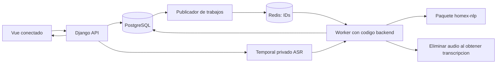

# Plan maestro de refactorización e integración HOMEX

**Fecha:** 13 de septiembre de 2026.  
**Versión del plan:** 2.1 — respuestas G01–G03, T01–T09, P29–P32 y comienzo de F00.  
**Punto de partida:** el repositorio actual `homex-nlp`.  
**Estado:** F00 completada localmente; las fases posteriores siguen pendientes. Evidencia y alcance ejecutado en [informe F00](F00_PREPARACION.md).  
**Objetivo:** terminar el componente ASR/NLP, dejarlo reproducible, evaluable e integrable y especificar su incorporación al sistema comercial Django/Vue/PostgreSQL.

## 0. Cómo utilizar este documento

Este es el documento rector para la siguiente etapa. Consolida P01–P28 con las decisiones posteriores del usuario sobre las 24 tablas del SQL v3. Estas últimas sustituyen las propuestas de versiones, promociones históricas, tablas adicionales y documentos ampliados del plan 1.0. Las respuestas finales resuelven las decisiones de §12.5/§21. Las diferencias con el SQL v3 son ahora requisitos de implementación futura, no preguntas abiertas ni cambios ya ejecutados. La [auditoría integral](ANALISIS_INTEGRAL_HOMEX.md) conserva la evidencia de los defectos; el [documento de rumbo](RUMBO_Y_DECISIONES_HOMEX.md) conserva el razonamiento previo. Ninguno debe utilizarse para reintroducir preguntas ya resueltas. Las respuestas finales se consolidan en [matriz de requisitos](requirements.md). El SQL v3 se preserva durante F00; sus ampliaciones aprobadas se trasladarán a migraciones en F07.

**Referencia estructural vigente:** [homex_bd_final_v3.sql](../homex_bd_final_v3.sql), incluidos sus comentarios finales. Las últimas decisiones explícitas del usuario prevalecen sobre propuestas previas. El SQL original `homex_bd.sql` queda como antecedente de auditoría; ya no está presente en el árbol revisado y no se enlaza como archivo disponible. Cuando una regla anterior no fue revocada pero el SQL v3 no puede representarla, el plan señala el conflicto y su puerta de resolución, en lugar de modificar silenciosamente el esquema o la regla. Las migraciones futuras serán la fuente operativa única después de trasladar y comprobar este diseño.

Cada fase indica responsable por repositorio, archivos, tareas, dependencias y condición de salida. No se marca una fase como terminada por haber creado sus carpetas: debe cumplir sus pruebas y entregar la evidencia indicada.

**Ruta de lectura:** secciones 1–5 fijan alcance, arquitectura y archivos; 6–9 describen la refactorización NLP/ASR; 10–15 especifican la conexión comercial; 16–18 cubren evidencia y operación; 19–22 son la guía de ejecución y cierre. Para iniciar un lote, leer su fase y después las secciones técnicas que referencia.

### 0.1. Dos alcances que no deben confundirse

| Alcance | Resultado | Dónde se implementa |
|---|---|---|
| A. Refactorización del componente actual | Paquete ASR/NLP, contratos, corpus validado, entrenamiento, evaluación, CLI y demostrador local sin persistencia comercial | Este repositorio, que se consolida como `homex-nlp`. |
| B. Integración del producto | Capturas persistidas, revisión, proformas mixtas, inventario, documentos, pagos, frontend y despliegue | Futuros `homex-backend`, `homex-frontend` y `homex-deploy`. |

El alcance A puede completarse sin inventar un backend comercial temporal. El alcance B necesita los repositorios futuros y pruebas con PostgreSQL real. Una integración simulada permite comprobar el contrato; no prueba que Django ya esté integrado.

### 0.2. Convenciones

- Las rutas en árboles y tablas son **rutas futuras relativas al repositorio indicado**, salvo las identificadas como existentes. No se crearán por escribir este plan.
- Los valores de configuración señalados como «iniciales» son decisiones técnicas ajustables mediante medición, no hechos empresariales atribuidos a HOMEX.
- Los términos MUST/SHOULD no son necesarios: «debe» identifica un requisito de salida; «propuesta» identifica una elección técnica pendiente de validación en la implementación.
- La autorización actual comprende actualizar decisiones y ejecutar F00. No ejecutar aún F01–F11, entrenar, modificar la lógica comercial ni desplegar; cada salida se acredita con evidencia.

## 1. Reglas consolidadas y trazabilidad de respuestas

| Respuesta | Regla que debe implementarse | Destino principal |
|---|---|---|
| P01 | Un importe sin indicación unitaria es total de línea; «cada uno»/«por unidad» activa cálculo unitario | Parser de precio y contrato monetario. |
| P02 | Mueble a medida: total comercial exacto, sin cargos separados. T08 posterior impide imponer CHECK de descuento cero sin nueva confirmación | Dominio de precios, SQL, documento. |
| P03 | Voz inicialmente para muebles; catálogo de sillas/pisos/otros en la misma proforma desde la primera versión comercial | NLP singular y frontend mixto. |
| P04 | Obligatorios según categoría/tipo y etapa; material no obligatorio bajo la convención de melamina | Perfil de validación y aprobación. |
| P05 | Aceptar m/cm/mm; conservar original; sin convención confirmada no inferir unidad/orden | Medidas y advertencias. |
| P06 | Una línea por unidad comercial; componentes permanecen dentro del mueble | Ensamblaje y especificaciones. |
| P07 | Vendedor revisa; aprobación comercial separada; crear pedido y descontar stock atómicamente | Permisos y comando de aprobación. |
| P08 + decisión v3 | Prospecto solo en BORRADOR; cliente registrado antes de enviar/aprobar; edición de la misma proforma antes de aprobar, sin versiones | Proforma y snapshots mínimos. |
| P09 | Cantidades enteras de catálogo; piso en cajas; stock general, sin reservas | Inventario y validadores. |
| P10 + decisión v3 | Cancelar pedidos no entregados genera REVERSA_VENTA; ENTREGADO no tiene transición a CANCELADO. Sin devoluciones en el sistema; bloquear cancelación con recibos EMITIDOS | Inventario; recibos erróneos se ANULAN, nunca se borran. |
| P11 | Todo pedido tiene OT y nota; jefe ve todas las líneas; entrega completa única | Taller y entrega. |
| P12 + decisión v3 | BOB y USD habilitados; catálogo base BOB, USD introducido explícitamente sin conversión; recibo hereda moneda | Precios y recibos. |
| P13 + decisión v3 | Cuatro documentos; secuencia independiente por tipo, continua sin reinicio anual; snapshots mínimos en tablas propias | Documentos y secuencias PostgreSQL. |
| P14 | 200 registros originales de HOMEX, validados comercialmente por vendedor | Manifiesto de procedencia. |
| P15 | Aún no hay audios reales para evaluación; se incorporarán posteriormente | Protocolo ASR y puerta de piloto. |
| P16 | Protocolo congelado; WER, P/R/F1 micro/macro y por etiqueta, campos/HITL/latencia/tiempo; test no se usa para ajustar | Evaluación. |
| P17 | Dos vendedores, uno por tienda | Capacidad central y concurrencia de dos clientes. |
| P18 | Web conectada, escritorio y Android/Chrome; retener Blob hasta recepción confirmada; reenvío sin redictado | Grabación y recepción idempotente. |
| P19 | Sin archivo histórico de audio | Privacidad de temporales y ausencia de consulta/reproducción posterior. |
| P20 | Solo existe este repositorio | Migración por etapas y creación futura de otros repositorios. |
| P21 | Temporal privado solo para ASR; eliminar al transcribir; error con retención corta y limpieza automática; fuera de backups | Ciclo del archivo y recuperación. |
| P22 | Stock general compartido; mostrar cantidades pendientes y disponibilidad referencial; no descontarlas ni reservar | Consulta de demanda pendiente. |
| P23 | Total negociado exacto gobierna la línea; unitario derivado no lo recalcula. Si se dictó unitario, cantidad × unitario | Contrato NLP; adaptación comercial aprobada a PRECIO_UNITARIO/TOTAL_NEGOCIADO, §10.2. |
| P24 | Promoción configurada sobre catálogo; descuento automático mientras vigente; no segundo descuento manual | Promociones y snapshot comercial. |
| P25 + decisión v3 | Pedido y OT automáticos. Nota única sin estado, receptor ni campos adicionales; se emite para realizar la entrega, nunca al aprobar; fecha de emisión | §13.2: emisión explícita cuando el pedido está LISTO_ENTREGA. |
| P26 + decisión v3 | Catálogo se prepara/verifica, no se fabrica; misma OT y estados de pedido, incluido EN_PRODUCCION | Etiquetas visuales según tipo; sin EN_PREPARACION. |
| P27 | Ningún pago antes de aprobar; pagos/recibos siempre vinculados a pedido confirmado | FK y servicio de pagos. |
| P28 | Validación comercial distinta de validación técnica NER; esta última automática antes de entrenar | Validador de corpus estricto. |

### 1.1. Propuestas anteriores que quedan descartadas

- No crear `grupos_proforma`, `movimientos_pago`, `documentos_emitidos`, `contadores_documento` ni `eventos_auditoria`. Solo se incorporan `intentos_captura` y `trabajos_outbox` a las 22 tablas originales.
- No introducir versiones históricas/de concurrencia de proforma, historial de correcciones humanas ni historial de promociones. Las versiones de modelos, contratos y métricas sí permanecen.
- No añadir estados, receptor, observaciones ni firma digital a `notas_entrega`; la firma sigue siendo física.
- No reiniciar números comerciales por año ni convertir automáticamente BOB/USD.

- No pedir aclaración de alcance ante «dos escritorios, precio 2000»: significa total de línea.
- No agregar cargos separados ni un flujo nuevo de descuentos de muebles. T08 retira la imposición automática de descuento cero por tipo: no añadir esa restricción sin confirmación empresarial.
- No conservar/reproducir audios históricos, ni respaldarlos ni utilizarlos después para reentrenar ASR.
- No dividir existencias por tienda ni bloquear por demanda referencial.
- No introducir reservas de stock por proformas.
- No desarrollar entregas parciales, varias OT/notas por pedido ni un recorrido documental distinto para sillas.
- No registrar pagos sobre proformas no aprobadas.
- No tratar el precio unitario referencial de un total negociado como cifra autoritativa.
- No eliminar las anotaciones de sillas de la fuente por quedar fuera del primer alcance de voz.

## 2. Inventario del proyecto y destino de cada archivo

La auditoría inicial encontró 200 ejemplos, 2.378 anotaciones, 18 etiquetas y 11 spans desalineados en 10 registros. El conversor interpreta otra clave y otra ruta. El SQL original tiene 22 tablas, 26 funciones y 23 triggers, con inconsistencias reproducidas. Esa auditoría corresponde exclusivamente a `homex_bd.sql`, no valida el v3. La nueva referencia contiene 24 tablas y cuatro secuencias comerciales. Esta actualización revisa estáticamente el SQL v3; su ejecución y las pruebas transaccionales/multiusuario quedan como entregables de F07.

| Archivo actual o antecedente | Qué aprovechar | Qué cambiar o retirar | Destino |
|---|---|---|---|
| `backend/nlp_engine.py` | Casos de vocabulario, fachada de procesamiento y separación inicial | Dividir esquemas, reglas, parsers y ensamblaje; retirar segmentación múltiple automática, floats monetarios y conteo de formulario vacío | `src/homex_nlp/`. |
| `backend/main.py` | Ejemplos de recepción, transcripción y respuesta | Retirar inicialización al importar, ASR HTTP bloqueante, payload HITL confiado y versión fija ficticia | Adaptador local mínimo; integración real en Django. |
| `backend/database.py` | Casos que motivaron métricas y trazabilidad | No trasladar SQLite ni sus commits por ítem; retirar cálculo por strings y autoridad del cliente | Comparador puro en NLP y servicios persistentes Django. |
| `backend/convert_to_spacy.py` | Lectura JSONL y concepto de conversión a DocBin | Claves/rutas, alineación estricta, labels, rechazo auditable, particiones por grupo | `training/`. |
| `backend/requirements.txt` | Foto de dependencias del experimento | Separar dependencias directas/runtime/ASR/dev; generar lock; eliminar librerías sin uso comprobado | `pyproject.toml` + `uv.lock`. |
| `backend/homex_trazabilidad.db` | Evidencia experimental | Fuera del runtime nuevo; no convertir automáticamente sus filas en ventas o muestras de oro | Archivo experimental protegido o referencia al commit original. |
| `frontend/index.html` | Recorrido visual de captura/corrección | No reutilizar caché única, arrays de muebles, innerHTML inseguro ni métricas como precisión NER | Demostrador pequeño; Vue futuro separado. |
| `data/dataset.jsonl` | Fuente original proporcionada por HOMEX | Mantener bytes originales verificables; corregir en una copia curada con registro de cambios | `data/raw/homex_original.jsonl` + manifiesto. |
| `homex_bd.sql` — antecedente ausente del árbol actual | Dominio documentado en auditoría | Recuperar desde Git si está disponible; no utilizarlo para crear el esquema final | Referencia histórica opcional, no prerrequisito para migrar v3. |
| `homex_bd_final_v3.sql` | Referencia vigente: 24 tablas, triggers, secuencias y semillas | Trasladar a migraciones con pruebas; resolver brechas de §12.5 sin sustituirlo por el diseño descartado | Referencia versionada y futuro esquema generado del backend. |
| `data/homex_catalogo_sillas_ner.jsonl` | 19 fichas, 182 anotaciones, 12 etiquetas | Conservar fuente; curar para NER y preparar catálogo comercial revisado en procesos distintos | Fuente/manifiesto propio y archivo de importación comercial, §8.7. |
| `Arquitectura.png` | Historia de la propuesta | Marcar como anterior; reemplazar documentación operativa por diagrama correcto | `docs/reference/` y `docs/architecture.md`. |
| `.gitignore` | Exclusión actual de caché Python | Añadir entornos, secretos, temporales, DB de ejecución, resultados/modelos pesados; mantener esquemas/manifiestos | Raíz. |
| `.vscode/settings.json` | Preferencias de desarrollo | No hacer depender el proyecto de una ruta local de Python | Raíz, opcional. |
| `docs/auditoria/` | Evidencia y casos reproducibles | Mantener como historial; convertir fallos en aserciones de rechazo para el código nuevo | Historial y tests por dominio. |

**Regla de retirada:** primero crear sustituto y pruebas, después comparar, finalmente retirar la ruta antigua. No conservar indefinidamente dos implementaciones operativas del mismo pipeline. Git preservará la historia; no copiar el proyecto completo a otro árbol activo `legacy/`.

### 2.1. Sustitución de funciones y contratos actuales

| Símbolo actual | Sustitución prevista |
|---|---|
| `DetalleMueble` | `ItemProposal` con precio discriminado, medidas tipadas y advertencias; no usarlo como detalle aprobado. |
| `CotizacionCapturada` | `ExtractionResult` singular con propuesta nullable; retirar `muebles[]` del contrato activo. |
| `normalizar_texto` | `text/reference.py` y `normalization.py`; separar texto de referencia y valores interpretados. |
| `segmentar_multiples_muebles` | Retirar de la ruta normal; detector de múltiples productos principales en ensamblaje. |
| `extraer_dimensiones_heuristica` | `extraction/dimensions.py`, con ejes/unidades/offsets y sin absorción de espesores. |
| `extraer_espesor_heuristica` | `extraction/thickness.py`, lista asociada a componentes. |
| `extraer_precio_heuristica` | `extraction/price.py`, parser completo y política HOMEX de total por defecto. |
| `extraer_cantidad_heuristica` | `extraction/quantity.py` y `text/numbers.py`, cantidades escritas y asociación al mueble. |
| `extraer_accesorios_heuristica` / `extraer_observaciones` | Recursos compartidos, `accessories.py` y ensamblaje que conserva observaciones completas. |
| `MotorNLP._cargar_modelo` / `_construir_modelo_fallback` | `model_loader.py` y modo explícito; política uniforme de reglas con o sin NER. |
| `_ensamblar_mueble_desde_ner` / `procesar_cotizacion` | `semantics/assemble.py` y `pipeline.py`, con candidatos y conflictos conservados. |
| `guardar_captura_inicial` / `guardar_items_ia` | Servicios de `apps/captures` del backend; transacción y resultado por intento. |
| `guardar_validacion_hitl` / `_calcular_metricas_item` | Servicio de confirmación Django más comparador semántico puro versionado. |
| `obtener_metricas_resumen` / `obtener_capturas_para_entrenamiento` | Consultas por corrección final/cohorte y exportación para anotación revisada; no exportación automática a NER. |
| `cargar_jsonl` / `validar_entidades` / `registros_a_ejemplos_spacy` / `guardar_docbin` | Ingesta, validación estricta y conversión en `training/`, con informe de pérdidas y tokenizador fijado. |

## 3. Arquitectura objetivo y límites de responsabilidad

### 3.1. Decisión arquitectónica

Usar un **backend Django modular** como dueño del negocio y PostgreSQL, y un **worker Celery separado** que instala el paquete `homex-nlp`. Vue consume exclusivamente la API comercial. Redis transporta identificadores de trabajo; no almacena audio ni el estado definitivo de las capturas.

En este repositorio se construye el paquete independiente. El worker de producción pertenecerá al backend porque necesita sus servicios y modelos. El paquete NLP no importará Django, modelos ORM, credenciales de base ni clases de Celery.



API y worker comparten solo el directorio temporal privado de ASR en el servidor inicial. Los documentos persistentes viven en otro almacenamiento/volumen; no comparten política de backup con esos temporales.

### 3.2. Límites por repositorio

| Repositorio futuro | Es propietario de | No es propietario de |
|---|---|---|
| `homex-nlp` — este | Contrato de extracción, ASR, reglas/NER, propuesta, corpus, evaluación offline, comparación semántica pura | Proformas, permisos, stock, promociones o persistencia de correcciones humanas. |
| `homex-backend` | Contrato API, autenticación, modelos/migraciones, trabajos, confirmación HITL, precios comerciales, documentos, pagos | Entrenamiento ni interfaces internas del modelo. |
| `homex-frontend` | Grabación/transmisión, formularios, vistas de catálogo, proforma y taller | Totales finales, stock definitivo y evidencia IA original. |
| `homex-deploy` | Imágenes/versiones, Compose, Nginx, secretos externos, backups, monitorización | Reglas comerciales ni copias alternativas del esquema. |

### 3.3. Dependencias y versionado

- Mantener inicialmente Python 3.11 como línea reproducible observada; probar una actualización por separado, no mezclarla con cambios de comportamiento.
- Usar spaCy/Pydantic/faster-whisper compatibles con el entorno comprobado como baseline; fijar versiones exactas en lock y probar instalación limpia.
- Backend: Django/DRF y Celery con versiones compatibles fijadas al crearlo. La documentación 5.2 de Django y estable de Celery es referencia de APIs, no una instrucción de instalar automáticamente lo último.
- Backend instala una versión publicada de `homex-nlp`, no una carpeta mutable ni `git main` sin pin. Durante desarrollo se permite instalación editable explícita.
- `schema_version` identifica compatibilidad del contrato; versión del paquete, modelo, ASR, reglas y perfil de normalización se registran por separado.
- Cambio incompatible del contrato → incremento mayor y prueba conjunta. Cambio de modelo → versión/hash nuevo aunque el contrato no cambie.
- El manifiesto de despliegue fija el conjunto API/frontend/paquete/modelo; no se descarga un modelo nuevo al iniciar producción.

## 4. Estructura final de este repositorio

Árbol propuesto. Los módulos se crean con responsabilidades reales y tests; no añadir abstracciones vacías por cumplir el árbol.

```text
homex-nlp/
├── README.md
├── pyproject.toml
├── uv.lock
├── .python-version
├── .env.example
├── .gitignore
├── Makefile
├── src/homex_nlp/
│   ├── __init__.py
│   ├── cli.py
│   ├── settings.py
│   ├── errors.py
│   ├── pipeline.py
│   ├── contracts/
│   │   ├── __init__.py
│   │   ├── input.py
│   │   ├── evidence.py
│   │   ├── item.py
│   │   ├── result.py
│   │   └── review.py
│   ├── asr/
│   │   ├── __init__.py
│   │   ├── service.py
│   │   ├── faster_whisper_adapter.py
│   │   └── audio_validation.py
│   ├── text/
│   │   ├── __init__.py
│   │   ├── reference.py
│   │   ├── normalization.py
│   │   └── numbers.py
│   ├── extraction/
│   │   ├── __init__.py
│   │   ├── model_loader.py
│   │   ├── ner.py
│   │   ├── rules.py
│   │   ├── dimensions.py
│   │   ├── thickness.py
│   │   ├── quantity.py
│   │   ├── price.py
│   │   └── accessories.py
│   ├── semantics/
│   │   ├── __init__.py
│   │   ├── candidates.py
│   │   ├── conflicts.py
│   │   ├── components.py
│   │   └── assemble.py
│   ├── validation/
│   │   ├── __init__.py
│   │   ├── profiles.py
│   │   └── warnings.py
│   ├── evaluation/
│   │   ├── __init__.py
│   │   ├── field_comparison.py
│   │   ├── entity_metrics.py
│   │   └── asr_metrics.py
│   └── resources/
│       ├── labels.yaml
│       ├── vocabulary.yaml
│       ├── patterns.jsonl
│       ├── units.yaml
│       └── furniture_profiles.yaml
├── training/
│   ├── __init__.py
│   ├── cli.py
│   ├── ingest.py
│   ├── validate_corpus.py
│   ├── curate.py
│   ├── split.py
│   ├── convert.py
│   ├── evaluate.py
│   ├── export_model.py
│   ├── configs/ner.cfg
│   └── policies/annotation_guide.md
├── data/
│   ├── raw/homex_original.jsonl
│   ├── raw/homex_catalogo_sillas_ner.jsonl
│   ├── manifests/catalogo_sillas.json
│   ├── curated/catalogo_sillas_v1.jsonl
│   ├── catalog/sillas_importacion.json
│   ├── manifests/source.json
│   ├── curated/homex_v1.jsonl
│   ├── curated/changes.jsonl
│   ├── splits/v1.json
│   └── corpus/                   # generado; no editar a mano
├── schemas/
│   ├── extraction-request-v1.schema.json
│   ├── extraction-result-v1.schema.json
│   └── review-comparison-v1.schema.json
├── examples/
│   ├── requests/
│   ├── expected/
│   └── integration/README.md
├── artifacts/                    # modelos e informes generados, fuera de Git
├── tests/
│   ├── conftest.py
│   ├── unit/
│   ├── corpus/
│   ├── contract/
│   ├── integration/
│   └── regression/
├── tools/
│   ├── demo_api.py
│   ├── demo_ui/index.html
│   └── export_schemas.py
├── docs/
│   ├── PLAN_MAESTRO_REFACTORIZACION_HOMEX.md
│   ├── architecture.md
│   ├── integration-django.md
│   ├── configuration.md
│   ├── evaluation-protocol.md
│   ├── model-card.md
│   ├── runbook.md
│   ├── reference/
│   └── auditoria/
└── .github/workflows/ci.yml
```

### 4.1. Responsabilidad específica de los archivos centrales

| Archivo/módulo futuro | Entrada/salida y obligación |
|---|---|
| `pipeline.py` | Fachada `extract(request) -> ExtractionResult`; orquesta texto, candidatos, resolución y validación. No persiste ni gestiona HTTP. |
| `settings.py` | Configuración tipada e inyectable; rutas explícitas, modo, hashes, límites. Ninguna ruta depende del CWD. |
| `contracts/input.py` | Texto de referencia, contexto de categoría, versiones y metadatos. No exige ID de cliente/producto que la IA desconoce. |
| `contracts/evidence.py` | Span original, etiqueta, fuente, valores y alternativas; offsets Unicode de Python con final exclusivo. |
| `contracts/item.py` | Un solo mueble propuesto; cantidad, medidas, espesores, colores, accesorios y modo de precio. |
| `contracts/result.py` | Propuesta nullable, advertencias, modo real, timings y trazabilidad. |
| `contracts/review.py` | Comparación de dos valores proporcionados por un llamador confiable; no decide quién tiene permisos. |
| `asr/service.py` | `transcribe(file_or_stream) -> TranscriptionResult`; consume por completo los segmentos antes de declarar éxito. |
| `audio_validation.py` | Verifica decodificación, duración y límites; el adaptador externo controla recepción y archivo temporal. |
| `model_loader.py` | Carga una vez por proceso, verifica compatibilidad y hash; no descarga ni cambia modo silenciosamente. |
| `rules.py` | Construye reglas desde recursos; misma configuración en entrenamiento/evaluación/inferencia cuando corresponda. |
| `conflicts.py` | Conserva candidatos y explica por qué se acepta uno; no depende de que un campo esté vacío. |
| `profiles.py` | Carga requisitos de muebles versionados; valida propuesta y comunica faltantes, no sustituye la aprobación del backend. |
| `field_comparison.py` | Compara valores canónicos, omisiones/adiciones y asociaciones; no usa `str(dict/list)`. |
| `training/validate_corpus.py` | Rechaza errores estructurales/técnicos antes de DocBin; informe por registro y salida no cero. |
| `training/split.py` | Crea IDs y particiones persistidas; separa documentos/familias y evita fuga. |
| `export_model.py` | Genera paquete/artefacto, manifiesto y métricas de dev; test sellado solo en evaluación formal. |
| `demo_api.py` | Adaptador opcional local, sin SQLite ni endpoint comercial HITL; utiliza el paquete real. |

### 4.2. Dependencias por grupo

- Runtime de texto: spaCy, Pydantic y recursos requeridos realmente.
- Extra `asr`: faster-whisper/CTranslate2 y dependencias de decodificación.
- Extra `demo`: FastAPI, servidor ASGI y multipart, sin convertirse en API comercial final.
- Desarrollo/evaluación: pytest, herramientas de lint/tipos, build y jiwer para ASR; lock reproducible.
- Entrenamiento: configuración spaCy y módulos `training`; sin cliente PostgreSQL ni Django.

No cargar ASR al importar `homex_nlp`; no requerir GPU ni descargar modelos para ejecutar los tests unitarios de texto.

## 5. Estructuras de los repositorios futuros

### 5.1. `homex-backend`

```text
homex-backend/
├── manage.py
├── pyproject.toml
├── uv.lock
├── .env.example
├── config/
│   ├── settings/{base,local,test,production}.py
│   ├── urls.py
│   ├── asgi.py
│   ├── wsgi.py
│   └── celery.py
├── apps/
│   ├── accounts/{models,permissions,services}.py
│   ├── catalog/{models,queries,services,serializers,views,urls}.py
│   ├── customers/{models,services,serializers,views,urls}.py
│   ├── quotations/
│   │   ├── models.py
│   │   ├── pricing.py
│   │   ├── validation.py
│   │   ├── services.py
│   │   ├── queries.py
│   │   └── {serializers,views,urls}.py
│   ├── captures/
│   │   ├── models.py
│   │   ├── audio_store.py
│   │   ├── nlp_adapter.py
│   │   ├── tasks.py
│   │   ├── services.py
│   │   ├── outbox.py
│   │   ├── reconciliation.py
│   │   └── {serializers,views,urls}.py
│   ├── orders/{models,services,queries,serializers,views,urls}.py
│   ├── inventory/{models,services,queries,serializers,views,urls}.py
│   ├── workshop/{models,services,serializers,views,urls}.py
│   ├── deliveries/{models,services,serializers,views,urls}.py
│   ├── payments/{models,services,queries,serializers,views,urls}.py
│   └── documents/{services,rendering}.py
├── sql/{catalogs,quotations,stock,orders,receipts,captures}.sql
├── templates/documents/{quotation,work_order,delivery,receipt}.html
├── tests/{integration,concurrency,api,contracts}/
├── docs/{api-contract,permissions,migrations,runbook}.md
├── Dockerfile
└── .github/workflows/ci.yml
```

Las apps con modelos tendrán `__init__.py`, `apps.py`, `migrations/` y tests. `documents` es un módulo de servicios/plantillas sin tablas propias ni numerador Python; usa las secuencias de PostgreSQL. No habrá app `audit` ni tabla de eventos. `catalog/management/commands/import_sillas.py` ofrecerá validación, previsualización y carga explícita del archivo comercial revisado, nunca del resultado NLP en vivo. La notación `{a,b}.py` representa archivos separados. No se copia todo el SQL en cada app: funciones especiales se versionan mediante las migraciones propietarias y la fuente SQL correspondiente.

Responsabilidades críticas: `pricing.py` selecciona precios/promociones y valida entradas; los triggers son autoridad de totales y stock y se prueban contra el cálculo esperado, sin duplicar escrituras; `inventory/queries.py` calcula demanda pendiente; `nlp_adapter.py` traduce el contrato del paquete; `audio_store.py` implementa temporales; `tasks.py` coordina intentos; `services.py` confirma desde evidencia del servidor. `documents/rendering.py` genera los cuatro documentos sin audio.

### 5.2. `homex-frontend`

```text
homex-frontend/
├── package.json
├── package-lock.json
├── vite.config.ts
├── tsconfig.json
├── .env.example
├── src/
│   ├── main.ts
│   ├── App.vue
│   ├── router/index.ts
│   ├── api/{client,generated}.ts
│   ├── stores/{session,quotation,capture}.ts
│   ├── composables/{useRecorder,useUpload,useCaptureStatus}.ts
│   ├── views/{QuotationEditor,CatalogView,WorkshopView,DeliveryView,PaymentsView}.vue
│   ├── components/capture/{Recorder,Transcript,ItemReview,WarningList}.vue
│   ├── components/quotation/{LineEditor,PriceEditor,DimensionsEditor,CatalogPicker,StockIndicator}.vue
│   ├── components/documents/DocumentPreview.vue
│   └── utils/{decimalDisplay,offsets,errors}.ts
├── tests/{unit,e2e}/
└── .github/workflows/ci.yml
```

`generated.ts` procede de la API Django. El editor de dinero distingue origen TOTAL_NEGOCIADO/PRECIO_UNITARIO; CATALOGO describe la selección de producto, no un modo de cálculo. `StockIndicator` presenta stock, pendientes y disponibilidad referencial; no reserva. `offsets.ts` convierte índices Python Unicode a índices UTF-16 cuando sea necesario para resaltar texto en JavaScript.

### 5.3. `homex-deploy`

```text
homex-deploy/
├── compose.yaml
├── compose.production.yaml
├── .env.example
├── releases/manifest.yaml
├── nginx/{nginx.conf,homex.conf}
├── redis/redis.conf
├── scripts/{deploy,backup,restore,smoke,cleanup-audio}.sh
├── monitoring/README.md
└── docs/{installation,operations,recovery}.md
```

Compose ejecutará frontend/Nginx, API, worker, publicador/reconciliador, PostgreSQL y Redis. El limpiador de audio debe seguir funcionando aunque el worker NLP caiga; no depender exclusivamente de una tarea que compite en la misma cola de inferencia.

## 6. Contratos de extracción y compatibilidad

### 6.1. Entradas públicas del paquete

Interfaz conceptual a implementar y probar:

```python
engine.extract(request: ExtractionRequest) -> ExtractionResult
asr.transcribe(source: BinaryIO | Path) -> TranscriptionResult
compare_review(original: ItemProposal | None, reviewed: ItemProposal | None) -> ReviewComparison
```

El paquete recibe un archivo/stream autorizado, nunca una URL arbitraria descargada por él. La vida del archivo la gestiona el adaptador llamador. Cada operación admite configuración inyectada para pruebas. El motor se construye por proceso y se reutiliza.

`ExtractionRequest`: `schema_version`, `request_id`, `text`, `language`, `expected_item_type=MUEBLE_MEDIDA`, `currency_context` (BOB/USD), `domain_profile_version` y metadatos de transcripción opcionales. IDs Django, usuario y proforma quedan en el sobre del backend; no se necesitan para reconocer lenguaje.

`TranscriptionResult`: texto original, idioma/modelo real, segmentos textuales con tiempos, duración, latencia y señales ASR útiles. No incluye bytes de audio ni URL recuperable. Se permiten datos incompletos con causa; no presentar log-probabilidades como confianza calibrada de una dimensión.

### 6.2. Campos de una propuesta singular

| Campo | Tipo/semántica |
|---|---|
| `item_type` | `MUEBLE_MEDIDA` para el alcance de voz v1. |
| `name`, `furniture_type_candidate` | Texto reconocido y candidato de tipo; nullable, sin inventar ID maestro. |
| `quantity` | Entero positivo o null; si falta, advertencia, sin valor 1 oculto. |
| `dimensions` | Colección tipada por eje, valor decimal, unidad original/canónica y evidencia; dimensiones sin eje/unidad quedan en pendientes. |
| `thicknesses` | Lista de valores por componente; preserva mesón 25 y estructura 18. |
| `primary_color`, `secondary_color` | Valores candidatos; asociaciones de componente si se dictan. Los requisitos se rigen por perfil. |
| `accessories` | Lista de objetos con nombre, cantidad opcional, componente y evidencia. |
| `price` | Modo, importe dictado, moneda/contexto y totales derivados solo cuando haya datos suficientes. |
| `observations` | Texto técnico conservado; no reemplazarlo por un único marcador «Según diseño». |
| `unresolved` | Candidatos ambiguos/no asociados; no se eliminan para producir una salida aparentemente limpia. |

No se exige `material`. Si se dicta «melamina», se conserva como evidencia/contexto sin crear un campo comercial obligatorio. Si se dicta MDF u otro material, conservarlo y advertir que debe revisarse el alcance; no convertirlo silenciosamente en melamina ni diseñar un maestro de materiales innecesario.

### 6.3. Ejemplo normativo: total negociado

Ejemplo reducido; el esquema generado describirá también evidencia y métricas. No confundir este contrato con una fila SQL.

```json
{
  "schema_version": "1.0",
  "request_id": "demo-001",
  "status": "REQUIRES_REVIEW",
  "text_original": "Tres escritorios, total cien bolivianos",
  "item_proposal": {
    "item_type": "MUEBLE_MEDIDA",
    "name": "escritorios",
    "quantity": 3,
    "dimensions": [],
    "thicknesses": [],
    "accessories": [],
    "price": {
      "mode": "TOTAL_NEGOCIADO",
      "stated_amount": "100.00",
      "currency": "BOB",
      "line_total": "100.00",
      "unit_price_input": null,
      "unit_price_reference": "33.33",
      "reference_is_approximate": true,
      "origin": "EXPLICIT_TOTAL"
    }
  },
  "warnings": [],
  "proposed_item_count": 1,
  "engine": {"mode": "RULES_ONLY", "model_version": null, "rules_version": "1.0"}
}
```

«Tres escritorios, precio cien» produce el mismo modo con `origin=HOMEX_DEFAULT_TOTAL`, sin advertencia de alcance. «Tres escritorios a cien cada uno» produce `PRECIO_UNITARIO`, `unit_price_input=100.00` y `line_total=300.00`. Si falta cantidad, no se calcula total desde un unitario.

El contexto de moneda proviene de la proforma; una moneda explícita contradictoria requiere revisión y nunca conversión automática. Un símbolo ambiguo no basta para inferir USD. La serialización monetaria usa strings decimales. Un precio explícito cero no equivale a ausencia; su admisibilidad comercial se configura y no se permite una venta sin precio definido. Un negativo se conserva como evidencia rechazada. El total negociado no se reconstruye desde `unit_price_reference`.

### 6.4. Evidencia y advertencias

Cada candidato debe registrar: `candidate_id`, `label`, `start`, `end`, `text`, `source` —NER/RULE/PARSER—, `normalized_value`, `component_ref` y decisión/motivo cuando hubo conflicto. `start/end` pertenecen al texto original exacto, con final exclusivo; validar incluso caracteres acentuados y emoji.

Advertencias mínimas: `NO_PRODUCT`, `NO_QUANTITY`, `MULTIPLE_MAIN_PRODUCTS`, `MISSING_UNIT`, `MISSING_AXIS`, `CONFLICTING_VALUES`, `UNSUPPORTED_MATERIAL`, `UNKNOWN_TERM`, `INVALID_NUMBER`, `INVALID_PRICE`, `UNSUPPORTED_CURRENCY`, `REQUIRED_FIELD_MISSING`, `RULES_ONLY_MODE`, `MODEL_UNAVAILABLE`, `INVALID_OFFSET`. Incluir ruta y severidad; el backend decide qué bloquea guardar borrador y qué bloquea aprobar.

Texto sin mueble → `item_proposal=null`, conteo cero y advertencias. No devolver una lista con un mueble vacío. No retornar éxito silencioso cuando el modelo falló.

### 6.5. Validación escalonada

1. Evidencia: puede contener valores inválidos del dictado, identificados como tales.
2. Propuesta: estructura válida, valores interpretados o pendientes, sin exigir completitud comercial.
3. Propuesta incompleta: permanece en `resultado_raw` y, si corresponde, `items_ia`; el formulario conserva la edición pendiente. El detalle exige nombre, cantidad entera positiva, unidad y fuente de precio válida según modo incluso en BORRADOR. En v3 el unitario es obligatorio; G01 lo adapta para TOTAL_NEGOCIADO en F07. No inventar ceros/unos para persistir faltantes. La proforma puede existir sin líneas.
4. Emisión/aprobación: cliente registrado, al menos una línea, total positivo, especificaciones de muebles con JSON V1 válido; perfiles solo si HOMEX los ha proporcionado; BOB o USD con precios explícitos en la moneda de la proforma; stock se verifica al aprobar.

El perfil de tipo define ejes obligatorios, colores/espesores aplicables. La lista real de perfiles todavía debe cargarse con HOMEX: no inferir una matriz normativa del corpus. La ausencia de perfil no bloquea emisión/aprobación: validar estructura JSON V1 y requisitos generales reales; no inventar obligatoriedad de dimensiones/espesor/color. El vendedor verifica la suficiencia comercial. Solo aplicar un perfil cuando HOMEX lo proporcione.

### 6.6. Adaptador entre contrato rico y JSONB V1

El resultado NLP conserva evidencia, medidas tipadas y componentes en `intentos_captura.resultado_raw`. Es la fuente original; `items_ia` es una proyección con nombre, espesor, colores, dimensiones, accesorios, cantidad, precio_total y observaciones. No copiar todo el contrato a columnas que no existen.

El JSON comercial de `especificaciones_mueble` exige `schema_version=1`, espesor como `{"espesor":"18 mm"}`, dimensiones con claves exclusivamente ancho/alto/profundidad/largo/diametro y valores de texto, y accesorios como array de strings. Ejemplo: `{"ancho":"1.80 mts","alto":"80 cm"}` y `["dos cajones con correderas telescópicas"]`. No almacenar objetos canónicos de valor/unidad en esas columnas ni añadir claves de componente rechazadas por el trigger.

El adaptador conserva unidades originales; normaliza solo para validación/comparación. Cuando existen varios espesores/componentes, preparar una representación textual explícita revisada —por ejemplo `{"espesor":"estructura: 18 mm; mesón: 25 mm"}`— y usar descripción/observaciones para medidas de componentes que no caben en los cinco ejes. La OT debe imprimir esas especificaciones; no confiar en que el taller consulte resultado_raw. Si no se puede representar un caso sin pérdida comprensible, revisar su representación con el vendedor antes de confirmar y revisar el contrato comercial antes de alterar JSON V1. La aceptación de strings por el trigger no certifica completitud técnica del mueble.

`items_humano` conserva la corrección final en sus campos compatibles, vinculada solo a item_ia. No agregar columnas de dimensiones normalizadas, origen o metadatos duplicados por conveniencia del parser. `schema_version` del contrato NLP y el SMALLINT del JSON comercial son versiones distintas.

## 7. Refactorización del motor de texto

### 7.1. Referencia y normalización

- Conservar texto exacto de ASR/entrada; NER y spans trabajan inicialmente sobre esa referencia.
- Reconocer variantes con LOWER, recursos de vocabulario y parsers; normalizar el valor interpretado después.
- Eliminar sustitución global coma→punto: el separador depende del contexto y formato completo.
- Si se introduce una vista normalizada para mejorar NER, exigir mapa bidireccional de offsets y corpus compatible antes de activarla.
- No eliminar muletillas o «este» globalmente; pueden cambiar límites o significado. Cualquier limpieza debe estar probada.
- Conservar negaciones y rectificaciones: «no de 18, de 25» no puede terminar en 18 por orden de aparición.

### 7.2. Parsers determinísticos

| Parser | Casos obligatorios | Límites |
|---|---|---|
| Números | Dígitos, coma decimal contextual, punto, números escritos, miles | Consumir todo el fragmento; `1.500.00` no puede aceptarse parcialmente como 1.5. |
| Cantidad | «dos escritorios», «cantidad 2», «dos unidades», «un par» si inequívoco | No confundir tres cajones con cantidad de muebles. |
| Dimensiones | m/cm/mm, abreviaturas, número pegado a unidad, ejes antes/después | Canonizar a mm; sin unidad/eje marcar pendiente; `x/por` no fija orden por sí solo. |
| Espesor | «estructura de 18 mm», «mesón engrosado a 25» con unidad/contexto suficiente | Asociar componente; no registrarlo además como ancho sin evidencia. |
| Precio | «precio 2000», «total 2000», «a 1000 cada uno», «por unidad», números escritos y Bs | Default total; moneda contextual BOB o USD marcada y proporcionada por el backend; varios importes contradictorios requieren resolución. |
| Accesorios | Variantes regionales, cantidad, componente | Deduplicar por identidad/asociación, no solo string; no convertirlos automáticamente en líneas. |

Ejemplos de separadores: `1,500.00` reconoce 1500.00 si el patrón completo es válido; `1.500 Bs` se interpreta con la política monetaria empresarial documentada y probada, no con la regla de dimensiones. Para notación que admita dos lecturas, conservar alternativas y revisión. La convención de precio total no elimina la ambigüedad del valor numérico.

### 7.3. NER y reglas

- Mantener NER HOMEX como componente contextual; no utilizar etiquetas genéricas LOC/ORG/MISC como cobertura del dominio.
- Inicializar la configuración híbrida tanto con modelo entrenado como en evaluación; no añadir reglas únicamente si falta el modelo.
- Extraer candidatos NER y candidatos de reglas antes de resolver; no escribir todos ciegamente sobre `doc.ents` perdiendo alternativas.
- Elegir un mecanismo principal por catálogo. EntityRuler/patrones pueden compartir recursos; no mantener tres listas diferentes en regex, Matcher y PhraseMatcher.
- Regla exacta valida formato; la semántica decide función. Ninguna prioridad global NER>regex o regex>NER es suficiente.
- Conservar una salida `RULES_ONLY` explícita para pruebas/degradación permitida. Producción no cambia a fallback sin estado visible, métrica y política de despliegue.
- No agregar LLM, entrenamiento online automático ni segmentación multiproducto general al alcance actual.

### 7.4. Ensamblaje

`assemble.py` identifica un producto principal, asocia componentes, agrupa ejes y resuelve rectificaciones. Ante dos productos principales, devuelve advertencia y evita incorporar ambos a una proforma desde una misma captura. El vendedor puede redictar por separado o ingresar manualmente.

Deduplicación debe respetar orientación y componente: dos valores de 800 mm pueden corresponder a ancho y alto. Dos bisagras de componentes distintos no necesariamente son un duplicado.

## 8. Corpus, entrenamiento y evaluación técnica

### 8.1. Ingesta y conservación

1. Calcular hash SHA-256 del dataset original antes de moverlo; copiarlo sin cambiar saltos de línea ni offsets.
2. Crear manifiesto con procedencia HOMEX, 200 registros comerciales, fecha/versión y alcance de validación comercial. No inventar nombres de anotadores ni fechas desconocidas.
3. Asignar ID estable por registro y hash del texto; no usar posición de línea como única identidad después de curar.
4. Copia curada independiente y `changes.jsonl` con motivo, spans antes/después y revisión.
5. Conservar sillas en la fuente. Identificar partición por categoría de forma revisada; no inferir que todo lo no reconocido es mueble.

### 8.2. Validador automático previo a entrenar

Debe verificar JSON válido; claves y tipos; texto no vacío; label list; tripletas válidas; enteros no booleanos; `0 <= start < end <= len(text)`; contenido no vacío; etiqueta admitida por la ontología fuente; duplicados/solapamientos; alineación estricta con el tokenizador exacto; distribución por etiqueta; duplicados de texto y partición; consistencia entre manifiesto y conteos.

La entrada acepta explícitamente `label` del corpus original y la transforma a la representación interna. Si encuentra `label` y `entities` contradictorios, falla; no prefiere una silenciosamente. No aceptar ausencia de clave como lista vacía para un corpus que declara anotaciones.

Los ejemplos negativos son válidos solo si están marcados como negativos intencionados. No llamar «corpus válido» a 200 textos accidentalmente sin entidades.

La validación técnica automatiza la detección, no decide automáticamente nuevos límites semánticos. Revisar las 11 desalineaciones conocidas y cualquier otra aparecida con un tokenizador actualizado. Corregir límite o tokenización con evidencia; no usar `expand` para ocultarlas.

### 8.3. Ontología y subconjunto v1

| Etiquetas fuente | Tratamiento |
|---|---|
| PRODUCTO, CANTIDAD, ESPESOR, ACCESORIO, OBSERVACION | Conservar y documentar límites, plurales y componentes. |
| ANCHO, ALTO, PROFUNDIDAD | Mantener orientación cuando esté sustentada; secuencias sin convención pasan a revisión de anotación. |
| PRECIO_TOTAL | Mantener fuente original; revisar semántica de frases unitarias al ampliar corpus. El parser determina modo final. |
| MATERIAL | Conservar evidencia; no hacerlo obligatorio para muebles. No enseñar que toda ausencia de etiqueta equivale a melamina. |
| MODELO, ERGONOMIA, APOYABRAZOS, CABECERA, SOPORTE_LUMBAR, SISTEMA, INCLINACION, POSICIONES | Conservar registros de catálogo; fuera del objetivo NER de muebles v1 con exclusión explícita, no descarte silencioso. |
| COLOR y DISENO del catálogo nuevo | Existen anotaciones reales en la fuente de sillas; documentar vocabulario y cobertura. Esto no demuestra cobertura entrenada de color/diseño en muebles. Curar y separar dominios antes de usar para entrenamiento. |

`labels.yaml` diferencia etiquetas de fuente, etiquetas de entrenamiento v1 y mapeo de salida. Un label fuera del subconjunto no es «desconocido»: el informe justifica la selección. No entrenar cada texto de silla como negativo de muebles sin una política documentada.

### 8.4. Particiones y configuración

- Auditar similitud/familias aunque todos los registros sean originales; originalidad no garantiza independencia lingüística.
- Crear `splits/v1.json` con IDs, grupos, seed y hash del corpus/tokenizador. Propuesta inicial: aproximadamente 70/15/15 por grupos, ajustada para soporte de etiquetas; registrar conteos reales, no forzar proporciones que rompan grupos.
- Mantener test sellado. Reglas, normalización, EntityRuler e hiperparámetros se ajustan con train/dev solamente.
- Si una etiqueta tiene soporte insuficiente, reportarla y recopilar más ejemplos; no mover registros entre particiones después de ver test para mejorar el resultado.
- Convertir a `train.spacy`, `dev.spacy`, `test.spacy`, documentando cada exclusión. Validar con las herramientas de spaCy.
- Crear configuración reproducible; seleccionar `model-best` mediante dev y conservar `model-last` para diagnóstico. Registrar seeds, dependencias, tokenizador y hash de config.
- Comparar reglas solas, NER solo e híbrido en las mismas particiones. El modelo híbrido solo se promueve si su aporte está demostrado en las métricas acordadas.

La configuración y particiones explícitas permiten reproducir entrenamiento y evaluación; spaCy documenta este flujo de corpus/configuración/modelos. [Guía oficial de entrenamiento](https://spacy.io/usage/training).

### 8.5. Artefactos de entrega del modelo

Cada versión: modelo, manifiesto con hash, etiquetas soportadas, corpus/split/config usados, versiones de normalización/reglas, métricas por etiqueta y globales, limitaciones, ejemplos de regresión, memoria/latencia y condición de fallback. No llamar `spaCy-HOMEX-v4` a una configuración de reglas sin entrenamiento.

La ficha de modelo distingue evaluación offline de un piloto con vendedores. La ausencia actual de audios reales impide declarar WER y desempeño extremo a extremo medidos.

### 8.6. Evaluación ASR sin guardar audio

Preparar un procedimiento de evaluación en vivo: el vendedor dicta, se procesa el temporal, se elimina y se conservan hipótesis ASR, referencia humana y métricas. La referencia humana debe obtenerse de un guion efectivamente leído o de una observación/transcripción independiente durante la sesión; no inventarla a partir de la salida ASR.

WER se puede calcular posteriormente con esos dos textos. **No se podrá volver a ejecutar otro ASR sobre los mismos audios eliminados.** Para comparar configuraciones de ASR, hacerlo durante la misma sesión y ventana de procesamiento autorizada, o recopilar otra sesión bajo el protocolo. No introducir un archivo de audios de evaluación para eludir P19/P21.

### 8.7. Catálogo real de sillas: dos usos separados

La revisión del archivo nuevo encontró **19 registros, 182 anotaciones y 12 etiquetas**. Con spaCy 3.8.13 y `spacy.blank("es")` no se encontraron offsets fuera de rango ni spans desalineados en modo estricto. Es una comprobación técnica del tokenizador indicado, no una certificación semántica ni una evaluación de modelo. Repetirla con el tokenizador definitivo y verificar también duplicados/solapamientos en F02.

| Uso | Procedimiento y salida |
|---|---|
| Evidencia/NER | Copia raw verificable, manifiesto independiente, ontología fuente que admite COLOR y DISENO, copia curada y partición por familia. No sumar automáticamente estas fichas al conjunto de 200 cotizaciones ni tratar 219 registros como ejemplos independientes. |
| Catálogo comercial | Preparar `data/catalog/sillas_importacion.json` con identificador de fuente, nombre comercial confirmado, SKU si existe, categoría, colores, especificaciones y campos faltantes. El comando Django hace dry-run, informa conflictos y carga solo fichas revisadas. |

Las fichas no proporcionan precios ni existencias; tampoco traen identificadores SKU, marca o modelo como campos estructurados. Ocho textos no tienen etiqueta PRODUCTO. No asignar una marca/modelo por deducción, no inventar nombres definitivos ni importar el precio por defecto cero como precio validado para venta. Se puede preparar una ficha inactiva con precio pendiente de validación; al habilitarla, el vendedor confirma datos comerciales. El stock nace en cero y se carga exclusivamente con `CARGA_INICIAL` a partir de un conteo real.

El importador crea `productos` y `productos_silla` en la misma transacción; resuelve códigos de catálogo existentes y nunca presupone IDs numéricos. No duplica productos al reejecutarse: requiere un SKU confirmado o un mapa de correspondencias persistido en el artefacto de importación; el nombre genérico «Silla Ejecutiva» no es una clave única. El SQL v3 siembra diez colores, pero no crea productos ni marcas reales.

Para `especificaciones` JSONB conservar características heterogéneas como materiales, ergonomía, cabecera, apoyabrazos, soporte lumbar, sistema e inclinación, con claves documentadas y valores revisados. Por ejemplo, una ficha puede guardar `{"materiales":["malla"],"cabecera":"ajustable en altura y ángulo"}`. Las etiquetas ayudan a proponer esta estructura; la revisión verifica contexto y evita perder características sin anotación.

**Colores alternativos no equivalen a colores simultáneos.** La ficha 5 dice «celeste con gris», compatible con los dos colores de una silla. La ficha 11 ofrece cuatro colores disponibles y la 12 enumera negro/guindo/plomo: no truncar a dos ni crear una silla tricolor. Obtener de HOMEX los SKU/identificadores de cada presentación antes de cerrar la carga (§21). P32 confirma productos/SKU independientes por presentación con stock propio, sin tabla de variantes. Falta asignar las identificaciones reales de cada ficha; no deducirlas ni inventarlas.

Familias casi idénticas —por ejemplo las fichas 2 y 3 que cambian de color— pertenecen al mismo grupo al particionar corpus. Comparar también con las sillas presentes en las 200 cotizaciones. La voz v1 sigue centrada en muebles a medida; el catálogo nuevo no amplía por sí solo el alcance de voz ni autoriza altas automáticas de productos.

## 9. Ciclo de vida de audio y procesamiento recuperable

### 9.1. Recepción en navegador y backend

1. El navegador graba un ítem y mantiene el Blob en memoria hasta una respuesta de recepción confirmada.
2. Envío multipart con referencia de proforma e identidad estable de recepción, según el protocolo a cerrar en §14.3. No existe versión de proforma en v3. Repetir la misma carga debe conservar identidad y contenido.
3. Backend comprueba identidad/permisos, tamaño y tipo soportado; transmite a un temporal privado con nombre aleatorio y permisos restrictivos.
4. Verifica archivo completo/checksum y registra captura e intento en una transacción; el trigger crea el outbox. La ruta y vencimiento del archivo son metadatos privados temporales externos a las 24 tablas; nunca `archivos_adjuntos` ni payloads públicos.
5. Responde 202 con ID y `received=true` solo cuando archivo y registro están listos para procesar. Si hubo respuesta perdida, el reenvío devuelve la misma captura; distinto contenido con la misma clave → 409.
6. El cliente libera el Blob después de la recepción confirmada. Un posterior vencimiento del audio permite nueva carga/captura, sin prometer recuperación infinita de un Blob ya liberado.

No almacenar en IndexedDB, service worker, storage permanente del navegador o backups. Si se cierra la pestaña antes de recepción, no se garantiza conservar la grabación; es consecuencia del alcance conectado y sin archivo histórico.

### 9.2. ASR, transcripción y eliminación

- Worker reclama el intento bajo bloqueo, comprueba identidad/estado y TTL, y abre el temporal. V3 no tiene columnas de lease; la exclusión y recuperación se implementan como protocolo técnico (§9.4), no como campos existentes.
- Consumir todos los segmentos de faster-whisper; su llamada inicial no equivale por sí sola a transcripción terminada.
- Tras obtener la transcripción, cerrar handles y eliminar inmediatamente el archivo, sin esperar al NLP o a la revisión humana. Registrar intento de borrado y confirmar ausencia.
- Persistir el texto y metadatos del resultado mediante una operación corta. Si el texto ya está confirmado y el proceso cae, el siguiente intento continúa desde texto y no solicita audio.
- Existe una ventana inevitable entre obtener transcripción, borrado y commit: no hay atomicidad entre filesystem y PostgreSQL. Si se borró el audio y no se pudo persistir el texto, registrar/recuperar el intento como `TRANSCRIPT_NOT_COMMITTED_AUDIO_GONE`; requerirá nueva entrada. No retener audio exitosamente transcrito para ocultar esa ventana.
- Si falla el borrado, no ofrecer audio al usuario: emitir alerta de limpieza, cerrar acceso y ejecutar limpieza prioritaria. La prueba debe cubrir este caso; no considerar cumplida la política mientras el archivo permanezca.
- Si ASR falla antes de producir transcripción, permitir reintentos acotados dentro del TTL. Si termina sin texto comprensible, tratarlo como entrada no útil, eliminar temporal y pedir nueva entrada.
- Si falla solo NLP, reintentar sobre el texto persistido. No conservar ni recrear audio a partir de él.

### 9.3. Parámetros iniciales propuestos

| Parámetro | Valor inicial para implementar/pruebas | Motivo |
|---|---|---|
| Tamaño máximo de audio | 10 MiB | Límite de recepción; evita cargas no acotadas. |
| Duración máxima | 120 s | Dictado de un ítem; ajustar tras piloto. |
| Retención máxima temporal desde recepción | 15 min | Ventana corta absoluta, no renovable en cada retry. |
| Reintentos ASR | 2 adicionales al intento inicial | Errores transitorios dentro del TTL. |
| Limpieza de huérfanos | Cada 60 s y al arrancar | También cubre caída de API/worker. |
| Tiempo máximo de procesamiento de una tarea | 180 s | Límite técnico inicial; medirlo y coordinarlo con cierre/borrado. |
| Concurrencia ASR | 1 | Dos vendedores pueden esperar en cola sin duplicar modelos. |

No son límites comerciales del usuario. El limpiador coordina con el proceso ASR y sus metadatos temporales mientras no venza el plazo máximo; si vence, cancela el trabajo y elimina el temporal. No ampliar indefinidamente TTL porque haya backlog. El endpoint avisa saturación antes de aceptar trabajos que no pueda procesar dentro de la ventana.

El directorio no se publica por Nginx, no se incluye en imágenes/backups, no existe endpoint GET de audio y sus rutas no se devuelven en API. Nginx/servidor multipart también generan posibles temporales: configurar sus buffers en ubicaciones excluidas y aplicar limpieza; no vigilar solamente el archivo del worker.

### 9.4. Estados y trabajos compatibles con v3

| Registro/campo | Valores exactos | Uso |
|---|---|---|
| `capturas.estado` | PENDIENTE, PROCESANDO, COMPLETADA, ERROR | Estado agregado del procesamiento de la entrada. COMPLETADA significa procesamiento finalizado, no aprobación comercial. |
| `intentos_captura.estado` | PENDIENTE, PROCESANDO, FINALIZADO, ERROR | Estado de una ejecución técnica. |
| `intentos_captura.etapa_alcanzada` | NULL, ASR, NLP, COMPLETO | Última etapa alcanzada; no otro catálogo de estados. |

No persistir EN_COLA, REQUIERE_VALIDACION, DESCARTADO, PROCESANDO_AUDIO ni COMPLETADO en estas columnas. La API deriva «esperando procesamiento», «pendiente de revisión» o «incorporada» desde outbox, intento, `items_humano` y `capturas.proforma_detalle_id`. No confundir COMPLETADA de captura con FINALIZADO de intento. No existe campo `audio_estado` en v3.

Un intento nuevo tiene número positivo único por captura. Asignarlo bajo bloqueo de captura; `input_hash` no es único porque los reintentos pueden consumir la misma entrada. Registrar versiones ASR/NLP reales, tiempos, etapa y errores. Las versiones adicionales de contrato/reglas y la evidencia detallada viven en `resultado_raw`, sin inventar columnas.

`trg_crear_outbox_intento` crea automáticamente un trabajo por intento, con clave `captura-{id}-intento-{numero}`. Django inserta el intento y **no inserta otro outbox**. El publicador consulta `publicado_at IS NULL` y `disponible_at`, publica IDs y actualiza `intentos_publicacion`, `ultimo_error` y `publicado_at`. Si cae después de publicar y antes de marcar, habrá duplicados: no ofrece ejecución exactamente una vez.

El worker reclama por ID/estado bajo bloqueo; no ejecuta un intento cerrado ni admite resultados atrasados sobre una captura ya confirmada. Evitar transacciones abiertas durante ASR: reclamo corto, cómputo fuera de transacción y cierre condicionado por estado/identidad. Un reconciliador usa `inicio_at`, límite técnico de tarea y proceso supervisor para detectar ejecución abandonada; cierra ERROR y crea un nuevo intento cuando corresponde. Probar que un worker antiguo no puede cerrar con éxito un intento ya vencido. No implementar un lease ficticio en columnas ausentes.

En el cierre exitoso, una sola transacción escribe `resultado_raw`, estado FINALIZADO y timings; después crea como máximo un `items_ia` y actualiza captura. El orden importa: `fn_validar_item_ia_intento` exige intento FINALIZADO con resultado no nulo. Un resultado sin propuesta conserva su evidencia sin fabricar una fila vacía. No sobrescribir `resultado_raw` de intentos cerrados ni editar `items_ia`; cambios humanos van a `items_humano`.

Reconciliar también trabajos publicados cuyo procesamiento no comenzó y temporales vencidos. Outbox recupera la intención de ejecutar; no recupera un audio eliminado. Celery usa JSON, IDs, resultados comerciales en PostgreSQL, prefetch inicial 1 y acknowledgement tardío solo con el protocolo idempotente probado. El timeout del broker no sustituye el TTL del archivo. La idempotencia de carga HTTP requiere trabajo adicional, descrito en §14.3; la clave de outbox no la resuelve.

## 10. Precios comerciales y correspondencia con SQL v3

El NLP extrae importe y significado; Django valida y selecciona precios; PostgreSQL calcula los importes persistidos. No aplicar dos veces la misma promoción ni dejar que el navegador sea autoridad de totales.

### 10.1. Campos y fórmula del v3 antes de las ampliaciones aprobadas

`proformas_detalle` tiene `cantidad INTEGER`, `precio_unitario NUMERIC(12,2)`, `descuento NUMERIC(12,2)`, `precio_antes_snapshot`, `precio_ahora_snapshot` y `total NUMERIC(14,2)`. Cantidad y precio son obligatorios. No contiene `modo_precio`, `importe_negociado`, `precio_unitario_final`, `promocion_id`, subtotal de línea ni campo de origen manual/NLP.

El trigger v3 calcula `total = cantidad × precio_unitario − descuento`. El descuento es **importe total de la línea**, no porcentaje ni descuento unitario. La cabecera suma brutos, descuentos y totales. Una línea incompleta permanece en propuesta/formulario, no se inserta con datos ficticios. Se permiten importes cero en el esquema, pero emitir exige total positivo; validar precios pendientes de catálogo antes de habilitar su selección.

| Caso compatible | Valores persistidos | Resultado |
|---|---|---|
| Tres muebles a 100 cada uno | cantidad 3, precio_unitario 100.00, descuento 0 | Total 300.00. |
| Cuatro sillas, antes 1500 y ahora 1200 BOB | cantidad 4, precio_unitario 1500.00, descuento 1200.00; snapshots 1500.00/1200.00 | Bruto 6000.00, rebaja 1200.00, total 4800.00. |
| Dos sillas cotizadas explícitamente a 180 USD | cantidad 2, precio_unitario 180.00, descuento 0, snapshots de promoción nulos | Total 360.00 USD. No convertir 1500 BOB a USD. |

Serializar dinero como strings decimales; usar Decimal, dos decimales y validación de formato/rango/valores finitos. Probar equivalencia Python/SQL; no aceptar truncamiento silencioso de precios con precisión excesiva. El formato visual no cambia la fuente de cálculo.

### 10.2. Total negociado: decisión G01/P29 cerrada

La línea tendrá discriminador contractual `modo_calculo` con valores **PRECIO_UNITARIO** y **TOTAL_NEGOCIADO**. Es parte de la regla de cálculo, no origen redundante. Incorporar en F07 `importe_negociado NUMERIC(14,2)` como fuente solo para TOTAL_NEGOCIADO y hacer nullable el unitario fuente en ese modo. Catálogo utiliza PRECIO_UNITARIO; la promoción es una condición comercial, no un tercer modo.

| Modo | Fuente / regla de BD |
|---|---|
| PRECIO_UNITARIO | Cantidad × precio_unitario − descuento de línea. Importe_negociado nulo; unitario obligatorio. |
| TOTAL_NEGOCIADO | Importe_negociado obligatorio y total igual a ese importe exacto. Unitario fuente nulo; unitario referencial derivado, nunca enviado como fuente al recálculo. No restar descuento al total contractual. |

No permitir fuentes contradictorias. El campo descuento no se utiliza para ajustar redondeos ni aplica una segunda rebaja en TOTAL_NEGOCIADO; su combinación incompatible se rechaza por modo de cálculo, sin crear una restricción general «mueble = descuento cero» por categoría. La política comercial de descuentos de muebles no se amplía en esta fase (T08).

Ejemplo: cantidad 3, importe_negociado 100.00 → total 100.00, referencia 33.333333…; cambiar cantidad conserva el total negociado. En PRECIO_UNITARIO cambia el total al cambiar cantidad. Proforma subtotal debe sumar las bases autoritativas de cada modo, descuento_total únicamente descuentos aplicados, total la suma de finales. Los cuatro totales derivados se protegen por BD ante INSERT/UPDATE/DELETE, incluso escrituras directas exclusivamente de total.

Unificar los nombres de modo en contrato NLP, API, ejemplos y pruebas. Durante una futura migración de datos reales, no inferir qué totales se negociaron desde un unitario redondeado; revisar casos históricos. En F00 no se ejecuta esta modificación de SQL.

### 10.3. Promoción simple y moneda

Conservar `UNIQUE(producto_id)` en `productos_descuento`: una fila con precio_antes, precio_ahora, fechas y activo. Crear/actualizar/desactivar esa fila; no implementar historial, múltiples rangos ni FK histórica de promoción desde el detalle. Los snapshots de la línea preservan lo cotizado aunque la promoción cambie o se elimine.

Django selecciona una promoción activa dentro de fechas, interpreta límites DATE de manera inclusiva en America/La_Paz y calcula descuento de línea como cantidad × (antes − ahora). Sin promoción usa precio_lista y descuento cero. Al crear/actualizar promoción, validar coherencia de `precio_antes` con el precio base mostrado; una modificación posterior de precio_lista debe exigir revisar la promoción vigente, sin alterar snapshots anteriores.

En BOB, la rebaja se aplica automáticamente al agregar el producto. En USD, el vendedor introduce explícitamente el precio USD; no copiar cifras BOB a USD ni aplicar un segundo descuento manual. Presentar catálogo y promoción BOB identificados como referencia, con precio cotizado USD aparte. Cambiar moneda en una proforma no aprobada obliga a revalidar/reingresar todas las líneas; no reinterpretar números existentes como otra moneda.

T08 exige validación automática de promoción y JSON, pero no autoriza imponer descuento cero a todos los muebles ni inventar descuentos manuales nuevos. Mantener pendiente solo esa eventual política empresarial; no bloquea F00 ni los perfiles flexibles. La aplicación automática de promociones de catálogo sí debe implementarse y probarse. Actualizar cantidad recalcula el descuento de catálogo a partir del snapshot vigente de esa línea. Una promoción que vence no reescribe líneas existentes; una actualización de precio del borrador es una acción explícita. No sumar descuentos a un unitario que ya fue rebajado.

## 11. Stock general y demanda referencial

### 11.1. Un solo stock, dos vendedores

Conservar `productos.stock` como existencia disponible real compartida. No agregar stock por tienda ni tabla de reservas. La tienda del vendedor puede registrarse como contexto organizativo si se necesita, sin determinar el saldo.

La consulta de disponibilidad devuelve:

```json
{
  "producto_id": "51",
  "unidad": "PIEZA",
  "stock_actual": 8,
  "en_proformas_pendientes": 3,
  "disponibilidad_referencial": 5,
  "cantidad_en_proforma_actual": 1,
  "pendientes_otras_proformas": 2,
  "es_reserva": false
}
```

Los dos campos contextuales son adicionales para evitar que el vendedor cuente su línea dos veces; el total pendiente ya incluye la proforma actual si cumple el criterio.

### 11.2. Criterio explícito de proforma pendiente

Criterio técnico inicial: contar detalles de catálogo de cada proforma en BORRADOR o ENVIADA, sin pedido y no vencida según `fecha` + `validez_oferta` cuando esta última esté definida. Documentar el último día válido como inclusivo y probar el valor cero. Sin validez definida, permanece pendiente hasta transición explícita; mostrar antigüedad para depurar borradores. El servicio y la consulta deben compartir este criterio; v3 no automatiza el vencimiento ni calcula la demanda.

No hay versiones ni grupos que filtrar. No contar capturas IA aún no incorporadas, ni ofertas RECHAZADAS/VENCIDAS/ANULADAS/APROBADAS. Editar una línea actualiza la misma demanda; aprobar excluye esa proforma del cómputo pendiente.

`disponibilidad_referencial = stock_actual - pendientes`. Si es negativa, mostrar el exceso de demanda en vez de ocultarlo con un cero silencioso. Es informativo: un pendiente de otra proforma no impide cotizar ni aprobar si hay stock real suficiente.

Implementar en `inventory/queries.py`/vista SQL, indexar producto/proforma/estado según consultas. Para dos vendedores, comenzar sin caché de existencias; actualizar tras cambiar líneas, editar oferta, aprobar/cancelar y registrar movimientos. Evitar caches que hagan pasar la referencia por garantía de stock.

### 11.3. Aprobación y movimientos

La comprobación decisiva ocurre en aprobación: agrupar cantidades por producto, bloquear filas en orden, verificar stock real y crear VENTA una sola vez. Una proforma pendiente no genera movimiento. La aprobación atómica excluye a la oferta del cómputo pendiente y resta stock real.

Cancelar un pedido no entregado dispara `REVERSA_VENTA` por la cantidad completa de cada VENTA original y cancela la OT. La reversa referencia la VENTA, conserva el mismo producto y lleva `pedido_id=NULL`; el pedido se obtiene del original. `AJUSTE` queda para correcciones con motivo y referencia opcional. No implementar devolución posterior a ENTREGADO como cancelación: no existe esa transición en v3. Probar exclusión concurrente de reversas duplicadas, no solo la consulta previa del trigger.

No modificar ni eliminar movimientos; no habilitar TRUNCATE al rol de aplicación; no usar `homex.stock_update_context` como autorización. La proyección stock se modifica mediante `fn_actualizar_stock_desde_movimiento`. El indicador de sesión utilizado por v3 coordina triggers, pero no es una barrera de seguridad para quien pueda emitir SQL libre; comprobar y endurecer permisos sin duplicar la lógica de movimientos. Separar rol migrador/propietario y rol runtime con permisos mínimos.

## 12. Esquema v3 y migraciones del backend

### 12.1. Matriz de las 22 tablas originales conservadas

Las siguientes decisiones sustituyen íntegramente la matriz del plan 1.0. La base corresponde al v3; las ampliaciones finales aprobadas se señalan explícitamente y se desarrollan en §12.5.

| Tabla | Diseño vigente y trabajo de integración |
|---|---|
| `catalogo_conceptos` | Código estructural inmutable; activo impide nuevas selecciones. No crear conceptos de estados alternativos desde UI. |
| `catalogo_valores` | Concepto/código inmutables; resolver IDs por códigos y validar pertenencia. BOB/USD habilitados; PIEZA/CAJA transaccionales. |
| `clientes` | PERSONA exige nombres/apellidos, sin empresa; EMPRESA exige empresa y contacto con nombres/apellidos. Cliente nullable solo en proforma BORRADOR. |
| `productos` | SILLA/PISO_FLOTANTE/OTRO, precio_lista BOB, stock entero inicial cero. Categoría/unidad inmutables. Stock solo mediante movimientos. |
| `productos_silla` | Una ficha por producto SILLA; marca/modelo, máximo dos colores distintos, secundario requiere primario; especificaciones JSONB objeto. Alta administrada, nunca desde NLP en vivo. |
| `productos_piso` | Una ficha por PISO_FLOTANTE; CAJA entera. Dimensiones/espesor positivos, m2_por_caja informativo; no transacciones en M2. |
| `productos_descuento` | Una promoción por producto, antes/ahora, fechas y activo. Se actualiza la misma fila; no historial complejo. |
| `proformas` | Sin versiones/grupos; prospecto en borrador, snapshots mínimos del cliente al emitir/aprobar. Numero UNIQUE desde secuencia; BOB/USD. |
| `proformas_detalle` | Cantidad INTEGER positiva, producto obligatorio salvo MUEBLE_MEDIDA, unidad coherente, nombre/precio obligatorios. Snapshots opcionales de promoción; total calculado. Sin origen redundante. Añadir modo_calculo/importe_negociado de G01 en F07. |
| `especificaciones_mueble` | Una por detalle MUEBLE_MEDIDA; schema_version=1, tipo de mueble opcional y JSONB validado. Espesor/dimensiones/accesorios se conservan como textos con unidades, §6.6. |
| `pedidos` | UNIQUE(proforma_id), relación inmutable; nace CONFIRMADO al aprobar. Cliente, moneda, detalle y total se obtienen desde proforma. |
| `transiciones_estado_pedido` | CONFIRMADO → EN_PRODUCCION → LISTO_ENTREGA → ENTREGADO; desde los tres primeros a CANCELADO. Sin EN_PREPARACION ni edición libre de rutas. |
| `ordenes_trabajo` | UNIQUE(pedido_id); automática PENDIENTE, jefe nullable y asignable después. Conserva campos reales, sin duplicar numero_proforma. |
| `notas_entrega` | UNIQUE(pedido_id); vendedor, número, fecha y actores existentes. No estado, receptor, observaciones, entregado_at ni firma digital. Emisión explícita para entregar; fecha de emisión, nunca en aprobación. |
| `recibos` | FK pedido, historial directo de cobros; pago_actual, total, a_cuenta y saldo con cálculo de trigger. Sin moneda duplicada ni FK a movimiento de pago. Añadir estado EMITIDO/ANULADO en F07; solo EMITIDOS cuentan como cobro. |
| `archivos_adjuntos` | Rutas/metadatos persistentes de diseños; binario fuera de PostgreSQL. Rechazo audio/* complementado con validación de contenido en aplicación. |
| `capturas` | Entrada lógica por proforma y detalle opcional de esa misma proforma; texto original/normalizado, vendedor, fecha y cuatro estados exactos. Sin audio ni versión de concurrencia. Añadir clave_idempotencia UNIQUE proporcionada por frontend, con validación de identidad/contenido. |
| `items_ia` | UNIQUE(intento_id); máximo una propuesta por intento FINALIZADO con resultado_raw. Proyección consultable; nombre nullable para propuesta parcial. |
| `items_humano` | UNIQUE(item_ia_id); una corrección humana final. No captura_id/intento_id redundantes ni historial de ediciones. Revisor/fecha identificados. |
| `evaluaciones_nlp` | UNIQUE(item_humano_id), version_metrica, tiempos, conteos y precisión operativa. No denominador → NULL; métricas NER offline fuera de esta tabla. |
| `mediciones_proceso` | MANUAL/NLP_HITL, proforma, operador obligatorio, protocolo_version opcional, intervalos y número de ítems positivos. |
| `movimientos_stock` | Inmutable. CARGA_INICIAL positiva; VENTA negativa por pedido/producto; AJUSTE con motivo/referencia opcional; REVERSA_VENTA completa del mismo producto al cancelar. |

### 12.2. Únicamente dos tablas nuevas

| Tabla | Campos/restricciones v3 | Responsabilidad |
|---|---|---|
| `intentos_captura` | captura_id + numero_intento UNIQUE, estado/etapa, input_hash, versiones ASR/NLP, inicio/fin/latencias, errores, labels_detectados y resultado_raw | Separar la entrada del vendedor de cada ejecución. Resultado original inmutable al cerrar; los reintentos NLP reutilizan texto sin conservar audio. |
| `trabajos_outbox` | intento_id UNIQUE, tipo PROCESAR_CAPTURA, clave_unica UNIQUE, disponible_at/publicado_at, intentos_publicacion y ultimo_error | El trigger lo crea con el intento; el publicador recupera la publicación a Redis. No garantiza exactamente una ejecución. |

**No crear:** `grupos_proforma`, `movimientos_pago`, `documentos_emitidos`, `contadores_documento`, `eventos_auditoria`. Sus propuestas anteriores se retiran de modelos, endpoints, carpetas, migraciones y criterios de aceptación. Las tablas de autenticación que Django necesita no son nuevas tablas comerciales de esta lista.

### 12.3. Relaciones, unicidades e integridad

- Conservar FK `(capturas.proforma_id, proforma_detalle_id)` → `(proformas_detalle.proforma_id, id)` y su UNIQUE de soporte. No sustituirla por dos FK independientes.
- Derivar `item_humano → item_ia → intento → captura`; no duplicar claves hacia captura/proforma en cada tabla. Confirmar pertenencia por esta cadena en el servicio.
- Un pedido, una OT y una nota por sus respectivas FK UNIQUE. Un resultado por intento, una corrección por IA y una evaluación por corrección.
- Conservar UNIQUE(producto_id) de promociones, no convertirla en historial.
- Conservar `uq_mov_stock_venta_pedido_producto WHERE pedido_id IS NOT NULL`: v3 permite pedido_id únicamente en VENTA, por eso el índice corresponde a ventas. AJUSTE y REVERSA_VENTA no repiten pedido_id. No usar subconsultas de catálogo en predicados de índice.
- Compensación del mismo producto y VENTA original; devolución completa, sin segunda reversa. Revisar concurrencia y coherencia con cancelación (§12.5).
- Cobros serializados por bloqueo de pedido; SUM(pago_actual) de EMITIDOS + nuevo_pago no supera total. Moneda por recibo → pedido → proforma; nunca duplicarla en recibos.
- Códigos de catálogos inmutables y consultas históricas independientes de activo. Las nuevas selecciones sí requieren actividad.

El adapter/migración deberá comprobar la FK compuesta en PostgreSQL real aunque el ORM no la represente como una relación compuesta de alto nivel. Mantener operaciones SQL versionadas donde sean necesarias, junto con estado de modelos coherente.

### 12.4. Migraciones y autoridad de escritura

| Lote | Contenido | Salida comprobable |
|---|---|---|
| DB-01 | Usuario Django, roles, 24 modelos comerciales por dependencia, catálogos y secuencias | Crear desde vacío sin duplicar auth; db_table/db_column y tipos coinciden con v3. |
| DB-02 | Restricciones/funciones/triggers de catálogo, productos, proforma, detalles y especificaciones | Casos válidos/rechazados, FK compuesta y snapshots; dos modos de cálculo de G01 comprobados. |
| DB-03 | Pedidos/estados, aprobación, stock, cancelación y OT | Mismo encadenamiento v3 sin doble escritura; rollback y concurrencia real. |
| DB-04 | Captura/intento/outbox/IA/humano/evaluación/medición | Estado exacto, outbox automático, evidencia y comparación final consistentes. |
| DB-05 | Recibos y notas, cuatro secuencias/plantillas | Cobros EMITIDOS/ANULADOS, cancelación bloqueada con EMITIDOS y nota emitida al entregar. |
| DB-06 | Servicios de selección/promoción, demanda pendiente, importador de sillas | Dry-run, catálogo revisado, stock inicial por movimiento y ausencia de duplicados. |
| DB-07 | Permisos, índices, recuperación y correcciones de integridad de §12.5 | Pruebas SQL y API con rol runtime y conexiones concurrentes; comparación del esquema resultante. |

Son lotes lógicos, no migraciones ya ejecutadas. Los modelos crean tablas; las migraciones RunSQL correspondientes crean las funciones/triggers/secuencias sin ejecutar además el script completo sobre tablas existentes. Registrar dependencias y orden de instalación, seeds por código y revisión de diferencias; usar schema dump para verificar equivalencia y documentar cualquier corrección aprobada.

Relacionar todos los actores (`created_by`, `updated_by`, vendedor, jefe_taller, revisor, operador y `evaluated_by`) con `settings.AUTH_USER_MODEL` según nulabilidad y permisos. Conservar `*_id` como nombres físicos donde corresponda. Añadir timestamps genéricos solo donde se decida en modelos; no sustituir capturado_at/inicio_at/fin_at/fecha_confirmacion/disponible_at por ellos. Esas ampliaciones de Django están previstas por la nota final del SQL y deben quedar reflejadas en migraciones.

No importar SQLite como ventas, cobros ni registros de referencia validados. No ejecutar v3 y después migraciones que vuelvan a crear lo mismo. Después de la formalización, el esquema operativo se mantiene en migraciones y el SQL de referencia se genera/compara; no conservar dos fuentes manuales divergentes.

### 12.5. Requisitos finales de integridad aprobados

El SQL v3 es la base; esta matriz describe cambios aún por implementar en F07/F08. No se atribuyen al SQL actual ni se ejecutan en F00. Se mantienen 24 tablas comerciales; los campos adicionales aprobados no crean tablas nuevas.

| ID | Decisión final | Implementación/prueba |
|---|---|---|
| G01/P29 | Total negociado exacto | modo_calculo PRECIO_UNITARIO/TOTAL_NEGOCIADO e importe_negociado; 3 por 100 conserva 100.00. |
| G02/P30 | Nota solo al emitirla para entregar | Acción explícita tras LISTO_ENTREGA; fecha de emisión; sin estado/fecha adicional. |
| G03/P31 | No devoluciones; no cancelar con recibos EMITIDOS | Estado de recibo EMITIDO/ANULADO; anulación por error sin borrar/editar cobro; sumas solo EMITIDOS. |
| T01 | Totales siempre calculados/protegidos por BD | Cubrir detalle.total y cabecera subtotal/descuento_total/total, incluidos UPDATE directos; paridad por modo. |
| T02 | Cliente editable en BORRADOR; cliente y snapshots congelados desde primera ENVIADA | Proteger tras primera emisión aunque cambie estado posteriormente. Aprobación directa congela también los datos. No reemplazar snapshot con maestro actual. |
| T03 | Detalle no cambia de proforma; especificaciones y datos comerciales congelados tras aprobar | Protección INSERT/UPDATE/DELETE de especificaciones y campos documentales; bloquear reasignación de detalle. |
| T04 | Bloquear proforma en operaciones críticas | FOR UPDATE común en detalle/especificaciones/HITL/aprobación; pruebas con dos conexiones. Sin versión optimista. |
| T05 | Reversa únicamente por cancelación y una por VENTA original | Referencia mismo producto, cantidad exacta, exclusión única y transacción; no reversas manuales aisladas. |
| T06 | Recibo emitido no cambia ni se borra/traslada; error → ANULADO | Transición controlada EMITIDO→ANULADO, sin reactivación; rechazo de cobros en pedidos cancelados. |
| T07 | IA sin UPDATE/DELETE; intento cerrado íntegramente inmutable | Congelar input, modelo, relaciones y resultado de FINALIZADO/ERROR; siguiente ejecución crea otro intento. |
| T08 | Validación de promoción y JSON flexible V1 | No inventar obligatorios por tipo ni imponer descuento cero por categoría sin confirmación. Falta de perfiles no bloquea. |
| T09 | Clave de idempotencia de frontend, única | capturas.clave_idempotencia UNIQUE, validación de hash/contenido/actor; misma clave devuelve captura o 409 si difiere. Sin leases persistentes ni motivos comerciales nuevos. |

Los recibos necesitan excepción controlada de transición a ANULADO; sus datos comerciales originales siguen inmutables. La anulación no representa una devolución de dinero ni puede usarse para simularla. Proteger la cancelación, cobro y anulación mediante el mismo bloqueo de pedido para evitar carreras.

## 13. Operación comercial atómica y documentos

### 13.1. Aprobación: conservar el encadenamiento v3

El servicio Django ejecuta `transaction.atomic()`, autoriza al actor, bloquea proforma con `select_for_update()` y valida estado, cliente, líneas, estructura JSON y perfiles disponibles, moneda y vigencia. Actualiza el estado a APROBADA con actor de sesión. **No inserta directamente otro pedido, VENTA u OT ni sustituye los triggers por la función de aprobación del plan 1.0.**

Cadena real:

1. `fn_aprobar_proforma_crear_pedido` crea el pedido CONFIRMADO al cambiar estado de proforma.
2. `trg_pedido_01_descontar_stock` agrupa cantidades de catálogo, bloquea productos ordenados por ID, verifica existencias e inserta VENTAS; el trigger de movimiento actualiza stock.
3. `trg_pedido_02_crear_orden_trabajo` crea OT PENDIENTE sin jefe asignado.
4. Django consulta IDs resultantes y no crea nota en esta operación; se emitirá después, al preparar la entrega.
5. Cualquier excepción dentro de la transacción revierte aprobación, pedido, movimientos, saldo y OT. Los números de secuencia consumidos pueden dejar huecos aunque la transacción se revierta.

Un reenvío de aprobación consulta la misma proforma bajo bloqueo y devuelve el pedido ya creado si corresponde; no vuelve a ejecutar salidas. La API no permite insertar proformas directamente APROBADAS ni PATCH libre de estados. La misma política de bloqueo se aplica al editar cabecera, detalle o confirmar HITL para evitar competir con aprobación.

Generar PDF después del commit. El fallo de render permite regenerar desde tablas comerciales sin repetir aprobación. Mantener rol migrador separado de runtime y probar permisos, triggers y SQL directo; no confiar en parámetros de sesión como autorización.

### 13.2. Estados, taller y nota de entrega

- Proforma: BORRADOR, ENVIADA, APROBADA, RECHAZADA, VENCIDA, ANULADA. Antes de aprobar se edita el mismo registro; no existe endpoint de revisiones. Emisión/aprobación requieren cliente. Una APROBADA no vuelve a borrador: cancelar pertenece al pedido.
- Pedido: CONFIRMADO → EN_PRODUCCION → LISTO_ENTREGA → ENTREGADO. Los tres primeros pueden ir a CANCELADO. ENTREGADO y CANCELADO no tienen salidas en las semillas v3.
- OT: PENDIENTE → EN_PROCESO → TERMINADA; CANCELADA al cancelar pedido. El backend coordina OT/pedido: exige responsable al iniciar y trabajo terminado antes de listo para entrega. La validación de catálogo del SQL no implementa por sí sola esa coordinación.
- Nota: no tiene estado. La interfaz deriva pendiente/entregado/cancelado del pedido, sin añadir columnas. Una nota por pedido y firma física; no solicitar receptor, observaciones o firma digital como datos persistidos.

En pedidos solo de catálogo también se usa EN_PRODUCCION como código vigente, mostrando «Preparación y verificación» para explicar la tarea real. En pedidos mixtos, cada línea distingue «Fabricar» o «Preparar y verificar». No agregar EN_PREPARACION ni saltar CONFIRMADO → LISTO_ENTREGA si la transición no está permitida.

**G02/P30 cerrado:** después de LISTO_ENTREGA, el vendedor emite la única Nota de Entrega para realizar la entrega. `fecha` es la fecha de emisión, no fecha de aprobación ni otro timestamp. Emitir nota no demuestra entrega física: el pedido permanece LISTO_ENTREGA hasta confirmarla; entonces pasa a ENTREGADO sin otro descuento de stock. La nota se reutiliza ante reenvíos, por UNIQUE(pedido_id), y nunca se crea al aprobar. No añadir estados ni otro campo de fecha.

### 13.3. Recibos como historial directo de cobros

Un cobro requiere pedido existente y no cancelado. Añadir estado de recibo EMITIDO por defecto y ANULADO para corrección de errores; no borrar, editar ni trasladar datos comerciales de un recibo. Los métodos sembrados son **EFECTIVO y CHEQUE**. CHEQUE exige numero_cheque y banco; el trigger limpia esos campos para efectivo. No habilitar métodos no acordados solo porque el catálogo admita nuevos valores.

| Campo de recibo | Significado exacto |
|---|---|
| `pago_actual` | Importe cobrado en esta operación. |
| `total` | Snapshot del total de la proforma asociada al pedido. |
| `a_cuenta` | Suma cobrada después de este recibo, incluido pago_actual. |
| `saldo` | total − a_cuenta después del cobro. |
| `monto_en_letras` | Texto del pago_actual, calculado y validado por backend. |

Ejemplo: pedido 3000 BOB, primer recibo 1000 → total 3000, pago_actual 1000, a_cuenta 1000, saldo 2000. Segundo recibo 500 → total 3000, pago_actual 500, a_cuenta 1500, saldo 1500. El primer recibo conserva su snapshot; saldo actual se consulta mediante SUM(pago_actual) de recibos EMITIDOS, no tomando un acumulado editable como verdad independiente.

El trigger bloquea pedido y evita sobrepago; Django inserta solo el recibo, no un movimiento de pago. Devuelve los valores recalculados por PostgreSQL. La moneda se obtiene de la proforma y no se acepta otra en el payload. Probar cobros simultáneos; impedir reenvíos que repitan un cobro mediante el protocolo de §14.3, no solo un botón deshabilitado.

G03/P31 queda cerrado: bloquear cancelación mientras exista algún recibo EMITIDO. Resolver dinero administrativamente fuera de un flujo de devoluciones del sistema. Un recibo erróneo pasa únicamente de EMITIDO a ANULADO mediante acción autorizada; no se editan sus campos ni se elimina. Acumulado y saldo actuales cuentan solo EMITIDOS, al igual que la validación de sobrepago de cobros posteriores. Los snapshots de recibos anteriores permanecen como fueron emitidos; mostrar estado ANULADO al consultar/imprimir el erróneo. Anular no es devolver dinero ni autoriza cancelar un cobro válido ficticiamente. Serializar cobro/anulación/cancelación con bloqueo del mismo pedido.

### 13.4. Documentos y numeración

| Documento | Fuente y contenido |
|---|---|
| Proforma-Cotización | Proforma/detalles/especificaciones y snapshots de cliente/precios; BOB o USD identificado. Borrador sin cliente solo como vista provisional. |
| OT | Orden → pedido → proforma; datos productivos y preparación de todas las líneas. Numero_proforma se consulta, no se duplica. |
| Nota de entrega | Nota → pedido → proforma/detalles; solo campos reales, firma física. Emisión explícita para entrega y fecha de emisión. |
| Recibo | Cobro, acumulado/saldo histórico, método, fecha, pagador y moneda heredada. |

Usar `seq_proformas_numero`, `seq_ordenes_trabajo_numero`, `seq_notas_entrega_numero` y `seq_recibos_numero`. Son continuas e independientes, con `numero UNIQUE` en cada tabla; sin año en la clave, reinicio anual, MAX+1 ni tabla de contadores. No reutilizar números anulados/huecos ni prometer consecutividad sin saltos. El formato visual puede incluir prefijo de tipo sin alterar identidad.

Los snapshots mínimos se guardan en las tablas del v3, no en documentos_emitidos. La información de clientes/precios emitida se lee de esos snapshots; no del maestro actual. Una proforma enviada puede editarse antes de aprobar sin historial: regenerar mostrará el estado comercial vigente, no todas las ofertas enviadas anteriormente. Tampoco se promete reproducción binaria exacta de un PDF con una plantilla futura distinta; las plantillas se versionan con el código de release. Las plantillas finales requieren los formatos reales de HOMEX.

## 14. Integración API con Django

### 14.1. Contrato externo propuesto `/api/v1/`

| Método/ruta | Entrada | Resultado |
|---|---|---|
| POST `proformas/` | Cliente/prospecto, moneda y condiciones de borrador | ID y número; sin grupo/revisión/versión de concurrencia. |
| GET/PATCH `proformas/{id}/` | Consulta o campos permitidos antes de aprobar | Proforma actual; validación de emisión, cliente, moneda y snapshots. |
| POST `proformas/{id}/detalles/` | Datos completos de línea manual o producto/cantidad | Servidor selecciona precio y snapshot; total SQL. |
| PATCH/DELETE `proformas/{id}/detalles/{linea}/` | Campos permitidos de la misma proforma | Recalcula bajo bloqueo; rechaza aprobada. No mover la línea a otra proforma. |
| POST `proformas/{id}/capturas/audio/` | Multipart e identidad de recepción acordada | 202, captura_id, estado, received=true tras aceptación segura. |
| POST `proformas/{id}/capturas/texto/` | Texto | Captura/intento y outbox automático, sin temporal de audio. |
| GET `capturas/{id}/` | Permiso por captura/proforma | Estado exacto, intentos, texto y propuesta; estado visual de revisión derivado, sin audio/ruta. |
| POST `capturas/{id}/reintentos/` | ID del intento fallido y acción permitida | Nuevo intento numerado bajo bloqueo; NLP desde texto conservado. |
| POST `capturas/{id}/confirmacion/` | item_ia_id, intento_id y corrección final | Una corrección/evaluación y una línea vinculada, transaccionalmente. |
| GET `productos/` | Filtros | Ficha, categoría, precio/promoción BOB; alta administrada separada. |
| GET `productos/{id}/disponibilidad/` | Proforma de contexto opcional | Stock, pendientes y referencia; nunca reserva. |
| POST/PATCH/DELETE `productos/{id}/promocion/` | Antes/ahora, fechas y permiso | Una promoción por producto; snapshots existentes no se alteran. |
| POST `proformas/{id}/emision/` | Acción comercial autorizada | Cliente/líneas validados, ENVIADA y snapshots mínimos. |
| POST `proformas/{id}/aprobacion/` | Acción autorizada | Pedido y OT únicos o rollback; sin nota en aprobación. |
| POST `pedidos/{id}/cancelacion/` | Acción autorizada; política G03 satisfecha | CANCELADO, reversas de stock y OT CANCELADA. |
| POST `ordenes-trabajo/{id}/acciones/` | Acción/asignación permitida | Coordinación OT/pedido con estados v3. |
| POST `pedidos/{id}/nota-entrega/` | Acción de emisión en LISTO_ENTREGA | Nota única con fecha de emisión; pedido aún pendiente de entrega física. |
| POST `pedidos/{id}/entrega/` | Confirmación de entrega completa, con nota emitida | ENTREGADO; sin fecha/receptor adicionales ni nuevo descuento de stock. |
| POST `recibos/{id}/anulacion/` | Acción autorizada por error | EMITIDO→ANULADO; datos originales inmutables, saldo actual recalculado solo con EMITIDOS. |
| POST `pedidos/{id}/recibos/` | Identidad de cobro, pagador, concepto, importe y método | Recibo con valores calculados y moneda heredada. |
| GET `documentos/{tipo}/{id}/` | Tipo permitido y PK del documento comercial | PDF regenerado desde su tabla, no ID de documentos_emitidos. |

Son rutas a implementar; no existen aún. Añadir lecturas de clientes, pedidos, taller y recibos necesarias para las vistas, con los mismos permisos. No crear endpoints de versiones de proforma, revisiones humanas históricas, reversiones de pagos o eventos de auditoría. No conservar `/save-hitl/` aceptando una copia de IA del navegador.

### 14.2. Confirmación humana final

Sobre conceptual (el objeto vacío ilustra ubicación, no un formulario válido):

```json
{
  "intento_id": "45",
  "item_ia_id": "82",
  "item_corregido": {}
}
```

El servidor obtiene IA/resultados por relaciones, bloquea la proforma y captura, verifica que el intento corresponde a esa entrada y no hay una confirmación incompatible, valida datos comerciales, compara contra evidencia original y persiste una corrección final. Guarda `items_humano`, `evaluaciones_nlp`, detalle/especificaciones y vínculo de captura en la misma transacción. Un reenvío idéntico devuelve lo incorporado; distinto contenido para una confirmación ya final exige una acción explícita de edición, sin generar historial de revisiones humanas.

Mientras falten nombre, cantidad, unidad, precio o los datos necesarios para representar la línea, se mantiene la propuesta y el formulario; no insertar detalles inválidos ni una corrección final ficticia. Captura COMPLETADA significa procesamiento terminado; la incorporación se reconoce por el vínculo a detalle y corrección final. La aprobación comercial sigue siendo otra operación.

Después de la confirmación, un cambio comercial se realiza en el detalle editable, sin reinterpretarlo como error de IA ni reescribir la evidencia. Si se permite corregir la propia evaluación final por error de revisión, actualizar corrección y evaluación juntas bajo una acción expresa; sigue existiendo una sola fila de cada una, sin historia V1/V2/V3.

El SQL no guarda motivo de descarte ni enum de intención del revisor. «No incorporar» puede cerrar el formulario conservando la captura procesada sin detalle, pero no equivale a un estado DESCARTADO persistido ni permite calcular una tasa histórica fiable de descartes. Evitar métricas que exijan datos ausentes (§16).

### 14.3. Concurrencia, recepción e idempotencia

**Sin versión de proforma:** bloquear cabecera para toda mutación, comprobar estado después del bloqueo, realizar transacción corta y devolver estado actualizado. Esto serializa escrituras y protege invariantes, pero no detecta por sí solo que un formulario visual quedó anticuado; refrescar antes de acciones críticas y explicitar que no existe control optimista por versión. No introducir quotation_version/expected_version como requisitos del API.

**Restricciones existentes:** pedido por proforma, OT/nota por pedido, IA por intento y corrección por IA permiten recuperar acciones ya realizadas. El outbox solo deduplica intención de procesamiento por intento. No deduplica dos cargas HTTP que crean capturas distintas ni dos recibos de igual importe: dos cobros iguales pueden ser legítimos.

**T09 aprobado:** añadir `capturas.clave_idempotencia` UUID NOT NULL UNIQUE, generada por frontend una vez por entrada lógica y reutilizada en cada reenvío. La clave no es permiso: verificar usuario/proforma y contenido exacto (hash del primer intento). Misma clave y entrada devuelve la captura existente; distinto contenido/actor/proforma produce conflicto sin filtrar datos ajenos. Resolver carreras con UNIQUE y relectura transaccional; no crear segundo intento/outbox por un reenvío HTTP. Reintentar NLP es una acción diferente que sí crea intento nuevo. No usar tokens con IDs preasignados para capturas ni Redis como autoridad de deduplicación. Probar carga incompleta, respuesta perdida y dos POST simultáneos. No añadir leases persistentes.

Para cobros, diseñar igualmente una identidad estable de operación emitida por servidor y recuperable por una clave existente única, por ejemplo un ID de recibo preasignado y firmado. La recuperación compara pedido, actor y contenido, no solo importe. No utilizar Redis como único historial durable de idempotencia ni añadir una tabla nueva sin decisión explícita. Hasta probar este protocolo, no habilitar reintentos automáticos de cobro tras respuesta incierta: consultar/conciliar el resultado primero.

Metadatos de archivo/TTL pueden mantenerse en un manifiesto temporal privado por captura, excluido de backups y eliminado con el audio. No almacenar allí un historial comercial. El hash de entrada original no debe cambiar al reintentar NLP desde texto; cada intento documenta cuál entrada identifica.

### 14.4. Errores, permisos y tipos

Errores: `{code, message, field_errors, correlation_id, retryable}`; sin tracebacks, rutas ni secretos. 400/422 según convención única, 401/403 por permisos, 409 por estado/identidad/conflicto, 413 límite y 429 saturación. La ausencia de propuesta no se transforma en línea vacía válida.

Frontend/API bajo mismo origen HTTPS; sesión Django con cookie segura/HttpOnly y CSRF. Roles vendedor/taller/administración y permisos por recurso; ambos vendedores consultan stock general. El jefe de taller ve sus tareas, pero acceso a cobros/importes requiere permiso definido. Actor procede de sesión; ningún *_by_id libre en payload.

IDs BIGINT y dinero como strings; cantidades enteras; OpenAPI genera tipos Vue. Correlation_id en logs técnicos sin transcripción completa ni audio. Los logs de operación no se presentan como la tabla de auditoría descartada.

## 15. Cambios del frontend y del demostrador

### 15.1. Demostrador local de este repositorio

Mantener una herramienta de prueba pequeña que invoca el paquete real: texto, audio temporal, resultado singular, advertencias y edición local opcional para comparar. No guarda una proforma, no persiste métricas comerciales y no presenta un botón como si hubiera aprobado una venta.

Por defecto, usar CLI para regresión reproducible. Si se mantiene `demo_api.py`, ejecutarlo solo en loopback, con límites y limpieza idéntica de temporales. Documentar expresamente que no es la futura API Django. Retirar interfaz/SQLite antiguas cuando las pruebas del paquete y el demo nuevo estén listas.

### 15.2. Vue comercial

1. Abrir borrador/prospecto y recuperar líneas desde servidor; ninguna `runtimeCache` global sustituye a la proforma.
2. «Añadir mueble» permite manual, texto o voz. Catálogo permite sillas/pisos/otros desde la misma pantalla.
3. Captura independiente por ID; no iniciar un segundo dictado local que sobrescriba uno aún no recibido. Permitir trabajo sobre otras líneas sin perder el estado recibido.
4. Mostrar transcripción textual y propuesta; no reproducir audio después del ASR ni incluir un historial de grabaciones.
5. Medidas por eje/unidad, espesores por componente, máximo dos colores en silla; no editar arrays mediante separadores `|`/comas como contrato principal.
6. Mostrar la interpretación NLP del total negociado y unitario explícito; implementar el editor comercial según los dos modos aprobados en G01. Catálogo BOB con antes/ahora y total; USD exige precio explícito.
7. Indicador stock actual/pendiente/referencial; advertencia visual sin impedir una intención de compra por pendientes ajenos.
8. Confirmar corrección final cuando la línea cumpla los campos obligatorios; conservar faltantes en propuesta/formulario, sin crear detalles con precio/cantidad ficticios.
9. Aprobar mediante acción independiente; mostrar pedido/OT, sin nota en aprobación. Proteger reenvíos en servidor además de deshabilitar doble clic.
10. Taller distingue «Fabricar» de «Preparar y verificar», pero todos los ítems pertenecen a una OT.
11. Entrega completa y nota con campos v3, sin receptor añadido; cobros desde pedido, promociones simples por producto y moneda USD explícita sin conversión.

Usar binding seguro de Vue/textContent. No `innerHTML` con productos o errores. No `parseFloat`/`parseInt` permisivos para dinero/medidas ni `|| null` que convierte cero en ausencia. Validar formato completo y conservar strings decimales.

MediaRecorder: comprobar MIME soportado, transmitir el real, detener tracks al finalizar/error, manejar permisos/rechazo y evitar cargas duplicadas. Probar Chrome escritorio y Android/Chrome mediante dispositivos representativos; no asumir soporte idéntico de todos los formatos/navegadores.

## 16. Métricas, correcciones y evidencia académica

### 16.1. Métricas separadas

| Familia | Definición/registro |
|---|---|
| NER | Precision, Recall, F1 por etiqueta, soporte y micro/macro sobre test congelado. Spans exactos; coincidencias parciales como diagnóstico distinto. |
| Campos | Igualdad canónica por campo/eje/componente, omisiones, falsos positivos y asociaciones erróneas. |
| HITL | Corrección final frente a IA: campos corregidos/agregados/eliminados, tiempo e ítems con cambio. Descartes y motivos de intención no tienen campo durable en v3; no inventar sus tasas históricas. |
| ASR | WER entre referencia humana e hipótesis de la sesión; no comparar texto con JSON comercial. |
| Rendimiento | Espera en cola, ASR, NLP, persistencia, revisión humana y tiempo total; p50/p95, errores y reintentos. |
| Proceso | Tiempo tradicional frente a asistido, complejidad, operador y orden; protocolo congelado antes de test. |

No denominador → null/no evaluable. No tratar listas vacías como aciertos por ser distintas de None. Accesorios sin orden significativo se comparan como multiconjunto de objetos canónicos; cantidades y asociaciones sí importan. Una medida 0.80 m y 800 mm es equivalente si es el mismo eje. En evaluación offline con referencia etiquetada, una falsa detección cuenta como tal. En operación, ausencia de item_humano no demuestra descarte: puede significar revisión pendiente.

Propuesta original y timestamps se obtienen del servidor. La duración de interacción de pantalla puede incluir eventos cliente, pero se identifica su origen; no se presenta como cronometraje confiable del servidor. Versionar política de campos evaluables y normalización mediante `version_metrica`. V3 tiene UNIQUE(item_humano_id): no guardar varias evaluaciones históricas por versión para la misma corrección. Reportes comparativos offline pueden ser artefactos separados; una actualización operativa de fórmula recalcula explícitamente la fila y su versión. Tiempo de revisión va en inicio_revision_at/fin_revision_at/tiempo_revision_ms; `mediciones_proceso` identifica operador y protocolo de comparación manual/asistida.

### 16.2. Aprendizaje desde HITL

Exportar texto/evidencia y correcciones con procedencia para revisión de anotación. No generar offsets por buscar un string que puede aparecer varias veces ni introducir en el corpus un valor comercial decidido después del audio como si se hubiera dictado.

Solo ejemplos anotados y técnicamente validados entran a una nueva versión de corpus. No mezclar capturas operativas sin referencia con el conjunto test. No reentrenar ni publicar automáticamente por cada confirmación.

### 16.3. Objetivos de piloto

Antes de piloto fijar umbrales de latencia, exactitud y reducción de tiempo en `evaluation-protocol.md`, con hardware/duración/tamaño de muestra. Esos valores no pueden deducirse de dos vendedores ni de 200 textos. Medir con dev/sesiones de preparación, fijar criterios y después evaluar test/piloto formal.

La entrega de software no debe anunciar WER o mejora de tiempo no medidos. Mientras falten audios reales, el paquete puede estar listo técnicamente y el protocolo preparado, pero la evaluación real queda explícitamente pendiente.

## 17. Configuración, infraestructura y operación

### 17.1. Servidor inicial recomendado

Un servidor central para las dos tiendas: **4 vCPU de rendimiento sostenido, 16 GB RAM, SSD de unos 80 GB y sin GPU inicial**. Un worker ASR con concurrencia 1 y 2 hilos CPU iniciales, ajustables tras medir; API/BD conservan margen. Dos cargas simultáneas se aceptan dentro de capacidad y se procesan por cola.

`small`/CPU/INT8 es baseline, no garantía de exactitud ni latencia. El benchmark oficial de faster-whisper muestra ejecución de small INT8 en CPU y consumo aproximado de 1,5 GB en su equipo; no representa el conjunto API+BD+NLP ni este servidor. [Benchmark oficial](https://github.com/SYSTRAN/faster-whisper#small-model-on-cpu).

Entrenamiento fuera de periodos de operación; preferir equipo separado para no competir con los vendedores. Añadir CPU/worker o evaluar GPU solo si el piloto identifica capacidad/calidad insuficiente, no por el número de tecnologías del diagrama.

### 17.2. Variables y responsables

| Variable propuesta | Consumidor / obligación |
|---|---|
| `HOMEX_NLP_MODE` | Paquete: HYBRID o RULES_ONLY declarado. |
| `HOMEX_NER_MODEL_PATH`, `HOMEX_NER_MODEL_SHA256` | Carga local verificada; no descarga automática. |
| `HOMEX_DOMAIN_PROFILE_VERSION` | Perfil de reglas/obligatorios y trazabilidad. |
| `HOMEX_ASR_MODEL_PATH`, `HOMEX_ASR_DEVICE`, `HOMEX_ASR_COMPUTE_TYPE` | ASR configurable, baseline cpu/int8. |
| `HOMEX_ASR_CPU_THREADS` | Control de recursos por proceso. |
| `HOMEX_AUDIO_TMP_DIR`, `HOMEX_AUDIO_TTL_SECONDS` | Backend/worker/limpiador; nunca volumen de backup. |
| `HOMEX_AUDIO_MAX_BYTES`, `HOMEX_AUDIO_MAX_SECONDS` | API y decoder; proxy compatible. |
| `DATABASE_URL` | Backend únicamente; credencial runtime. |
| `CELERY_BROKER_URL` | Worker/publicador, red privada. |
| `DJANGO_SECRET_KEY`, `ALLOWED_HOSTS`, `CSRF_TRUSTED_ORIGINS` | Configuración segura por entorno, no valores reales en Git. |
| `HOMEX_BUSINESS_TIMEZONE` | America/La_Paz para fechas/años/vigencias; UTC para timestamps persistentes. |
| `HOMEX_DOCUMENTS_DIR` | Persistente y respaldado; distinto de audio. |

`.env.example` documenta nombres, valores de desarrollo no sensibles y obligatoriedad. Validar configuración al inicio y devolver readiness fallida si falta un modelo obligatorio. Liveness no debe asegurar que un modelo inexistente está operativo.

### 17.3. Servicios y almacenamiento

- Nginx sirve frontend y enruta `/api/`; HTTPS obligatorio, límites de body y buffering ajustados.
- API no monta modelos ASR si no los usa; imagen worker sí los incluye/monta de solo lectura.
- PostgreSQL y Redis sin puertos públicos. Redis con límites/memoria/política acordes a broker; no enviar audio/base64 ni propuestas comerciales grandes.
- Directorio temporal privado compartido API/worker/limpiador, acceso por UID de servicio; nombres no derivados del archivo del usuario.
- Modelo montado read-only; volúmenes separados PostgreSQL/documentos/temporales. Exclusión expresa de temporales en backups de host, contenedores y proxy.
- Logs estructurados por IDs, etapa, duración/error; no bytes, transcripción completa ni credenciales. Métricas agregadas para operación.

### 17.4. Recuperación y despliegue

Publicar primero versiones compatibles del paquete y modelos; construir imagen de worker; migrar BD con usuario migrador; ejecutar smoke; activar nueva release. No cambiar contrato/modelo de intentos ya en ejecución: dejar terminar o identificar explícitamente nueva versión de intento.

Rollback de aplicación a una versión compatible con el esquema y contrato. No revertir ciegamente migraciones que borrarían recibos o evidencia de intentos; para errores de esquema usar migración correctiva o procedimiento de recuperación documentado.

Backups de PostgreSQL, documentos y manifiestos necesarios; **sin audio**. Ensayar restauración en entorno aislado, incluyendo consistencia de documentos/recibos y recuperación de jobs. Tras restaurar, trabajos ASR cuyo temporal ya no existe deben quedar en error accionable o continuar desde transcripción si existe; no esperar eternamente por audio eliminado.

Definir con operación la frecuencia de copia, RPO/RTO y retención de textos/documentos antes de uso real; no inventar obligaciones de conservación. El runbook incluye disco lleno, Redis caído, trabajador caído, borrado fallido, modelo inválido, restauración y cambio de release.

## 18. Pruebas y criterios de aceptación por requisito

### 18.1. Paquete y corpus — este repositorio

| ID | Prueba obligatoria | Resultado exigido |
|---|---|---|
| NLP-01 | «dos escritorios, precio 2000» | TOTAL_NEGOCIADO 2000, cantidad 2, sin advertencia de alcance. |
| NLP-02 | «dos escritorios a 1000 cada uno» | PRECIO_UNITARIO 1000 y total 2000. |
| NLP-03 | «tres muebles, total 100» | Total exacto 100; unitario referencial no usado para recalcular. |
| NLP-04 | `1,500.00`, `1.500 Bs`, formato malformado | Parseo completo correcto o revisión; nunca prefijo 1.5 silencioso. |
| NLP-05 | 18 mm de estructura, 25 mm de mesón, ancho 1.80 m | Dos espesores asociados y ancho 1800 mm, sin confusión. |
| NLP-06 | Medida sin eje/unidad y triple no convenida | Advertencia y valor pendiente, no asunción. |
| NLP-07 | «sin datos» | Propuesta null, conteo 0. |
| NLP-08 | Dos productos principales / componente incorporado | Diferencia advertencia de multiproducto frente a un solo mueble con componente. |
| NLP-09 | Negación/rectificación | No seleccionar primera entidad contradicha. |
| NLP-10 | Plurales/números escritos/accesorios con cantidad | Cantidad del mueble distinta de cajones/puertas. |
| NLP-11 | Modelo ausente o hash inválido | Estado real/fallo controlado; no anunciar HOMEX entrenado. |
| NLP-12 | Unicode, acentos, emoji | Spans correctos y conversión de índices documentada. |
| DATA-01 | Corpus original bajo clave `label` | Se reconocen 200 registros/2.378 anotaciones de fuente, sin entrenar accidentalmente vacíos. |
| DATA-02 | Offset inválido, token desalineado, solapamiento | Informe y bloqueo de entrenamiento. |
| DATA-03 | Etiquetas de silla fuera del subconjunto | Conservación fuente/exclusión explícita y conteos. |
| DATA-04 | Familia o registro en train y test | CI rechaza fuga identificable. |
| DATA-05 | Corpus curado/configuración cambiados | Nuevo manifiesto/split o incompatibilidad detectada; hashes verificables. |
| DATA-06 | Catálogo de sillas independiente | Reconoce 19 fichas/182 anotaciones/12 etiquetas; prueba offsets con tokenizador definitivo y no mezcla familias entre train/test. |
| CONTRACT-01 | JSON Schema y ejemplos | Validación automática y snapshot de compatibilidad. |
| CONTRACT-02 | Importar paquete sin ASR/modelos/BD | Sin descarga, creación SQLite ni inicialización global pesada. |

### 18.2. Audio, integración y negocio — repositorios futuros

| ID | Prueba obligatoria | Resultado exigido |
|---|---|---|
| AUDIO-01 | ASR correcto | No existe temporal al entrar al NLP; no hay endpoint de consulta. |
| AUDIO-02 | ASR falla/reintenta/vencimiento | Ventana acotada y borrado; no renovar TTL indefinidamente. |
| AUDIO-03 | Fallo del worker/proxy/API | Limpieza independiente de temporales y huérfanos. |
| AUDIO-04 | NLP falla tras ASR | Reintento solo desde texto; audio no reaparece. |
| AUDIO-05 | Respuesta de recepción perdida | Reenvío con misma clave produce una captura; distinto contenido genera conflicto. |
| AUDIO-06 | Borrado falla o disco lleno | Error/alerta recuperable, limpieza y ausencia de exposición pública. |
| HITL-01 | Cliente altera supuesto original IA | El servidor lo ignora/rechaza y compara con su evidencia. |
| HITL-02 | Confirmar dos veces / resultado atrasado | Una línea y corrección final por IA; sin duplicado ni reemplazo por intento atrasado. |
| HITL-03 | Editar comercialmente después de confirmar | No cambia evidencia ni corrección final utilizada en la evaluación. |
| HITL-04 | Listas vacías, ausencia de campos, descarte | Sin 100% ficticio ni pérdida de falsos positivos. |
| DB-TEST-01 | Aprobación con una existencia insuficiente entre varios productos | Rollback de pedido/OT/VENTA y stock; ninguna nota se crea al aprobar. |
| DB-TEST-02 | Dos aprobaciones concurrentes por último stock | Solo compromisos compatibles con stock real. |
| DB-TEST-03 | UPDATE directo de total/stock/estado, creación aprobada | Rechazo/protección con rol runtime y caminos controlados. |
| DB-TEST-04 | Editar proforma ENVIADA/APROBADA | ENVIADA se edita sobre misma fila con consistencia de snapshot; APROBADA impide cambios comerciales, incluidos especificaciones. |
| DB-TEST-05 | Cruce captura/detalle/proforma e IA/intento/corrección | FK compuesta y cadena sin redundancias rechazan relaciones ajenas. |
| DB-TEST-06 | 3 por 100 / unitario explícito | PRECIO_UNITARIO/TOTAL_NEGOCIADO; el total negociado conserva 100.00 y nunca 99.99. |
| PROMO-01 | Producto 1500−300, cantidad 4 | Total 4800 y descuento agregado 1200, sin segunda rebaja. |
| PROMO-02 | Vence/desactiva/cambia promoción | Nuevas líneas usan vigencia actual; antiguas conservan snapshot. |
| STOCK-01 | Stock 8, pendientes 3 | Referencial 5; ninguna VENTA por crear borrador. |
| STOCK-02 | Editar misma proforma, vencer, rechazar o aprobar | Pendientes por filas actuales y criterio de vigencia; sin grupos ni versiones. |
| STOCK-03 | Referencial negativo con stock real suficiente | Aviso, no bloqueo por reserva inexistente. |
| DOC-01 | Aprobar catálogo o pedido mixto | Una OT automática; sin nota en aprobación, sin estados nuevos; jefe ve todas las líneas. |
| DOC-02 | Confirmar entrega | Pedido ENTREGADO y nota única con fecha de emisión; firma física, sin otro descuento de stock. |
| PAY-01 | Pago antes de aprobar | Rechazo; pago siempre asociado a pedido. |
| PAY-02 | Cobros parciales, simultáneos y reenvío | pago_actual/a_cuenta/saldo correctos; no sobrepago ni duplicado; snapshots anteriores protegidos. |
| CANCEL-01 | Cancelación antes/después de entrega | Antes: REVERSA_VENTA exacta y OT CANCELADA; después: transición rechazada. Con algún recibo EMITIDO la cancelación se rechaza; ANULADOS no cuentan como cobro. |
| UI-01 | Chrome escritorio y Android, permisos/reenvío/reapertura | Recorrido utilizable y sin pérdida de captura recibida. |
| SEC-01 | Vendedor/taller/administrador por recurso | Permisos comprobados y datos ajenos restringidos conforme a matriz. |
| OPS-01 | Restaurar backup | Documentos/datos consistentes, sin audios y jobs recuperables/errores visibles. |
| DB-TEST-07 | Editar detalle y aprobar desde conexiones distintas | Sin total/stock calculado a partir de estados incompatibles; protección de ambas acciones por cabecera. |
| DB-TEST-08 | Especificaciones, traslado de línea, snapshots y cliente NULL fuera de borrador | Rechazo consistente en API y SQL conforme a T01–T04. |
| STOCK-04 | Dos reversas simultáneas / reversa fuera de cancelación | Nunca duplica ingreso ni revierte una venta aún vigente. |
| PAY-03 | Modificar/borrar/trasladar recibo antiguo o cobrar a cancelado | Rechazo; anulación explícita por error mantiene snapshots y excluye importe de saldo actual. |
| PAY-04 | Anular recibo, cobrar y cancelar concurrentemente | Bloqueo común de pedido; solo EMITIDOS suman, sin sobrepago ni cancelación con cobro activo. |
| DOC-04 | Emitir nota estando LISTO_ENTREGA y repetir petición | Una nota con fecha de emisión; emisión no cambia aún a ENTREGADO. |
| VALID-01 | Tipo de mueble sin perfil proporcionado | JSON V1 flexible, sin bloqueo por obligatorios inventados ni CHECK de descuento cero por categoría. |
| MONEY-01 | Catálogo BOB y proforma USD | Precio USD explícito, sin conversión ni snapshots BOB reinterpretados como USD. |
| MONEY-02 | Cambiar moneda antes de aprobar | Revalidación explícita de todas las líneas, sin reutilizar importes bajo otra moneda. |
| DOC-03 | Numeración simultánea, rollback y cambio de año | Números únicos por tipo; secuencia continua y huecos permitidos. |
| JOB-01 | Insertar intento con Redis caído | Exactamente una fila outbox por intento; publicación posterior recuperable. |
| JOB-02 | Reentrega de tarea / worker tardío / intento cerrado | No duplica IA ni reescribe resultado_raw o identidad de evidencia. |
| EVAL-01 | Una corrección y una evaluación por IA/corrección | Version_metrica explícita y NULL sin denominador; no historial de revisiones inventado. |
| CATALOG-01 | Importar fichas revisadas dos veces | Sin duplicados; código/SKU o mapa confirmado, nunca nombre genérico como identidad. |
| CATALOG-02 | Colores alternativos, nombre/precio/stock ausentes | Informe de pendientes; no truncar colores ni crear datos comerciales ficticios. |
| CATALOG-03 | Alta con stock y carga inicial | Producto nace en cero; existencia real solo mediante CARGA_INICIAL. |
| SCHEMA-01 | Migrar desde vacío y comparar v3 | 24 tablas comerciales, autenticación Django aparte, cuatro secuencias y restricciones verificadas; excepciones documentadas. |

Las pruebas de concurrencia requieren PostgreSQL multiusuario con conexiones distintas y sincronización de intercalados; no afirmar cobertura usando modo monousuario o mocks. Añadir recorridos E2E de proforma mixta y fallo de aprobación después de confirmar capturas.

## 19. Fases de ejecución y entregables verificables

### F00 — Preparación y protección del punto de partida

**Completada localmente.** Ver [informe F00](F00_PREPARACION.md) y [manifiesto previo](baseline/f00-manifest.json). CI configurada; ejecución remota pendiente de publicar los cambios. F01–F11 aún no ejecutadas.

**Repositorio:** NLP. **Dependencias:** ninguna.

- Crear rama de trabajo cuando se autorice implementación; comprobar cambios locales y no sobrescribirlos.
- Registrar commit/hash del SQL v3, ambos JSONL y resultados de auditoría; recuperar la referencia del SQL original desde Git si existe, sin inventar un archivo ausente. Documentar qué comprobaciones corresponden a cada fuente.
- Crear `docs/architecture.md`, `integration-django.md` y matriz de requisitos a partir de esta versión del plan, últimas decisiones v3 y respuestas finales G01–G03; mantener P01–P28 como antecedente, no autoridad sobre cambios posteriores.
- Crear `pyproject.toml`, grupos de dependencias, lock y estructura mínima `src/`; imports sin side effects.
- Preparar CI de instalación/lint/tests sin ASR real ni red.

**Salida:** instalación limpia del paquete vacío de comportamiento comercial, estructura ejecutable y prueba CONTRACT-02. No retirar todavía los archivos antiguos.

### F01 — Contratos, ejemplos y políticas técnicas

**Repositorio:** NLP. **Dependencias:** F00.

- Implementar `contracts/`, `errors.py`, settings y recursos versionados.
- Crear ejemplos de precio total/unitario, medidas, componentes, entrada vacía, catálogo fuera de voz y conflictos.
- Exportar esquemas y validar todos los ejemplos; fijar semántica de null, cantidad, moneda y offsets.
- Definir perfiles de muebles como configuración pendiente de carga real, sin requisitos inventados.
- Crear guía del consumidor Django, políticas de cambios compatibles y errores; incluir mapeo JSONB V1 de §6.6, estados exactos y diferencia entre evidencia y detalle comercial.

**Salida:** CONTRACT-01 y casos NLP-01/02/03 representables sin pérdida; contrato v1 revisable. Aún no se afirma calidad de extracción.

### F02 — Corpus técnicamente válido

**Repositorio:** NLP. **Dependencias:** F01 para ontología/contrato.

- Mover fuente con hash, manifiesto y copia curada.
- Implementar ingesta/validación/cambios; reparar las desalineaciones conocidas con revisión técnica.
- Documentar etiquetas, anotaciones faltantes y relación entre subset muebles y ambas fuentes completas; incluir COLOR/DISENO del catálogo, sin confundir cobertura de sillas con muebles.
- Validar las 19 fichas de sillas, revisar similitud con las 200 cotizaciones y preparar manifiesto separado y borrador de importación comercial con faltantes, sin cargar productos.
- Crear particiones por grupos y configurar entrenamiento reproducible; mantener test sellado.

**Salida:** DATA-01–06 pasan sobre corpus curado; ningún ejemplo desaparece sin explicación. Si faltan etiquetas de color, se declara la cobertura de reglas y se programa anotación; no inventar F1 de color entrenado.

### F03 — Motor determinístico y ensamblaje singular

**Repositorio:** NLP. **Dependencias:** F01; utiliza hallazgos F02.

- Extraer/reemplazar normalización, parsers numéricos, dimensiones, espesor, cantidad, precio y accesorios.
- Implementar candidatos, conflictos, componentes, advertencias y ensamblaje singular.
- CLI de texto y pruebas de regresión: default total, cálculo unitario, 3 por 100, precisión, negaciones y sin datos.
- Comparar con motor anterior para verificar que los fallos conocidos dejan de ocurrir; no exigir conservar su comportamiento erróneo.

**Salida:** NLP-01–10 y NLP-12 pasan; modo RULES_ONLY explícito y salida íntegra. Esta base funciona aunque todavía no haya un modelo entrenado.

### F04 — NER personalizado e híbrido evaluado

**Repositorio:** NLP. **Dependencias:** F02/F03.

- Entrenar desde config; evaluar dev y ajustar solo con datos permitidos.
- Integrar carga de modelo y reglas por candidatos con la misma política de resolución.
- Comparar reglas/NER/híbrido, generar ficha y manifiestos, ejecutar regresiones después del entrenamiento.
- Evaluación formal de test una vez congeladas políticas; guardar resultados sin optimizar sobre ellos.

**Salida:** artefacto identificable, reporte por etiqueta/micro/macro y limitaciones; NLP-11 y compatibilidad pasan. Si el NER no mejora, documentarlo y no falsear que el híbrido es superior; se debe decidir release con evidencia.

### F05 — ASR desacoplado, CLI y demo seguro

**Repositorio:** NLP. **Dependencias:** F01/F03; F04 para modo híbrido final.

- Implementar adaptador faster-whisper, validación/metadata y carga una vez por proceso.
- Separar archivo/stream de persistencia; demo/CLI respetan eliminación inmediata de los temporales que crean.
- CLI de audio y de texto; logs a stderr, JSON limpio a stdout/archivo; ninguna creación SQLite.
- Demo singular opcional; pruebas con dobles de ASR para éxito/fallo/borrado y pruebas de humo con audio efímero autorizado cuando esté disponible.

**Salida:** paquete usable sin Django, contrato ASR y documentación de propiedad/borrado del archivo; límites y fallos comprobados. Calidad ASR real sigue pendiente hasta sesiones reales.

### F06 — Distribución y cierre del alcance A

**Repositorio:** NLP. **Dependencias:** F00–F05.

- Publicar wheel/versiones o preparar artefacto instalable privado; verificar instalación en entorno limpio desde artefacto, no solo editable.
- Preparar integración de ejemplo con dobles del backend, comparación HITL pura y esquemas finales.
- README/configuración/guía Django/protocolo/ficha/runbook completos.
- Retirar `backend/main.py`, `database.py`, `nlp_engine.py`, `convert_to_spacy.py` y frontend antiguos de la ruta activa tras sus sustitutos. Preservar historia/evidencia y fuente.
- Confirmar que no quedan imports/rutas SQLite ni referencias activas a listas de muebles por captura.

**Salida:** checklist A de sección 22. No marcar la integración comercial como realizada; entregar paquete y contrato al futuro backend.

### F07 — Crear backend y formalizar PostgreSQL

**Repositorio:** backend futuro. **Dependencias:** F01; puede comenzar en desarrollo junto a F02–F05, consumiendo contrato fijado.

- Crear Django/DRF, usuario/roles, configuración y migraciones DB-01–07 basadas en v3; implementar las decisiones finales G01/G02/G03 para las operaciones afectadas y documentar correcciones T01–T09.
- Implementar proforma manual editable sin versiones, catálogo mixto, snapshots mínimos, promoción única, BOB/USD explícitos y demanda referencial.
- Implementar import_sillas.py con dry-run, correspondencias estables, transacción de producto/ficha, revisión de colores y carga inicial de stock solo con cantidades reales.
- Integrar aprobación mediante triggers v3 (pedido+VENTA+OT); emitir nota posteriormente para entregar; recibos directos, cancelación con REVERSA_VENTA y documentos desde tablas propias.
- Convertir todos los hallazgos de SQL en tests de corrección, incluyendo permisos runtime y concurrencia real.

**Salida:** recorrido comercial manual consistente y pruebas de §18; G01–G03 implementados y probados para cerrar la fase, catálogo cargado solo con datos confirmados. OpenAPI disponible; no depende de que NLP acierte.

### F08 — Integrar capturas, jobs e HITL en Django

**Repositorio:** backend. **Dependencias:** F06/F07.

- Instalar paquete por versión; crear `nlp_adapter.py`, temporales, outbox, tasks y reconciliación.
- Implementar estados exactos, exclusión/reconciliación de intentos sin leases persistentes y con clave_idempotencia UNIQUE de frontend según §14.3 con pruebas de reenvío; limpieza independiente y endpoints.
- Confirmación recupera resultado_raw/IA en servidor, crea corrección final y línea vinculada, traduce JSON V1 y calcula una evaluación con version_metrica. No crea historial humano.
- Probar fallos entre archivo/BD/Redis/ASR/NLP y ausencia de audio histórico.

**Salida:** AUDIO/HITL/CONTRACT de integración pasan; 202 y consulta de estado funcionan con worker real y PostgreSQL.

### F09 — Vue comercial y cuatro documentos

**Repositorio:** frontend + backend. **Dependencias:** F07/F08.

- Sustituir demo por vistas Vue y API generada; captura por ID y Blob hasta recepción.
- Proforma mixta sin versiones, precios conforme a los dos modos de G01, catálogo BOB/USD explícito, promoción única y stock referencial; corrección humana y aprobación separadas.
- Vistas de taller, entrega completa y pagos/recibos; plantillas basadas en documentos reales.
- E2E de dos sesiones concurrentes sin versión optimista, reenvíos, propuestas incompletas sin detalles ficticios y pedido mixto; nota con campos exactos y decisión G02.

**Salida:** UX usable en dispositivos objetivo, números/documentos comprobados y sin puntos de inserción HTML inseguros.

### F10 — Despliegue reproducible y recuperación

**Repositorio:** deploy. **Dependencias:** F06–F09.

- Compose, proxy HTTPS, credenciales externas, volúmenes separados y recursos iniciales.
- Modelos preinstalados, manifiesto de release, migraciones controladas, smoke y rollback compatible.
- Limpieza de temporales fuera del worker, alertas, backup sin audios y restauración ensayada.
- Ensayo con dos solicitudes simultáneas y fallos de servicios; ajustar límites del plan sin cambiar reglas comerciales.

**Salida:** OPS-01, seguridad y carga básica pasan; operación dispone de runbook y responsables.

### F11 — Piloto, evaluación y cierre integrado

**Repositorios:** los cuatro. **Dependencias:** F10 y sesiones/documentos reales disponibles.

- Congelar protocolo/umbrales antes de test/piloto formal; registrar versión de cada componente.
- Medir WER sin audio histórico, métricas NER/campos/HITL y tiempo manual frente a asistido.
- Resolver defectos críticos y ejecutar regresión; nuevas mejoras usan dev o una nueva versión de protocolo, no afinan sobre test ya observado.
- Entregar informe de resultados, limitaciones, guía vendedor/taller y mantenimiento.

**Salida:** checklist B y criterios medidos cumplidos; si faltan datos reales, registrar específicamente esa condición y no declarar terminado el estudio.

### Dependencia resumida

```text
F00 → F01 → F02 ─┐
         └→ F03 ├→ F04 → F05 → F06
                ┘                │
F01 → F07 ──────────────────────┼→ F08 → F09 → F10 → F11
                                 ┘
```

F05 puede iniciarse antes de F04 para desacoplar ASR; su cierre final valida ambos modos. Las dependencias expresan requisitos, no autorizan trabajo paralelo de agentes ni fechas ficticias.

## 20. Comandos y automatizaciones que deberán existir

Los siguientes son **interfaces de desarrollo a implementar**, no comandos disponibles en el proyecto actual. Ejecutarlos solo cuando la fase correspondiente los haya creado.

```bash
# Desde homex-nlp, después de implementar empaquetado y CLI.
uv sync --extra dev --extra asr
uv run pytest tests/unit tests/contract tests/regression
uv run python -m training.cli validate --input data/raw/homex_original.jsonl --report artifacts/corpus-audit.json
uv run python -m training.cli validate --input data/raw/homex_catalogo_sillas_ner.jsonl --report artifacts/catalogo-sillas-audit.json
uv run python -m training.cli split --input data/curated/homex_v1.jsonl --output data/splits/v1.json
uv run python -m training.cli convert --input data/curated/homex_v1.jsonl --split data/splits/v1.json --output data/corpus
uv run python -m spacy debug data training/configs/ner.cfg
uv run python -m spacy train training/configs/ner.cfg --output artifacts/training/run-001
uv run homex-nlp extract --text-file examples/requests/item.txt --output artifacts/extraction.json
uv run python tools/export_schemas.py --check
uv build
```

En el futuro backend deberán existir `python manage.py import_sillas --input sillas_importacion.json --dry-run` y la carga explícita sin `--dry-run`, con identificadores revisados y reporte de cambios. La entrada comercial es distinta del JSONL NER y no contiene stock inventado.

El validador de fuente original puede fallar inicialmente por anotaciones conocidas; eso es correcto. La conversión y entrenamiento usan la copia curada validada. Configurar rutas de corpus en `ner.cfg`; los comandos no deben buscar un archivo inexistente de Doccano. El módulo `training` se ejecuta desde el checkout según estas instrucciones; el runtime instalado del paquete no depende del directorio de trabajo.

`Makefile` debe ofrecer `check`, `test`, `corpus-audit`, `schemas`, `build` y `demo` como envoltorios documentados. CI del NLP: instalar lock → lint/tipos → tests sin modelos pesados → validar corpus/esquemas → construir wheel → prueba de instalación. Entrenamiento y evaluación formal se ejecutan en pipeline separado para no consumir test en cada PR.

CI backend: PostgreSQL real → migrar desde vacío → pruebas de negocio/permisos/concurrencia → contrato con versión NLP fijada. CI frontend: tipos/API → tests → build → E2E en entorno controlado. CI deploy: validación Compose/manifiesto → smoke de release y prueba programada de restauración.

## 21. Decisiones cerradas e insumos pendientes

G01–G03, T01–T09 y P29–P32 están respondidos y consolidados en §10–§14 y [requirements.md](requirements.md). No quedan preguntas bloqueantes para F00. Las nuevas columnas/validaciones se implementarán en F07/F08; no se presentan como ya incluidas en el SQL v3.

| Insumo | Necesidad y fase |
|---|---|
| Identificación/SKU, precio, colores y stock real por presentación de silla | Imprescindible para importación real en F07; no bloquea preparar importador. Productos separados por existencia propia, sin variantes. |
| Catálogo de pisos/OTRO/promociones | Datos reales antes de cargarlos; no inventar valores. |
| Perfiles de dimensiones/espesor/color por mueble | Útiles pero no bloqueantes. JSON V1 flexible y validación estructural hasta recibirlos. No inventar requisitos por tipo. |
| Cuatro documentos físicos de HOMEX | Necesarios para validar plantillas finales F09. |
| Sesiones y referencias humanas | Necesarias para demostrar resultados NLP/ASR en F11; audio temporal eliminado. |
| RPO/RTO y retención formal | No bloquean desarrollo; definir antes de producción/piloto formal. |

T08 impide introducir una restricción general de descuento cero para muebles sin confirmación empresarial. No se añade un flujo de descuentos nuevo por inferencia. El total negociado exacto y promociones de catálogo ya están definidos y pueden implementarse.

## 22. Definición de terminado

### A. Componente `homex-nlp` terminado y listo para integrar

- [ ] Paquete instalable por versión, sin inicializar DB/ASR al importar y sin dependencia Django/Celery.
- [ ] Contratos versionados, esquemas generados y ejemplos correctos/ambiguos verificables.
- [ ] Un ítem por captura; precio total por defecto y unitario explícito; 3 por 100 preservado.
- [ ] Parsers, dimensiones/componentes, advertencias y resolución de conflictos cubiertos por regresión.
- [ ] Ambas fuentes intactas/verificables, corpus curado técnico, etiquetas/subconjuntos y exclusiones documentados; catálogo de sillas separado de las 200 cotizaciones.
- [ ] Particiones fijadas, entrenamiento reproducible, modelo/modo real e informes sin fuga conocida.
- [ ] ASR desacoplado, metadata, validación y eliminación de temporales creados por adaptadores de prueba.
- [ ] Comparador HITL puro, semántico y versionado; no métricas comerciales confiadas al navegador.
- [ ] CLI y demo opcional sin persistencia comercial; originales retirados de ejecución activa con historia conservada.
- [ ] README, ficha de modelo, configuración, guía Django y limitaciones de evaluación completas.
- [ ] Wheel probado en entorno limpio y contrato de consumidor validado con ejemplos/dobles.

### B. Integración y operación completas

- [ ] Django es dueño de negocio/BD; paquete NLP integrado sin copiar motor ni esquema.
- [ ] PostgreSQL v3 trasladado a migraciones con 24 tablas comerciales, autenticación y cuatro secuencias; brechas T01–T09 verificadas/cerradas y decisiones G01–G03 incorporadas.
- [ ] Prospectos solo en borrador, proforma mixta sin versiones, promoción única, BOB/USD explícitos, stock real y pendientes correctos.
- [ ] Aprobación conserva triggers de pedido+VENTA+OT sin duplicados; nota única emitida posteriormente para entregar, con sus campos v3.
- [ ] Preparación/fabricación con estados v3 y una entrega completa; nota sin receptor/estado añadido, fecha con significado acordado.
- [ ] Recibos directos desde pedido, sobrepago bloqueado, snapshots protegidos y anulación EMITIDO→ANULADO probada; cancelación no entregada con REVERSA_VENTA.
- [ ] Capturas con protocolo de reenvío probado, outbox automático/reconciliación, una corrección final y evaluación desde evidencia del servidor.
- [ ] Sillas cargadas por importador revisado, colores/identidad resueltos, sin altas desde NLP ni precios/stock inventados.
- [ ] Audio eliminado tras ASR, TTL/huérfanos/borrado fallido probados, sin backups ni consulta posterior.
- [ ] Vue en escritorio y Android probado, reenvío sin redictado mientras no se confirme recepción.
- [ ] Release fijada, modelos locales, HTTPS, limpieza independiente, observabilidad y restauración sin audios.
- [ ] Evaluación real y comparación de tiempos efectuadas bajo protocolo; resultados/limitaciones entregados.

**Cierre:** completar A termina esta parte reutilizable del proyecto. Completar B demuestra su funcionamiento dentro de HOMEX. El plan evita llamar «terminado» a un modelo aislado, a un esquema que solo carga o a una demostración que todavía depende de datos y reglas provisionales.
