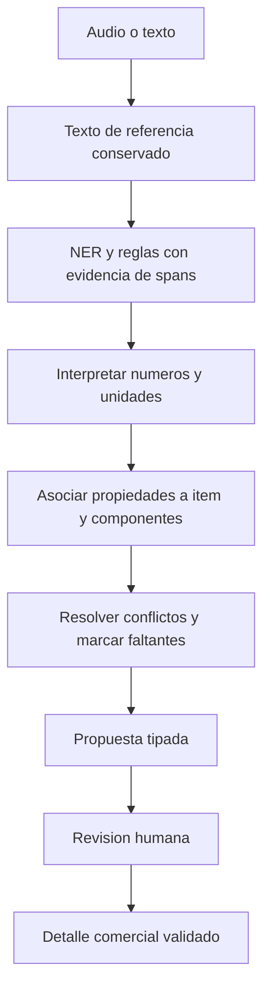

# HOMEX: rumbo recomendado y decisiones para desarrollar el proyecto

**Fecha:** 13 de septiembre de 2026.  
**Estado:** propuesta de dirección técnica y funcional; las decisiones empresariales pendientes se identifican expresamente.  
**Base:** [auditoría integral del proyecto](ANALISIS_INTEGRAL_HOMEX.md), [modelo SQL actual](../homex_bd.sql), arquitectura proporcionada y requisitos del usuario.

## 1. La dirección que recomiendo

HOMEX debería evolucionar hacia **un sistema de cotización y gestión comercial con captura asistida por voz, validación humana y trazabilidad completa**. Su núcleo debe ser una proforma correcta y reproducible. El motor de lenguaje debe facilitar su elaboración, conservando la posibilidad de trabajar manualmente cuando falten datos, el audio sea ambiguo o la inferencia no esté disponible.

El mejor camino, con la información disponible, consiste en:

1. Definir con precisión las reglas comerciales y el significado de los datos.
2. Corregir y formalizar PostgreSQL mediante migraciones de Django.
3. Construir un recorrido completo para crear, revisar y emitir una proforma.
4. Integrar la captura de **un ítem por dictado**, con procesamiento en segundo plano.
5. Entrenar y evaluar un motor híbrido de spaCy y reglas sobre un corpus consistente.
6. Incorporar progresivamente inventario, pedidos, taller, entregas y cobros según las necesidades confirmadas.

La recomendación arquitectónica es **Django modular + PostgreSQL + Vue + worker Celery/Redis**, con el motor NLP distribuido como paquete Python versionado en su propio repositorio.

Esta elección aprovecha las decisiones acertadas del SQL y la arquitectura ya prevista, concentra las reglas de negocio en un lugar y permite ejecutar los modelos pesados fuera de la atención HTTP. La separación de repositorios se conserva sin obligar a distribuir cada módulo comercial en un servicio independiente.

No existe una arquitectura universalmente mejor: esta propuesta es la más adecuada al alcance observado. Si aparecen varios equipos autónomos, otros consumidores del motor o exigencias de capacidad diferentes, habrá motivos concretos para revisarla.

## 2. Qué está definido y qué sigue siendo una propuesta

| Estado | Decisión o dato | Cómo debe tratarse |
|---|---|---|
| Definido por la intención del usuario | Dictar mueble por mueble y acumularlos en una proforma | Base del flujo principal. |
| Referencia de negocio proporcionada | `homex_bd.sql` prevalece sobre el esquema temporal SQLite | Conservar sus conceptos centrales y corregir las inconsistencias demostradas. |
| Organización prevista | Backend, frontend, NLP y despliegue en repositorios separados | Diseñar contratos y versiones compatibles entre ellos. |
| Comprobado en la auditoría | El conversor no interpreta correctamente el dataset y existen fallos de integridad | Son correcciones necesarias, no preferencias de arquitectura. |
| Recomendación de este documento | Primera captura por voz centrada en muebles a medida | Pendiente de confirmar; las sillas ya aparecen en el corpus y no se descartan. |
| Pendiente de negocio | Alcance del precio dictado, pagos, cancelaciones, fracciones y entregas parciales | No convertir una suposición en una regla definitiva. |
| Pendiente de dimensionamiento | Usuarios concurrentes, hardware, latencia y conectividad | Medir antes de prometer capacidad o elegir una infraestructura mayor. |

El código puede avanzar en infraestructura, contratos generales y correcciones comprobadas mientras se responden las preguntas. Las operaciones económicas que dependan de una respuesta deben quedar explícitamente sin habilitar hasta definir su comportamiento.

## 3. Qué significa que el proyecto esté bien logrado

La calidad del proyecto debe apreciarse en cuatro resultados simultáneos:

| Resultado | Evidencia que lo demuestra | Por qué importa |
|---|---|---|
| Cotizaciones fiables | Cantidades, medidas, importes y condiciones coherentes; documentos históricos reproducibles | Un error comercial puede costar más que el tiempo ahorrado al dictar. |
| Menor esfuerzo del vendedor | Tiempo completo de elaboración, correcciones y pasos necesarios frente al procedimiento manual | Una extracción rápida que exige demasiadas correcciones puede no aportar valor. |
| Procesamiento trazable | Audio/texto de referencia, propuesta original, cambios humanos, autor y versiones | Permite explicar errores, resolver diferencias y mejorar el modelo. |
| Operación recuperable | Reintentos sin duplicados, recuperación de borradores y restauración comprobada | Una demostración aislada no prueba que el sistema resista el trabajo cotidiano. |

La evaluación académica y la utilidad empresarial deben apoyarse mutuamente. Un F1 alto no compensa un total calculado incorrectamente; una tasa baja de correcciones no demuestra por sí sola que el NER aprendió bien.

## 4. Primera decisión: el centro del sistema será la proforma

### 4.1. Vocabulario que debe utilizar todo el proyecto

| Concepto | Significado recomendado | Ejemplo |
|---|---|---|
| Proforma | Documento comercial que reúne líneas, cliente y condiciones | Una propuesta de equipamiento de oficina. |
| Ítem o detalle | Una línea comercial con una especificación y una cantidad | Dos escritorios iguales a un precio determinado. |
| Captura | Entrada de audio o texto que propone un ítem | Un dictado describiendo esos escritorios. |
| Componente | Parte de un mismo mueble | Mesón, estructura, puertas o cajonera incorporada. |
| Revisión humana | Corrección o aceptación de una propuesta extraída | El vendedor cambia el ancho a 1800 mm. |
| Confirmación de captura | Acción que incorpora la propuesta validada al detalle | Añadir el escritorio a la proforma. |
| Aprobación de proforma | Aceptación comercial que genera el pedido según el SQL | Confirmar la venta y aplicar la regla de stock. |

Esta distinción evita un error de diseño recurrente: llamar «cotización» indistintamente al audio, a un mueble y al documento completo. También separa la revisión de la IA de la aceptación comercial.

### 4.2. Una captura propone como máximo una línea

**Decisión:** mantener el contrato singular. Una proforma admite muchas líneas y una línea puede tener varias unidades.

**Ejemplo:** «Dos escritorios ejecutivos de melamina, de un metro ochenta de ancho» propone un ítem con cantidad dos. «Un escritorio y dos veladores independientes» contiene más de un producto principal y requiere separar la entrada o registrar los ítems manualmente.

**Justificación:** coincide con tu objetivo y con la cardinalidad del SQL; reduce errores al asociar precios, colores y dimensiones; facilita la revisión y la medición. La ventaja de rendimiento debe medirse: no se supone que cada audio corto garantice automáticamente una determinada latencia.

**Límite:** «escritorio con cajonera incorporada» puede ser un solo producto. No se debe segmentar automáticamente cada vez que aparezca otro nombre de mueble. Cuando sea ambiguo si se trata de componente o línea separada, la interfaz debe hacerlo explícito.

### 4.3. La edición manual es una función central

**Decisión:** ofrecer creación y corrección manual desde la primera versión funcional.

**Justificación:** permite terminar una proforma sin depender del micrófono o del modelo. Además, establece el mismo formulario y las mismas validaciones para comparar el proceso manual con el asistido.

El detalle debe registrar su origen: manual, captura asistida o importación. Una línea manual no debe fingir que tuvo una predicción IA ni entrar en el denominador de métricas de aceptación del modelo.

## 5. Segunda decisión: reducir el alcance inicial sin romper el modelo completo

Recomiendo organizar el producto en tres entregas utilizables.

| Entrega | Incluye | Motivo de este orden |
|---|---|---|
| A. Cotización fiable | Usuarios/permisos, clientes mínimos, borrador de proforma, muebles a medida, ingreso manual, voz/texto, revisión, totales y documento emitido | Permite validar la utilidad principal antes de desplegar todo el flujo comercial. |
| B. Venta e inventario | Productos de catálogo, selección de SKU, aprobación, pedidos, movimientos y cancelación/devolución definida | El stock exige reglas y pruebas más estrictas que una propuesta todavía editable. |
| C. Ejecución y cobros | Taller, entregas, recibos y saldos, según el proceso real de HOMEX | Evita construir cardinalidades y flujos basados en suposiciones. |

En la entrega A, la aprobación comercial del pedido puede quedar deshabilitada hasta completar B. Una proforma emitida no debe presentarse como pedido confirmado.

La recomendación de comenzar la voz con muebles a medida se basa en que es el flujo más cercano a tu idea y permite resolver dimensiones y componentes con un alcance controlado. **Si las sillas son indispensables para la primera entrega**, deben añadirse como un recorrido explícito de búsqueda y confirmación de catálogo. No basta con procesarlas como si fueran un mueble personalizado.

El dataset de sillas se conserva y se prepara desde ahora; los pisos necesitan ejemplos y requisitos propios antes de afirmar cobertura de voz para esa categoría. Reducir temporalmente el alcance debe quedar documentado tanto en la interfaz como en la evaluación.

## 6. Tercera decisión: un backend comercial modular y un worker separado

### 6.1. Reparto de responsabilidades

| Componente | Responsabilidad | Frontera que debe respetar |
|---|---|---|
| Vue | Captura, edición, presentación de advertencias, estado y documentos | No decide stock, permisos ni total definitivo. |
| Django/DRF | Autorización, casos de uso, contratos externos y persistencia comercial | No ejecuta ASR pesado dentro de la petición del usuario. |
| PostgreSQL | Relaciones, datos persistentes e invariantes económicas | No sustituye el flujo de revisión ni la explicación de errores al vendedor. |
| Celery/Redis | Distribuir trabajo, controlar intentos y permitir recuperación | Redis no será el registro definitivo del estado comercial. |
| Paquete NLP | ASR, extracción, normalización de valores, propuestas y evidencia | No aprueba proformas ni escribe libremente en tablas comerciales. |
| Almacenamiento privado | Audios y archivos asociados, con acceso controlado | Guardar una ruta no basta: debe existir una política de acceso y conservación. |

**Por qué Django:** ya forma parte de la dirección prevista y permite reunir modelos, migraciones, identidad y casos de uso comerciales en un backend coherente. FastAPI también podría servir, pero conservar dos APIs con las mismas responsabilidades añadiría contratos y mantenimiento sin una necesidad demostrada.

**Qué hacer con el FastAPI actual:** mantenerlo como referencia temporal y banco de comparación mientras se extraen funciones útiles. Retirarlo del camino comercial cuando el recorrido equivalente esté verificado en Django. El NLP reutilizable debe poder probarse sin importar ese servidor ni inicializar bases de datos.

### 6.2. Organización entre los cuatro repositorios

| Repositorio | Contenido propuesto | Publicación/consumo |
|---|---|---|
| Backend | Django, servicios de aplicación, modelos, migraciones, adaptador Celery y pruebas de integración | Imagen de API y variante de imagen para worker. |
| NLP | Paquete Python, esquemas de propuesta, reglas, entrenamiento, evaluación y metadatos de modelos | Paquete versionado y artefactos de modelo identificados por hash. |
| Frontend | Vue, formularios, captura y cliente de API | Artefacto web con versión compatible de API. |
| Deploy | Compose, Nginx, configuración de entornos, supervisión y restauración | Manifiesto que fija versiones de los componentes. |

El worker recomendado ejecuta código del backend e instala una versión concreta del paquete NLP. Así puede guardar resultados a través de los servicios del backend y comparte sus modelos/migraciones. Es un proceso desplegable por separado, pero no un segundo dueño del esquema.

El repositorio NLP mantiene independencia porque no importa modelos Django. Su contrato de extracción vive con el paquete; el backend lo adapta al contrato comercial. La API externa publica OpenAPI y el frontend consume tipos derivados. No hace falta un quinto repositorio de contratos mientras no aparezca una necesidad real.

### 6.3. Módulos internos del backend

Recomiendo módulos por responsabilidad: identidad/permisos, clientes/catálogos, proformas, capturas/revisiones, pedidos/inventario y, cuando corresponda, taller/entregas/cobros.

Dentro de cada módulo, separar modelos, servicios de aplicación, consultas y endpoints/serializadores. Esto permite probar operaciones como `confirmar_captura` o `aprobar_proforma` sin depender de la pantalla que las invoca. No es necesario crear una interfaz o repositorio abstracto para cada tabla: añadir esas abstracciones solo cuando aíslen una dependencia o una variación real.

### 6.4. Cuándo tendría sentido un servicio NLP autónomo

Revisaría esta decisión si otros productos necesitan consumir el motor, si un equipo separado lo opera o si su infraestructura exige un ciclo de despliegue independiente del worker comercial. En ese caso se define un contrato interno autenticado y versionado para resultados.

Hasta entonces, el coste de otra API, credenciales internas y fallos de red no parece compensado. Tampoco se justifica iniciar con Kubernetes, múltiples bases comerciales o un servicio por módulo.

## 7. Cuarta decisión: contratos explícitos antes de entrenar o migrar datos

Se deben distinguir tres representaciones. Que compartan algunos nombres no significa que deban tener las mismas restricciones.

| Representación | Qué conserva | Ejemplo |
|---|---|---|
| Evidencia | Texto, offsets, fuente y alternativas, incluso información inválida o contradictoria | «No de 18, de 25 milímetros». |
| Propuesta editable | Valores interpretados, ausencias, conflictos y advertencias | Espesor propuesto 25; referencia a la rectificación. |
| Detalle comercial validado | Datos confirmados, cálculos y referencias consistentes | Espesor de estructura 25 mm, confirmado por un vendedor. |

**Justificación:** la IA debe poder devolver un resultado incompleto sin inventar un producto. El detalle confirmado debe tener requisitos más estrictos. Intentar usar un único esquema con todos los campos opcionales para ambos casos impide distinguir un borrador válido de una venta incompleta.

### 7.1. Medidas y componentes

**Propuesta técnica:** utilizar milímetros como representación canónica de dimensiones del mueble, conservando el valor y la unidad originales en la evidencia. La interfaz puede mostrar metros o centímetros según preferencia. Las unidades de venta —pieza/caja— son otro concepto y no deben mezclarse con las unidades geométricas.

Ejemplo de interpretación:

> «Escritorio de 1.80 metros de ancho; estructura de melamina de 18 mm, mesón de 25 mm, cuerpo blanco y puertas nogal».

| Dato | Resultado estructurado |
|---|---|
| Ancho | 1800 mm |
| Estructura | Material melamina; espesor 18 mm |
| Mesón | Espesor 25 mm; material sin confirmar si no existe una regla de herencia acordada |
| Cuerpo | Color blanco |
| Puertas | Color nogal |

Un solo campo `espesor` o `color` no conserva esta información. Recomiendo un objeto versionado de especificaciones que describa componentes y asociaciones. Para el primer alcance, JSONB validado permite flexibilidad; los IDs comerciales, cantidades, dinero y relaciones principales permanecen relacionales.

Si se necesitan consultas frecuentes por pieza, listas de corte o planificación de fabricación, será preferible promover componentes a tablas hijas. No diseñaría un sistema de fabricación completo escondido dentro de un JSON.

«0,60 de profundidad» debe conservar unidad pendiente, salvo que HOMEX defina una convención inequívoca. «1.80 × 0.80 × 0.60» requiere igualmente una regla de orden de ejes. La plausibilidad física por sí sola no autoriza a inventar una medida.

### 7.2. Dinero, cantidad y alcance del importe

**Decisión técnica:** utilizar Decimal en cálculos y NUMERIC en PostgreSQL, intercambiando importes como strings decimales. El backend calcula y valida los totales; el navegador puede mostrar una estimación, pero no fijar la cifra definitiva.

**Decisión comercial pendiente:** si el importe dictado es unitario o de toda la línea.

| Dictado | Interpretación propuesta |
|---|---|
| «Dos escritorios a 850 cada uno» | Cantidad 2, precio unitario 850.00; bruto 1700.00. |
| «Dos escritorios, los dos por 1700» | Total de línea 1700.00; unitario derivable 850.00 si no hay otros ajustes. |
| «Dos escritorios, 1700» | Alcance ambiguo: requiere elección del vendedor. |

Las dos primeras frases justifican una interpretación por su contenido. Para la tercera, no asumiré que la palabra o posición del importe equivale a una política ya aceptada por HOMEX.

También debe cerrarse el caso «tres unidades por 100»: un precio unitario a dos decimales puede dar 99.99 o 100.02. Recomiendo permitir una propuesta basada en total de línea, pero no confirmar la operación hasta elegir una política única: mayor precisión del unitario, ajuste explícito de redondeo o restricción comercial. La opción elegida debe quedar reflejada en fórmula, campos y documento; nunca corregirse silenciosamente con un descuento artificial.

Para productos con precio de lista, definir moneda base o precios por moneda. La moneda de una proforma no puede reinterpretar un precio de lista sin una conversión registrada.

## 8. Quinta decisión: PostgreSQL desde las pruebas de integración

### 8.1. Formalizar el esquema mediante migraciones

**Decisión:** mantener SQLite como evidencia del prototipo, y usar PostgreSQL para integrar el nuevo backend desde el inicio.

**Justificación:** JSONB, triggers, bloqueos y reglas transaccionales forman parte del comportamiento del sistema. Una prueba sobre SQLite no demuestra que funcionen esas características. El paquete NLP puro sí puede probarse sin base de datos.

El SQL revisado debe convertirse en una referencia de diseño y en migraciones reproducibles, no seguir aplicándose manualmente en paralelo a modelos que cambian por otro camino. Definir primero el usuario de Django y sus referencias; incorporar después tablas, índices, restricciones, funciones y datos iniciales necesarios.

Los registros SQLite de prueba no tienen que convertirse en ventas reales. Conservarlos identificados como experimentos; importar solo lo útil con un procedimiento explícito. Tampoco las 200 anotaciones constituyen clientes, proformas y pedidos listos para cargar.

### 8.2. Qué conservar y qué modificar

| Área | Decisión recomendada | Razón |
|---|---|---|
| Mueble a medida | Mantenerlo como detalle más especificaciones | Su diseño particular no equivale a un SKU con existencias. |
| Sillas/pisos/otros | Mantener maestro y fichas; seleccionar un SKU al cotizar | El dictado no debe crear inventario ni alterar la ficha maestra. |
| Catálogos | Mantener vocabularios configurables; proteger códigos estructurales y pertenencia | Cambiar un código no debe reinterpretar documentos previos. |
| Capturas | Mantener pertenencia a proforma y asociación opcional a detalle | Permite capturar antes de confirmar la línea. |
| Propuesta IA | Cero o una por intento, con evidencia conservada | Un fallo o una ausencia de producto no debe contar como detección. |
| Revisiones | Añadir historial de revisiones y una versión actual identificada | Reprocesar o corregir no debe borrar quién decidió qué. |
| Totales | Calcularlos y proteger toda vía de modificación | Los triggers actuales no cubren todas las escrituras. |
| Inventario | Mantener movimientos y stock proyectado, restringiendo permisos de escritura | Permite conciliación y evita ajustes que no tengan evidencia. |
| Captura/detalle/ítem IA | Exigir igualdad de sus padres mediante restricciones apropiadas | Que existan los IDs no prueba que pertenezcan al mismo documento. |

Una nueva tabla de intentos permitiría distinguir una nueva ejecución técnica de una nueva captura del vendedor. En ese diseño, `items_ia` pasaría a referenciar un intento, y la revisión indicaría exactamente qué resultado revisó. Es un cambio propuesto al SQL, no una cardinalidad ya implementada.

### 8.3. Documentos emitidos y aprobados

**Recomendación:** un borrador puede editarse. Al emitir, guardar una instantánea con sus datos comerciales y versión de plantilla. Al aprobar, congelar la proforma aceptada, incluidos sus detalles y especificaciones.

Para corregir una oferta emitida, crear una revisión trazable; para modificar una venta ya aprobada, utilizar el proceso empresarial acordado de modificación/cancelación. No volver la misma fila a BORRADOR dejando el pedido y el movimiento anterior activos.

**Ejemplo:** si el cliente cambia de dirección el mes siguiente, reimprimir la oferta original debe mostrar la dirección con la que se emitió. Consultar únicamente el maestro vivo del cliente no lo garantiza.

No hace falta implantar un sistema general de eventos para obtener esta trazabilidad: revisiones de documentos, instantáneas y un historial de acciones pueden ser suficientes.

### 8.4. Un solo responsable de aprobar y descontar

Para la primera formalización, recomiendo conservar el mecanismo transaccional de aprobación del SQL, corregido y cubierto por pruebas. El servicio Django comprueba permisos, bloquea la proforma y solicita la transición; la operación SQL crea pedido y movimientos.

El servicio no debe insertar un segundo pedido ni descontar de nuevo. Si en el futuro se decide trasladar esa coordinación al código de aplicación, se retira del SQL en una migración explícita y se mantiene un único responsable.

Toda edición/aprobación debe seguir el mismo protocolo de bloqueo. Primero proforma y después productos en orden estable; las operaciones relacionadas deben respetar un orden compatible. Las transacciones deben ser cortas: ASR no debe ejecutarse mientras se bloquean filas comerciales. Django ofrece bloques `atomic()` para delimitar operaciones que deben confirmarse o revertirse juntas. [Documentación de transacciones](https://docs.djangoproject.com/en/5.2/topics/db/transactions/).

Las cancelaciones, devoluciones y entregas parciales deben diseñarse antes de habilitar el recorrido correspondiente. «Añadir CANCELADO al catálogo» no define cuándo se devuelve stock, qué pasa con un anticipo o cómo se registra una entrega ya realizada.

## 9. Sexta decisión: extracción híbrida y conservadora

### 9.1. Orden recomendado del procesamiento

**Decisión inicial:** mantener como referencia NER el texto original recibido/transcrito y normalizar valores después de identificar fragmentos. Los diccionarios y patrones pueden reconocer variantes sin reescribir irreversiblemente esa referencia.

**Justificación:** reduce errores de offsets y la diferencia entre texto anotado y texto de inferencia. Si una corrección previa al NER demuestra una mejora, introducir una vista normalizada versionada con mapa de offsets; no reutilizar los offsets antiguos sobre un texto diferente.

La normalización sigue siendo necesaria, pero se distingue entre reconocer variantes del texto y convertir un valor a una representación estándar. Cambiar `0,80` a `0.80` como valor de dimensión es distinto de reemplazar todas las comas numéricas de una transcripción.

### 9.2. Qué técnica usar para cada necesidad

| Necesidad | Técnica inicial | Justificación y límite |
|---|---|---|
| Nombres y atributos contextuales | NER personalizado | Aporta generalización, pero necesita datos y evaluación independiente. |
| Vocabulario empresarial conocido | EntityRuler o matcher de frases según el caso | Coincidencias controladas y revisables; elegir una implementación principal por catálogo. |
| Números, precios y unidades | Parser específico con reglas y validación de consumo completo | Evita aceptar un prefijo como precio válido, como ocurrió con 1,500.00. |
| Ejes y expresiones de relación | Reglas de contexto/Matcher y ensamblaje semántico | Reconocer una cifra no determina a qué dimensión pertenece. |
| Conflictos y rectificaciones | Resolutor que conserva candidatos y motivo | «No blanco, nogal» requiere interpretar una corrección, no tomar el primer color. |
| Forma final | Pydantic y validación comercial posterior | Tipos correctos no implican por sí solos una cotización confirmable. |

No añadiría un LLM generativo al primer diseño: el proyecto ya dispone de una dirección spaCy/reglas y necesita establecer una línea base fiable. Si posteriormente persisten errores semánticos relevantes, podría evaluarse otra técnica sobre el mismo conjunto de prueba, incluyendo su latencia, coste y trazabilidad.

### 9.3. Política de conflictos

Un patrón exacto puede aportar evidencia fuerte sobre la forma de un número, pero no decidir siempre su función. `18 mm` puede ser espesor; una medida en milímetros también puede ser ancho. La prioridad debe depender del campo, contexto y asociación, no de una regla global «regex siempre gana».

Conservar por candidato texto, ubicación, fuente, valor interpretado y motivo de aceptación/rechazo. Ante contradicción sin resolución suficiente, devolver alternativas y una advertencia. No inventar porcentajes de confianza para justificar decisiones: primero medir y calibrar cualquier puntuación que vaya a mostrarse como probabilidad.

## 10. Séptima decisión: reparar el corpus antes de presentar resultados de IA

La auditoría comprobó 200 registros y 2.378 anotaciones. El conversor actual produce ejemplos sin entidades al leerlos; cambiar únicamente nombres de claves no resuelve las etiquetas incompatibles ni las 11 desalineaciones.

### 10.1. Secuencia de trabajo

1. Conservar una copia/versionado del dataset original y su procedencia.
2. Publicar una guía de anotación: definición de etiqueta, límites, ejemplos y casos ambiguos.
3. Corregir el adaptador `label`/`entities`, rutas y validación estricta; emitir un informe de rechazo y detener el entrenamiento ante pérdidas inesperadas.
4. Revisar desalineaciones, materiales no anotados y cobertura de colores/acabados.
5. Separar familias/documentos de origen antes de generar train/dev/test.
6. Entrenar una primera configuración reproducible y compararla con reglas solas e híbrido.
7. Validar sobre transcripciones de audio reales y medir el recorrido completo.

Las configuraciones y los corpus de entrenamiento/desarrollo forman parte del procedimiento reproducible de spaCy; deben versionarse junto con la identidad del modelo seleccionado. [Guía oficial de entrenamiento](https://spacy.io/usage/training).

### 10.2. Política inicial de etiquetas

Recomiendo preservar las etiquetas originales en la fuente y definir un mapeo explícito para cada experimento. Para muebles, conservar inicialmente `ANCHO`, `ALTO` y `PROFUNDIDAD` cuando la orientación está sustentada por el texto o una convención acordada; no reducirlas automáticamente a `DIMENSION` perdiendo información.

En secuencias sin ejes explícitos, la guía debe indicar cuándo el orden permite asignarlos y cuándo son medidas ambiguas. Una etiqueta aparentemente precisa basada en una suposición no constituye una referencia de calidad.

Para `PRECIO_TOTAL`, conservar el fragmento original y registrar aparte el alcance económico confirmado. Las etiquetas específicas de silla pueden procesarse en su conjunto de entrenamiento/evaluación; no se eliminan silenciosamente por quedar fuera del primer MVP.

La estructura de componentes requiere anotación de relaciones o reglas revisadas adicionales. No puede esperarse que un NER de spans descubra por sí solo todas las relaciones que el dataset no expresa.

### 10.3. Cómo evitar conclusiones engañosas

Los 200 ejemplos son un punto de partida, no una garantía de generalización. No hay un porcentaje de división que por sí solo evite fuga: hay que conocer grupos de origen y separar variantes próximas. El test reservado no debe utilizarse para retocar reglas.

Las correcciones HITL se convierten en candidatos a un nuevo corpus. Algunas corrigen la transcripción y otras cambian la intención comercial después del dictado; esas situaciones deben diferenciarse. Si el vendedor cambia el ancho pedido de 1800 a 2000 después de escuchar al cliente, no necesariamente hubo un error de extracción de 1800.

## 11. Octava decisión: HITL como parte del negocio y de la evidencia

El formulario debe mostrar el ítem propuesto, datos pendientes y advertencias concretas. La transcripción y, cuando se conserve, el fragmento de audio ayudan a verificar información dudosa. Las medidas se editan por eje y unidad; el importe indica si es unitario o de línea.

Al confirmar, el frontend envía la identidad de captura/revisión y los cambios. **La propuesta original, las latencias y las versiones se recuperan desde el servidor.** Así se evita que el cliente redefina la evidencia contra la que se calcula el desempeño.

La acción debe producir conjuntamente una revisión, su comparación y el detalle validado. Repetir la solicitud no debe crear otra línea. Si el usuario tenía una versión antigua abierta, el backend debe detectar el conflicto y pedir que revise la versión vigente.

Recomiendo distinguir cuatro acciones:

- Aceptar propuesta.
- Corregir y confirmar, indicando cuando corresponda cambio de intención posterior.
- Descartar captura porque no representa un ítem útil.
- Crear manualmente el ítem que la extracción no pudo obtener.

Cada acción tiene consecuencias distintas en las métricas. Una extracción vacía no debe contarse como acierto y un ítem descartado no puede desaparecer del cálculo de falsos positivos.

## 12. Novena decisión: asincronía con recuperación explícita

El flujo recomendado es: API registra captura y referencia al audio → publica trabajo → worker procesa → backend conserva resultado → frontend consulta y revisa.

La tarea debe identificar captura, intento y versión de entrada. Si el trabajador se reinicia, un nuevo intento no duplica el detalle ni sobrescribe una revisión ya confirmada. La entrega repetida de tareas exige idempotencia; los acknowledgements y reintentos de Celery deben configurarse de acuerdo con ese comportamiento. [Guía oficial de tareas](https://docs.celeryq.dev/en/v5.5.0/userguide/tasks.html).

**Recomendación concreta:** registrar junto a la captura una entrada de trabajo pendiente en la misma transacción. Un publicador la entrega a Redis y una reconciliación detecta pendientes antiguos. La publicación puede repetirse; la aceptación del resultado sigue siendo única. Es una outbox pequeña para trabajos, no un sistema general de eventos.

`on_commit` sirve para publicar después de confirmar los datos, pero una caída entre commit y publicación sigue necesitando recuperación. [Acciones posteriores al commit](https://docs.djangoproject.com/en/5.2/topics/db/transactions/#performing-actions-after-commit).

El audio vive fuera de la transacción de PostgreSQL. Registrar estado de almacenamiento, comprobar que el archivo existe antes de encolar y limpiar cargas huérfanas con una política definida. No afirmar atomicidad entre archivo, base y broker cuando son recursos separados.

Para la primera interfaz basta polling del estado. Introducir SSE/WebSocket solo si mejora una necesidad observada. La pantalla debe permitir volver a abrir una proforma sin perder resultados o correcciones.

Los fallos se separan en técnicos recuperables, entradas inválidas y ambigüedades comerciales. Un fallo transitorio de infraestructura puede reintentarse; una medida sin unidad necesita revisión, no ejecutar diez veces el mismo modelo.

## 13. Cómo comprobar que el rumbo funciona

### 13.1. Pruebas que deben bloquear una entrega

| Caso | Resultado exigido | Qué protege |
|---|---|---|
| Falta stock en uno de varios productos | No se aprueba, no se crea pedido ni se modifica ninguna existencia | Atomicidad comercial. |
| Dos aprobaciones concurrentes compiten por el último stock | Solo se aceptan operaciones compatibles con la existencia real | Concurrencia, no cubierta por las pruebas monousuario previas. |
| Se repite una confirmación de captura | Se conserva una sola incorporación comercial | Idempotencia. |
| Se modifica una línea de proforma aprobada | Se rechaza la mutación y se dirige al proceso definido de revisión | Históricos e inventario. |
| Captura y detalle pertenecen a proformas distintas | Se rechaza la asociación | Integridad y permisos. |
| Se altera en el cliente el resultado original de IA | El backend usa la evidencia propia | Validez de métricas. |
| Se recibe un precio ambiguo o una medida sin unidad | Se conserva la duda y se bloquea la confirmación del campo necesario | Ausencia de inferencias silenciosas. |
| El worker cae después de comenzar | El trabajo se recupera o queda en error visible, sin resultado duplicado | Continuidad operativa. |
| Un usuario intenta ver otra proforma fuera de sus permisos | Se deniega el acceso, también al audio | Control por recurso. |
| Se restaura una copia de seguridad | Documentos y referencias a archivos siguen siendo utilizables | Recuperación verificable. |

Los casos SQL de la auditoría que reproducen defectos deben transformarse en pruebas de rechazo de esos estados después de corregirlos. No basta con mantener `verificado: true` en el informe histórico.

### 13.2. Métricas útiles

Separar F1 por entidad, exactitud de valores/asociaciones, calidad de transcripción, tasa de corrección humana y tiempo total de elaboración. Registrar soporte por etiqueta y modo de motor activo. No mezclar métricas de fallback con modelo entrenado sin identificar las cohortes.

Comparar las mismas clases de cotización manual y asistida, registrando operador y complejidad. Alternar el orden para reducir el efecto de práctica. Medir cola, ASR, NLP y revisión por separado ayuda a decidir dónde optimizar.

Los objetivos numéricos de latencia y mejora se fijarán después de medir la línea base y conocer el hardware. No prometo un F1 ni un tiempo máximo basándome únicamente en el tamaño del dataset. Antes de un piloto deben acordarse esos umbrales y cómo se medirán; no se eligen retrospectivamente para declarar éxito.

## 14. Hoja de ruta con entregables y puntos de decisión

| Etapa | Trabajo y entregables | Condición para avanzar |
|---|---|---|
| 0. Acordar el producto | Responder preguntas críticas; glosario; recorrido del vendedor; alcance y matriz de permisos | Existe una versión aprobada de las reglas que afectan precios, medidas y aprobación. |
| 1. Contrato y dominio | Esquemas de evidencia/propuesta/detalle, ejemplos válidos/ambiguos y decisiones de estados | Backend, UI y NLP pueden intercambiar los mismos ejemplos sin pérdida. |
| 2. Base persistente | Django, PostgreSQL, migraciones, catálogos mínimos, auditoría y corrección de invariantes | La base se crea desde cero; pruebas de relaciones, cálculos y estados pasan. |
| 3. Recorrido manual | Crear proforma, añadir ítems, validar, emitir y recuperar borradores | Un vendedor termina una proforma correcta sin intervención de desarrolladores. |
| 4. Corpus y extracción | Adaptador estricto, guía de anotación, particiones, reglas y primer NER evaluado | Se identifica qué etiquetas y casos funcionan y cuáles requieren revisión. |
| 5. Voz integrada | ASR, cola, intentos, almacenamiento, revisión y confirmación idempotente | El recorrido asistido funciona con errores, reintentos y reconexiones. |
| 6. Piloto medido | Audios reales autorizados, estudio comparativo y observabilidad | Se cumplen los objetivos acordados y no quedan defectos críticos conocidos. |
| 7. Ampliación comercial | Categorías y módulos adicionales, cancelación, entregas y cobros definidos | Cada módulo tiene reglas, permisos y pruebas antes de activarse. |

La preparación del corpus puede avanzar junto a la base persistente después de acordar el contrato. La asincronía se diseña desde el inicio, aunque su integración completa aparezca en la etapa 5. No son siete grandes reescrituras: cada etapa debe entregar un avance utilizable y comprobable.

### Primer lote de trabajo recomendado

1. Resolver las preguntas P01–P08 de la siguiente sección.
2. Crear un documento de reglas de negocio y tres esquemas versionados con ejemplos.
3. Reparar el conversor y generar un informe del corpus; todavía sin presentar cifras de modelo definitivo.
4. Preparar migraciones PostgreSQL y convertir los fallos SQL comprobados en pruebas de integridad esperada.
5. Implementar la proforma manual como primer recorrido completo.

No fijaría fechas de entrega hasta conocer disponibilidad del equipo, alcance académico y estado de los otros repositorios. Sí estimaría cada lote cuando tenga criterios de aceptación y dependencias claras.

## 15. Preguntas que faltan para cerrar el diseño

Las preguntas están priorizadas por el coste de tomar una decisión equivocada. La columna de propuesta indica una recomendación inicial, **no una respuesta atribuida a HOMEX**.

### 15.1. Resolver antes de fijar las reglas centrales

| ID | Pregunta | Qué cambia con la respuesta | Propuesta inicial |
|---|---|---|---|
| P01 | ¿Qué significa «total 1700» con cantidad 2: importe de ambas unidades o de cada una? ¿Existen frases con ambas intenciones? | Extracción, etiquetas, formulario y fórmula comercial | Interpretar frases explícitas y pedir alcance cuando sea ambiguo. |
| P02 | ¿Se cotiza por precio unitario, por total negociado o de ambas formas? ¿Cómo se aplican descuentos, redondeos e importes adicionales como instalación/transporte? | Campos monetarios y conciliación de totales | Una política documentada por línea; ajustes visibles. No inventar un descuento para cuadrar. |
| P03 | ¿La primera entrega debe cubrir por voz muebles, sillas y pisos, o es aceptable iniciar con muebles a medida? | Alcance, corpus y formularios | Muebles a medida primero; catálogo incorporado cuando sea imprescindible. |
| P04 | ¿Qué datos mínimos hacen confirmable cada tipo de mueble? ¿Existen excepciones legítimas a ancho/alto/profundidad? | Validación obligatoria y bloqueos de revisión | Requisitos por tipo y etapa; no exigir tres ejes a todos los productos indiscriminadamente. |
| P05 | ¿Qué unidades y orden de ejes usa realmente HOMEX cuando no se dictan? Por ejemplo, «uno ochenta por ochenta por sesenta». | Normalización y anotaciones de orientación | Conservar ambigüedad hasta disponer de una convención explícita. |
| P06 | ¿Cuándo una cajonera, puerta o accesorio forma parte del precio del mueble y cuándo debe ser otra línea? | Componentes, segmentación y cantidades | Una línea por unidad comercial; componentes asociados cuando forman parte del conjunto. |
| P07 | ¿Quién revisa la extracción y quién aprueba comercialmente la proforma? ¿La aprobación requiere aceptación del cliente, anticipo o autorización interna? | Permisos, estados y momento de crear pedido/descontar stock | Separar confirmación de captura de aprobación comercial, incluso si las realiza la misma persona. |
| P08 | ¿Puede una proforma cotizarse sin cliente identificado? ¿Se modifica la misma oferta después de enviarla o se emite una revisión? | Cardinalidad inicial e historial documental | Prospecto explícito si hace falta y revisión identificada de ofertas emitidas; evitar clientes ficticios compartidos. |

### 15.2. Resolver antes de activar inventario, entregas y cobros

| ID | Pregunta | Qué cambia con la respuesta | Propuesta inicial |
|---|---|---|---|
| P09 | ¿Piezas y cajas se venden siempre completas? ¿Hay uno o varios almacenes y qué representa hoy «stock»? | Tipo de cantidad, ubicación y saldo disponible/físico | Unidades enteras si son indivisibles; mantener la regla actual de descuento al confirmar hasta acordar otra. |
| P10 | ¿Se permiten cancelaciones/devoluciones después de aprobar, producir o entregar? ¿Qué ocurre con stock y anticipos en cada caso? | Transiciones, movimientos compensatorios y cobros | Reversiones referenciadas e idempotentes; nunca borrar el movimiento original. |
| P11 | ¿Se entregan pedidos parcialmente y se fabrican en varias órdenes o talleres? ¿Cómo se manejan pedidos mixtos de muebles y sillas? | Cardinalidades de OT/notas y cantidades pendientes | Diseñar detalles de entrega si hay parciales; permitir ruta comercial sin producción cuando corresponda. |
| P12 | ¿Se cobra en BOB, USD o ambas? ¿Cómo se fija el cambio? ¿Qué significan total, a cuenta y saldo en el recibo actual, y qué medios de pago se usan? | Precios, pagos, saldos e instantáneas monetarias | Importes y moneda inequívocos; saldos derivados de pagos válidos y política de conversión registrada. |
| P13 | ¿Qué datos y formatos deben aparecer en proforma, OT, nota y recibo? ¿Hay numeración por año/sucursal y documentos de referencia aprobados por HOMEX? | Plantillas, snapshots y numeración | Partir de documentos reales y distinguir numeración comercial de ID interno. |

### 15.3. Resolver para dimensionar el piloto y la evaluación

| ID | Pregunta | Qué cambia con la respuesta | Propuesta inicial |
|---|---|---|---|
| P14 | ¿De dónde provienen los 200 registros? ¿Hay originales y grupos de variantes del mismo documento? ¿Quién validó las anotaciones? | Particiones, calidad y representatividad | Conservar procedencia y revisar por familias antes del entrenamiento. |
| P15 | ¿Hay audios reales autorizados, dispositivos representativos y ejemplos de errores frecuentes de dictado/transcripción? | Evaluación ASR y cobertura del NLP | Recoger una muestra del entorno real además de textos históricos. |
| P16 | ¿El trabajo exige una evaluación académica específica, una fecha de defensa, F1 por etiqueta o un diseño experimental acordado? | Entregables, particiones y prioridades | Acordar el protocolo antes de usar el conjunto de prueba. |
| P17 | ¿Cuántos vendedores usarán el sistema a la vez, cuántos audios procesarán y qué espera el negocio como tiempo aceptable? ¿Qué CPU/GPU/RAM habrá? | Concurrencia, colas, modelo ASR y capacidad | Medir en el hardware objetivo antes de seleccionar tamaño de modelo y número de workers. |
| P18 | ¿Se usará desde móviles, computadoras o ambos? ¿La conexión es estable y se requiere operar sin internet? | Grabación, formatos, sincronización y despliegue | Empezar conectado con borradores persistidos; offline completo requiere diseño propio. |
| P19 | ¿Quién puede consultar audios y correcciones, cuánto tiempo se conservarán y cuál es la tolerancia a perder datos o a una interrupción? | Acceso, retención, backups y recuperación | Acceso por recurso, conservación limitada definida y restauración ensayada. |
| P20 | ¿Qué existe ya en los otros repositorios, quién desarrolla cada parte y quién operará el sistema? | Reutilización, contratos y calendario realista | Revisar esos activos antes de crear funcionalidades duplicadas o fijar fechas. |

## 16. Cómo mantener estas decisiones bajo control

Registrar cada decisión relevante en una ficha breve: problema, opción elegida, motivo, alternativas descartadas, consecuencias, responsable y condición para revisarla. Al responder las preguntas, actualizar el documento de reglas y los ejemplos del contrato, no dejar las respuestas únicamente en conversaciones.

Mantener vinculados cuatro artefactos: reglas de negocio, esquema/migraciones, contratos y pruebas. Cuando cambie una regla —por ejemplo, permitir entregas parciales— los cuatro deben actualizarse en el mismo trabajo.

La primera meta verificable es que un vendedor pueda crear una proforma, añadir un mueble manualmente o por voz, revisar información dudosa y emitir un documento correcto que pueda recuperar después. Sobre ese recorrido estable, HOMEX podrá ampliar cobertura y demostrar con evidencia cuánto aporta el NLP.
