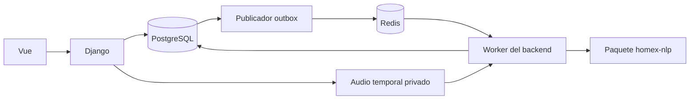

# Arquitectura HOMEX — base F00

El diseño objetivo es un backend Django modular propietario de PostgreSQL y del
negocio. Vue consume esa API. Un worker Celery del backend instala una versión
fijada del paquete `homex-nlp`; Redis transporta identificadores y el outbox de
PostgreSQL conserva la intención de procesamiento.

El paquete NLP no importa Django, Celery, ORM ni SQLite. Extrae una propuesta por
entrada y conserva evidencia; no confirma precios comerciales, stock o cobros.
El llamador gestiona audio privado temporal y su eliminación inmediata al obtener
transcripción. No hay almacenamiento histórico, endpoint de reproducción o backup
de audio. La vida de archivos se implementará en F05/F08, no en el import.

## Dependencias y carpetas

F00 crea `src/homex_nlp/__init__.py`, `pyproject.toml`, `uv.lock`,
`tests/contract/test_import.py` y CI. No crea módulos vacíos para fases posteriores.
F01 añade contratos y recursos; F02 prepara corpus; F03–F05 implementan motor/ASR;
F06 cierra el paquete. La estructura detallada de los cuatro repositorios se
mantiene en §§4–5 del [plan](PLAN_MAESTRO_REFACTORIZACION_HOMEX.md).

El nuevo runtime de texto declara spaCy/Pydantic; ASR y demo son extras separados.
El modelo español genérico del experimento no se instala como dependencia del
nuevo paquete ni se presenta como modelo HOMEX entrenado. Entrenamiento/config y
artefactos se tratarán en fases posteriores. F00 fija Python 3.11 y no actualiza el
experimento previo.

## Fronteras comerciales definitivas

La base tiene 24 tablas comerciales, sin grupos/versiones de proforma, historial
humano ni las cinco tablas descartadas. Las últimas respuestas añaden a la futura
migración modo contractual de precio, estado EMITIDO/ANULADO de recibo y
clave_idempotencia de captura; no se ha cambiado el SQL durante F00.

Aprobar dispara pedido CONFIRMADO, VENTA y OT mediante los triggers. No crea nota.
La nota se emite para entregar desde LISTO_ENTREGA; emitirla no confirma entrega
física. No hay devoluciones dentro del sistema. Cancelar exige ausencia de recibos
EMITIDOS y genera una única reversa por VENTA. Los recibos erróneos se anulan sin
borrar ni alterar el cobro original.

Stock general compartido; presentaciones de silla con existencia propia son
productos/SKU separados, sin tabla de variantes. Los perfiles de muebles faltantes
no bloquean: JSON V1 flexible y validación estructural hasta recibir perfiles
reales. T08 no permite imponer descuento cero a muebles por categoría.

## Estado y pruebas

El prototipo sigue en `backend/` y `frontend/`; retirarlo corresponde a F06 después
de sus sustitutos. F00 no conecta Django ni demuestra calidad de extracción.
CONTRACT-02 comprueba importación sin infraestructura, escritura ni red en un
proceso aislado y desde un directorio ajeno al repositorio. La integración real y
las carreras de stock/cobros requieren PostgreSQL multiusuario en F07/F08.
